# Open System Interconnect (OSI ) Model

------

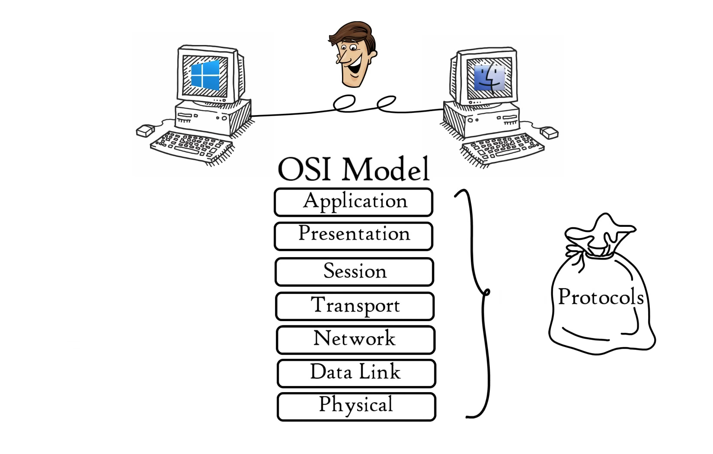

Each layer contains a set of protocols. When talk about application layer it does not mean computer applications like chrome, edge etc. But it includes application layer protocols that are needed to make these applications work correctly in a network or internet.

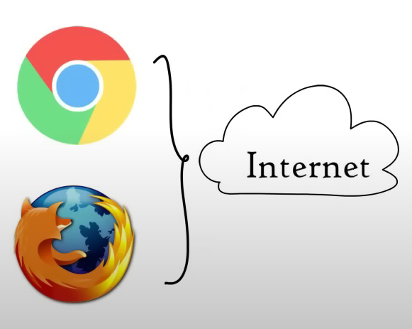

## 7. Application layer

- Used by network applications (computer applications that use internet)

- Application layer provides services for network applications with the help of protocols to perform user activities.

## 6. presentation layer

-  Presentation layer receives data from application layer. This data is in the form of characters and numbers. Presentation layer converts this characters and numbers  to a binary format.

- Presentation layer performs THREE BASIC FUNCTIONS.

  1. Translation
  2. Data Compression : Very helpful at real time audio / video streaming
  3. Encryption: Encryption is done at the senders and decryption is done at the receivers end (using SSL protocol)

  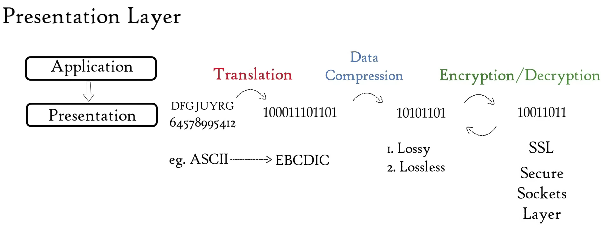

  

## 5. Session layer

- Suppose you have planned a party. You have hired few helpers ensuring that each activity runs smoothly. Helpers will help you in setting up , assisting , cleaning , and then closing the party , same as the case with session layer. <mark>Session layer helps in setting up and managing connections enabling sending and reciving data followed by termination of connection or sessions </mark> 
- As helpers in party session layer has its own helpers called API's.  ex:- NETBIOS : allows application on different computers to communicate with each other.

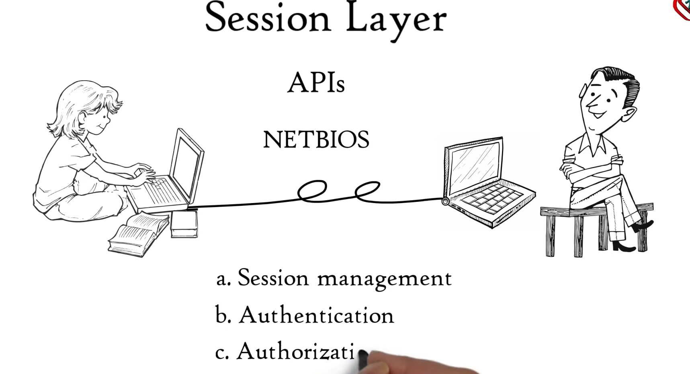	

-  Just before a session or a connection is established with the server, server performs a function called <u>authentication</u>. Authentication is the process of verifying who you are. For this, server uses a username and a password. Once entered username and password are matched, a session or a connection is established between your computer and the server. After authenticating the user, authorization is checked. <u>Authorization</u> is the process used by server to determine if you have permission to access a file. If not, you will get a message saying you are not authorized to access this page.

-  Both of these functions, authentication and authorization, are performed by session layer. Session layer keeps a track of the files that are being downloaded. For example, a web page contains text, images, etc. These text and images are stored as separate files on the web server. When you request a website in your web browser, your web browser opens a separate session to the web server to download each of these text and image files separately. These files are received in the form of data packets. Session layer keeps a track of which data packet belongs to which file, either text file or image file, and tracks where the received data packet go. In this case, it goes to web browser, that is, session layer helps in session management. <mark>So session layer helps in session management, authentication, and authorization. </mark>

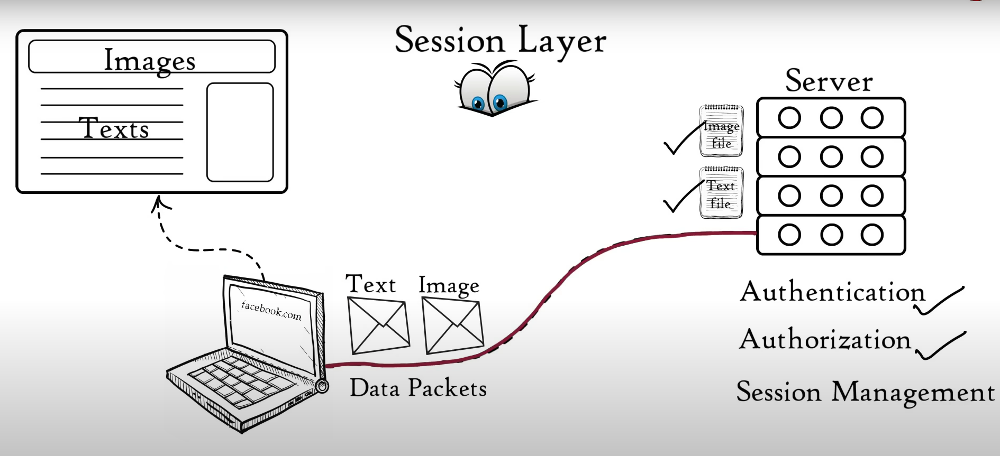

  

  > Your web browser performs all functions of session, presentation, and application layer. 
  >
  > 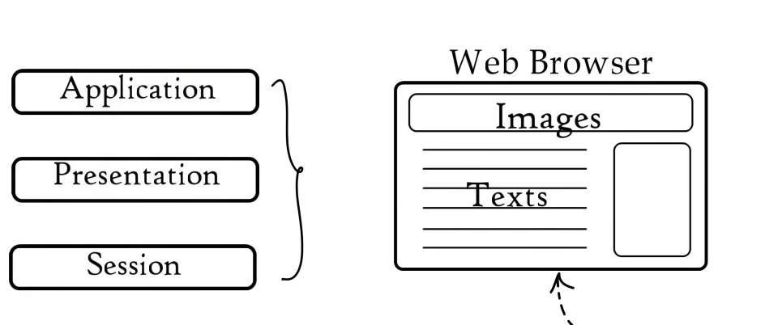

 

## 4. Transport layer

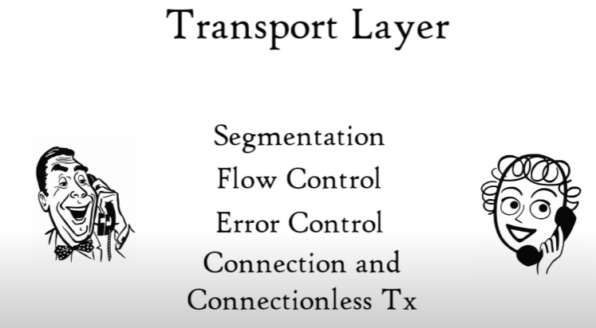

- Transport layer controls the reliability of communication through segmentation, flow control, and error control.

1. Segmentation

   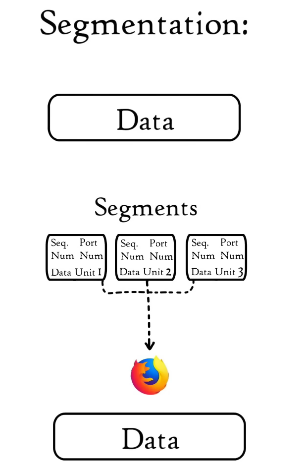

   

   -  <mark>In segmentation, data received from session layer is divided into small data units called segments.</mark> 

   -  Each segment contains a source and destination's port number and a sequence number.

   - Port number helps to direct each segment to the correct application, and sequence number helps to reassemble segments in the correct order to form correct message at the receiver.

     

2. Flow Control

   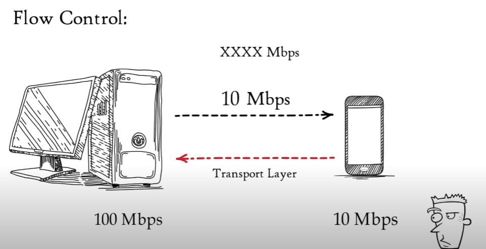

   

   -  In flow control, transport layer controls the amount of data being transmitted. Consider, our mobile is connected to a server. Suppose, server can transmit data maximum at 100 Mbps, and our mobile can process data maximum at 10 Mbps. Now, we are downloading a file from the server, but server starts sending data at 50 Mbps, which is greater than the rate our mobile can process. So mobile phone with the help of transport layer can tell the server to slow down data transmission rate up to 10 Mbps so that no data gets lost. Similarly, if server is sending data at 5 Mbps, mobile phone tells the server to increase data transmission rate to 10 Mbps to maintain system performance.

     

3. Error Control

   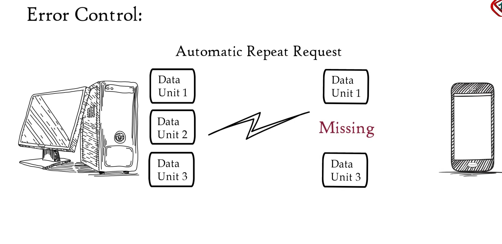

   - Transport layer also helps in error control. If some data does not arrive the destination, transport layer uses automatic repeat request schemes to retransmit the lost or corrupted data. <mark>A group of bits called checksum is added to each segment by the transport layer to find out received corrupted segment.</mark>

     

   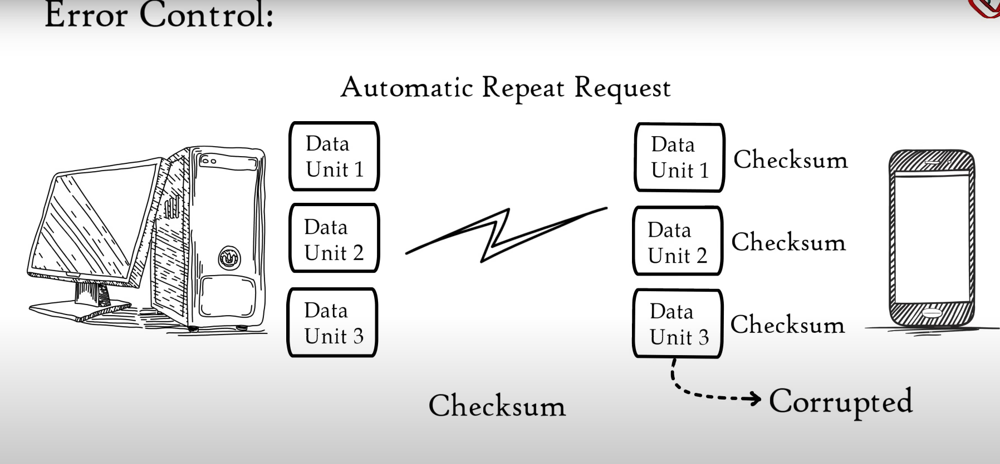

#### protocols of transport layer

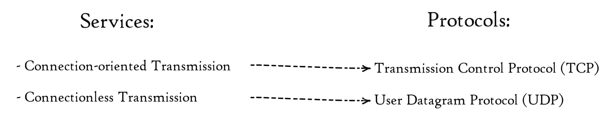

- Protocols of transport layer are Transmission Control Protocol or TCP and User Datagram Protocol or UDP. Transport layer performs two types of services, Connection Oriented Transmission and Connectionless Transmission. Connection Oriented Transmission is done via TCP while Connectionless Transmission is done via UDP.

- TCP is faster than UDP because it does not provide any feedback whether data was really delivered whereas TCP provides a feedback therefore lost data can be retransmitted in TCP.

- UDP is used where it does not matter whether we have received all data, for example online streaming movies, songs, games, voice over IP, TFTP, DNS, etc. On the other hand, TCP is used where full data delivery is must, for example World Wide Web, Email,FTP, etc.

  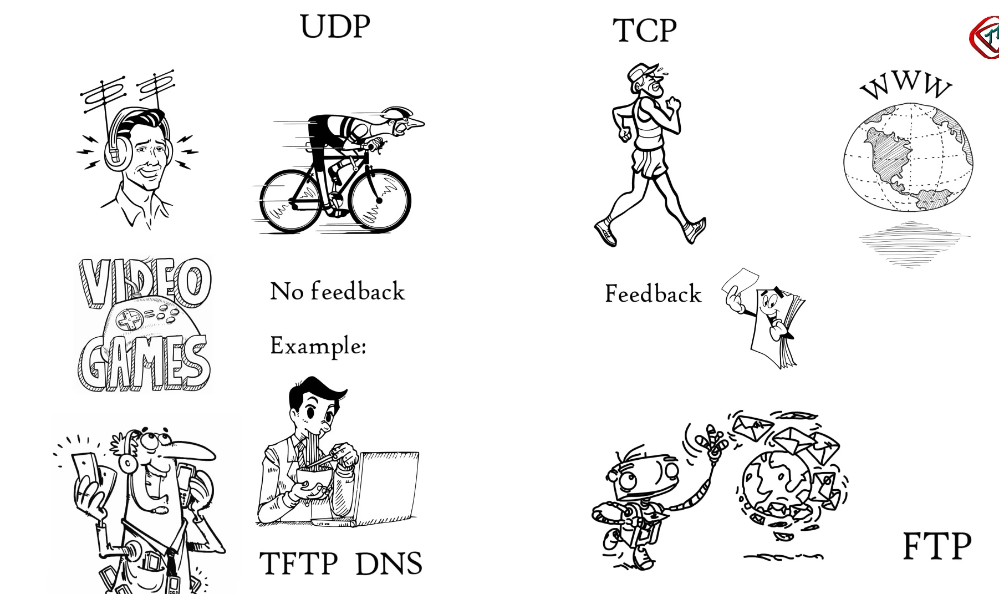

So transport layer is involved in segmentation, flow control, error control, connection oriented and connectionless transmission.

> Transport layer passes data segments through the network layer.
>
> 

## 3. Network layer

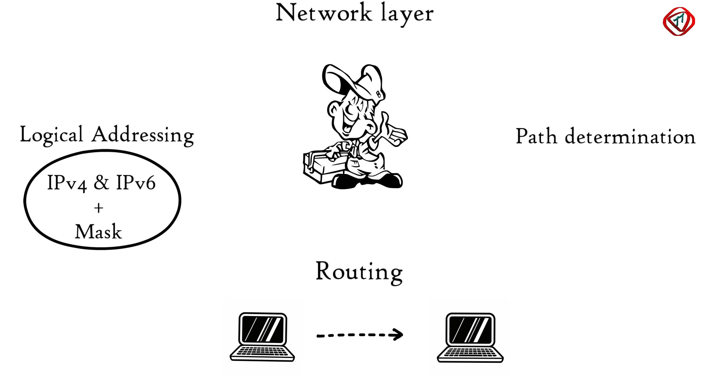

- Network layer works for the transmission of the received data segments from one computer to another located in different networks. <mark>Data units in the network layer are called packets.</mark>

- It is the layer where routers reside. 

- The functions of network layer are logical addressing, routing and path determination. 

<u>Logical Addressing</u>

- IP addressing done in network layer is called logical addressing. Every computer in a network has a unique IP address. <mark>Network layer assigns sender and receiver's IP address to each segment to form an IP packet.</mark> IP addresses are assigned to ensure that each data packet can reach the correct destination. 

<u>Routing</u>

- Routing is a method of moving data packet from source to destination and it is based on the logical address format of IPv4 or IPv6. 

- Suppose computer A is connected to network 1 and computer B is connected to network 2. From computer B we have requested to access Facebook.com and now there is a reply from Facebook server for computer B in the form of of packet. This packet needs to be delivered to computer B only. Since in a network each device has a unique IP address so these both computers will be having a unique IP address as well. Network layer of the Facebook server has already added sender and receivers IP address in the packet. Suppose mask use is 225 .225 .225 .0 This mask tells that the first three combination represents network while the last combination represents host or computer B. So based on IP address format received data packet will move first to network 2 and then to computer B. So based on IP address and mask routing decisions are made in a computer network.

<u>Path determination</u>

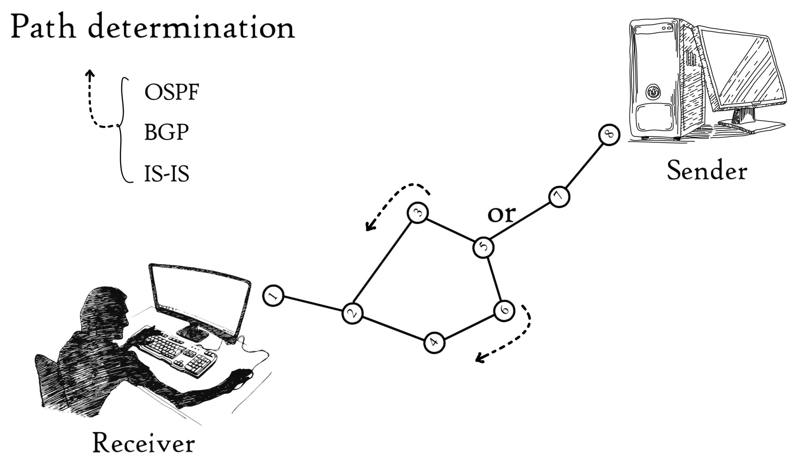

- A computer can be connected to Internet server or a computer in a number of ways. Choosing the best possible path for data delivery from source to destination is called path determination. Layer 3 devices use protocols such as open shortest path first, border gateway protocol, intermediate system to intermediate system to determine the best possible path for data delivery. 

## 2. Data Link Layer

-  Data link layer receives data packet from network layer. Data packets contain IP addresses of sender and receiver. 

- There are two kinds of addressing, logical addressing and physical addressing. 

  

  1. Logical addressing is done at network layer where sender and receivers IP addresses are assigned to each segment to form a data packet. 
     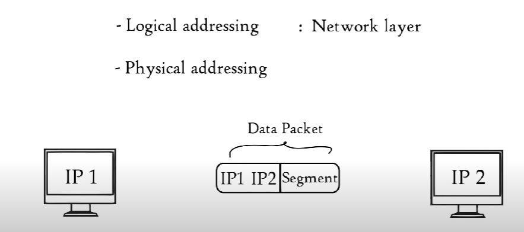

     

  2. Physical addressing is done at data link layer where MAC addresses of sender and receiver are assigned to each data <mark>packet to form a frame</mark>. MAC address is a 12 digit alphanumeric number embedded in network interface card of your computer by your computer manufacturer. 

     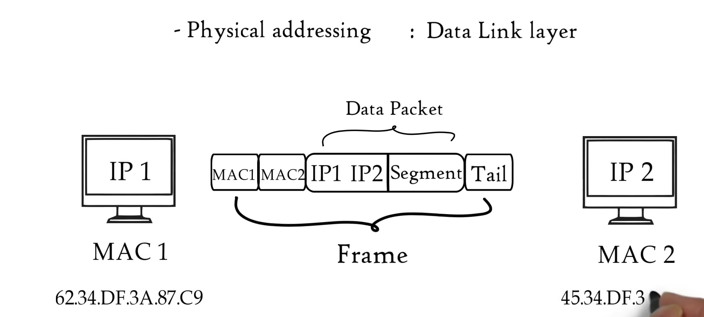

     

     

- <mark>Data unit in data link layer is called frame.</mark>

-  Data link layer is embedded as software in network interface card of a computer and provide means to transfer data from one computer to another via a local media. Local media includes copper wire, optical fiber or air for radio signals. Please note here media does not correspond to audio, video or animation. It refers to the physical links between two or more computers or networks. 

   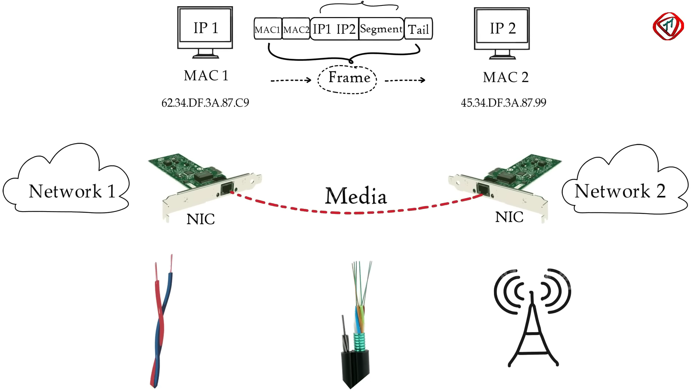

- Data link layer performs two basic functions. 

  1. It allows upper layers of OSI model to access media using techniques such as framing. 
     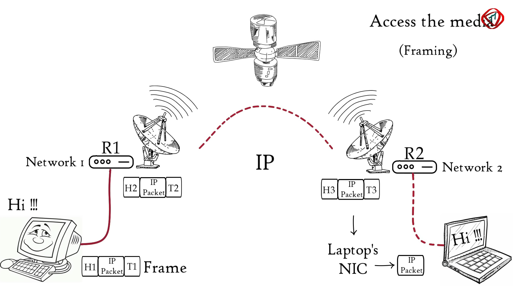

     

     - Consider two distant hosts, a laptop and a desktop communicating with each other. As laptop and desktop are connected to different networks, so they will be using network layer protocols, IP for example, to communicate with each other. 
     - In this example, desktop is connected to router R1 via an Ethernet cable. Router R1 and R2 are connected via a satellite link. And laptop is connected to router R2 via a wireless link.
     - Now desktop wants to send some data to laptop. Based on the medium used to connect desktop and router R1, data link layer adds some data in the head and tail of IP packet and converts it to a frame, Ethernet frame in this case. Router R1 receives this Ethernet frame, decapsulate it to an IP packet and then encapsulate it again to a frame so that it can cross satellite link to reach router R2. 
     - Router R2 will again decapsulate the received frame and encapsulate it again to form a wireless data link frame. Laptop receives this wireless data link frame, decapsulate it and then forward IP packet to network layer. Finally, data arrives application layer. Application layer protocols then make the received data visible on computer screen. 
     - <mark>So network layer or higher level layers are able to transfer data over media with the help of data link layer. That is, data link layer provides access to media for higher layers of OSI model.</mark>

     

     

     

  2. It controls how data is placed and received from media using techniques such as media access control and error detection.
     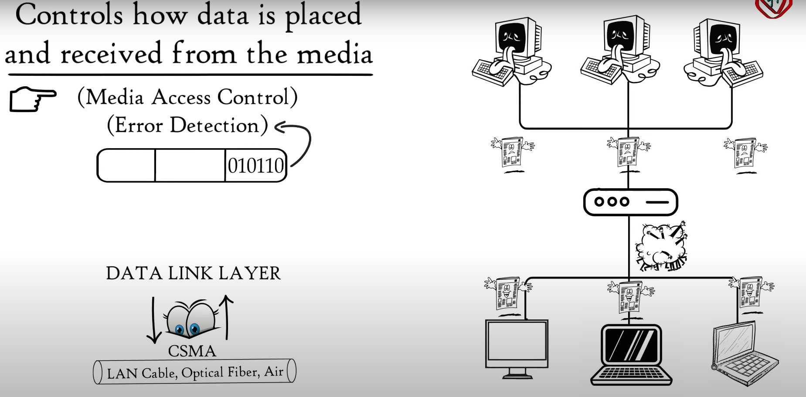

     

     - Data link layer also controls how data is placed and received from the media. 
     - The technique used to get the frame on and off the media is called <mark>media access control</mark>. 
     - There may be a number of devices connected to a common media. If two or more devices connected to same media send data at the same time,then there may be a possibility of collision of the two messages resulting in a useless message that neither recipient can understand. To avoid these situations, data link layer keeps an eye on when the shared media is free so that device can transmit data for the receiver. This is called carrier sense multiple access. So data link layer with its media access control methods controls data transmission. 
     - Tail of each frame contains bits which are used to detect errors in the received frame. Errors occur due to certain limitations of the media used for transmitting data. 

## 1.Physical Layer

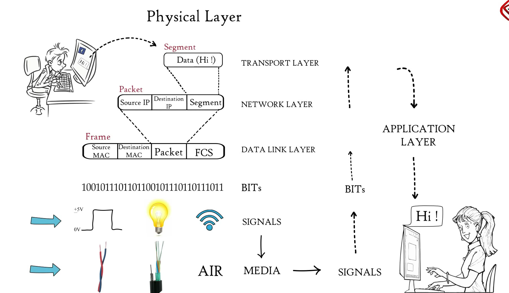

- Till now, data from application layer has been segmented by transport layer, 
- placed into packets by network layer and 
- framed by data link layer, which is a sequence of binary zeros and ones.
- Physical layer converts these binary sequence into signal and transmit over local media. It can be an electrical signal in case of copper cable or LAN cable, light signal in case of optical fiber and radio signal in case of air. So signal generated by physical layer depends on the type of media used to connect two devices.
- At the receiver, physical layer receives signals, convert it to bits and pass it to data link layer as a frame. Frame is further decapsulated as data moves through higher layers.  Finally, data is moved to application layer. Application layer protocol makes the sender's message visible in the application in the receiver's computer screen. In this way, OSI model is helping to transfer data between distant hosts.

