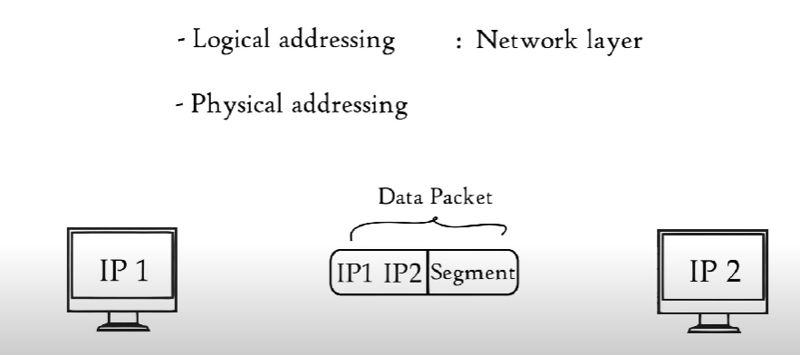
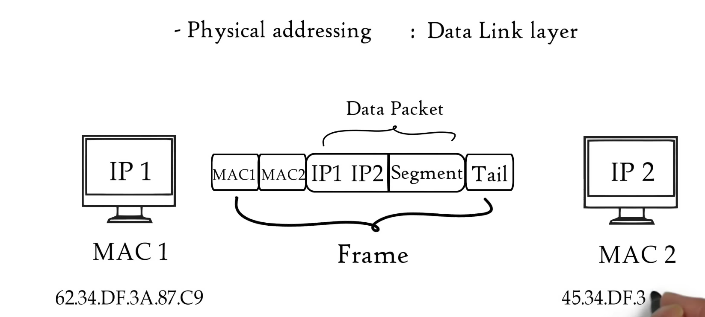

# 	    Data communication and networking

## *1.Communication*

Communication refers to the process of sending information from one place to another. This transmission involves signals that are interpreted as data, allowing information to be conveyed. This can happen electronically between two points over a physical connection medium.

###  Key Points:

1. **Sending Information**: Involves transferring data from one place to another.
2. **Transmission of Signals**: Signals carry the information and need to be interpreted as data.
3. Connection Mediums:
   - **Physical**: Includes cables, fiber optics, or other physical means through which electronic data is transmitted.
   - **Wireless**: Utilizes electromagnetic waves, such as radio waves, microwaves, and infrared, to transmit data without physical connections.

### Types of Communication

<u>Based on Medium:</u>

1. **Video**: Transmission of visual content, often accompanied by audio.
2. **Text**: Exchange of written messages, such as emails, SMS, and instant messaging.
3. **Voice**: Audio communication, including phone calls and voice messages.
4. **Data**: Transfer of digital information, such as files and databases.
5. **Multimedia**: Combination of text, audio, video, and data, such as video conferences and interactive applications.

<u>Based on Direction of Information Flow:</u>

1. One-way: Communication where information flows in a single direction without feedback.
   - **Examples**: Television broadcasting, radio broadcasting.
2. Interactive – Non real-time : Communication where information is exchanged, but not simultaneously.
   - **Examples**: Email, forums, and social media posts.
3. Interactive – Real-time : Communication where information is exchanged instantly.
   - **Examples**: Phone calls, video conferencing, instant messaging.

- Simplex = One-way communication.
- Half-duplex = Interactive, but not simultaneous.
- Full-duplex = Interactive and simultaneous.

<u>Based on Number of Parties Involved:</u>

1. Two-party : Communication between two individuals or entities.
   - **Examples**: One-on-one phone calls, private messaging.
2. Multi-party : Communication involving more than two participants.
   - **Examples**: Group chats, conference calls, webinars.

------

## *2. Network*

### Definition:

A network is a system that connects devices for communication, enabling data exchange and resource sharing among connected devices.

### Types of Networks:

- PSTN (Public Switched Telephone Network)
  - **Description**: A traditional circuit-switched network used for telephone communication over copper wires or fiber optic cables.
- LAN (Local Area Network)
  - **Description**: Connects computers and devices within a limited geographical area like an office building, campus, or home.
- Television Network
  - **Description**: Infrastructure for broadcasting television signals to viewers via cable, satellite, or terrestrial transmission.
- Vehicular Networks
  - **Description**: Networks enabling communication between vehicles (V2V) and between vehicles and infrastructure (V2I), supporting applications like traffic management and safety systems.
- Internet
  - **Description**: A global network of interconnected networks that facilitates worldwide communication and access to information and services.

### Components of a Network:

1. Terminals for Access:
   - Devices that allow users to connect to the network, such as computers, smartphones, printers, and IoT devices.
2. Equipment for Switching:
   - Devices that manage the routing and switching of data within the network, such as routers, switches, and gateways.
3. Media for Transmission: Physical mediums through which data is transmitted, including:
   1. **Copper Wires**: Used in traditional telephone networks (PSTN) and Ethernet LANs.
   2. **Fiber Optic Cables**: Used in high-speed LANs and long-distance communications.
   3. **Wireless Spectrum**: Utilized by wireless LANs (Wi-Fi), cellular networks, and satellite communications.

### Challenges in a network

> In this course we will learn the Layering

### Layered Architecture

In network and communication systems, a layered architecture refers to a structured approach where functionalities are divided into distinct layers, each handling specific tasks. Here are some key characteristics and examples:

- **Separate Functional Layers**: Each layer in the architecture serves a specific function, such as data transmission, error detection, or application support.
- **Transparent Implementation**: Layers are designed to be independent of each other, with well-defined interfaces for communication. This transparency allows changes in one layer to be implemented without affecting others.
- **Flexible to Modify**: The modular nature of layered architecture enables flexibility in modifying and upgrading individual layers without impacting the entire system.
- **Independent Design and Testing**: Layers can be designed, implemented, and tested independently, facilitating easier troubleshooting and maintenance.
- **Examples**:
  - **OSI Reference Model**: Developed by the International Organization for Standardization (ISO), this model defines seven layers from physical to application layers, serving as a guideline for designing and understanding network protocols and systems.
  - **TCP/IP Model**: The Transmission Control Protocol/Internet Protocol model is a simpler and widely used alternative to the OSI model, consisting of four layers: Application, Transport, Internet, and Link.

Layered architecture provides a structured framework for building complex systems, ensuring scalability, interoperability, and ease of maintenance in network and communication technologies.

#### OSI model (Open Systems Interconnection)

### 1. Physical Layer

#### Purpose:

*`The physical layer of the OSI model is responsible for accepting a raw string of bits and deliver it across a link. Its primary purpose is to ensure that data can be transmitted reliably across the physical link between devices.`*

#### Functions:

1. **Encoding and Signaling**:
   - Converts digital data into signals suitable for transmission over the physical medium.
   - Includes modulation techniques that encode data into waveforms that can be transmitted over cables or wireless channels.
2. **Data Transmission and Reception**:
   - Handles the actual transmission and reception of data bits.
   - Manages timing and synchronization of data signals to ensure accurate delivery.
3. **Topology and Physical Network Design**:
   - Defines the physical layout of the network, including the arrangement of devices and cables.
   - Determines network topology (e.g., bus, star, mesh) that affects how devices communicate.
4. **Hardware Specifications**:
   - Specifies operations of physical hardware devices such as cables, connectors, wireless radio transceivers, and network interface cards (NICs).
   - Ensures compatibility and performance of hardware components in transmitting and receiving data.

#### Examples :computer:

- **Encoding and Signaling**: Techniques like Manchester encoding, NRZ (Non-Return-to-Zero), and modulation schemes (e.g., QAM for wireless).
- **Data Transmission**: Sending bits across Ethernet cables or transmitting wireless signals.
- **Topology and Design**: Structuring networks as bus, ring, star, or mesh configurations.
- **Hardware Specifications**: Specifications for Ethernet cables (e.g., CAT5, CAT6), connectors (RJ45), wireless standards (802.11ac), NICs (Ethernet cards).

The physical layer forms the foundation of network communication by ensuring that data can be reliably transmitted and received across physical links, adhering to hardware specifications and network design principles.

### 2. Data Link Layer

#### Purpose:

*`The data link layer of the OSI model is primarily concerned with providing error-free transmission of data over a single link  (or hop) between devices`*. It ensures reliable and efficient communication between directly connected nodes.

#### Functions:

1. **Data Framing**:
   - Divides the data received from the network layer into manageable frames.
   - Adds header and trailer information to each frame to facilitate its transmission and reception.
2. **Error Detection and Handling**:
   - Detects and corrects errors that may occur during data transmission.
   - Uses techniques like checksums and CRC (Cyclic Redundancy Check) to verify data integrity and detect transmission errors.
3. **Flow Control**:
   - Manages the flow of data between devices to prevent congestion and ensure smooth transmission.
   - Implements mechanisms such as buffering and windowing to regulate the rate of data transfer.
4. **Addressing - Hardware Level**:
   - Assigns physical addresses (MAC addresses) to devices connected to the same network segment.
   - Uses MAC (Media Access Control) addresses to uniquely identify devices and enable direct communication within the local network.

#### Examples:

- **Data Framing**: Encapsulation of packets into frames with header and trailer information (e.g., Ethernet frames).
- **Error Detection and Handling**: CRC checks performed on received frames to verify data integrity.
- **Flow Control**: Sliding window protocol to manage the flow of data between sender and receiver.
- **Addressing - Hardware Level**: MAC addresses assigned to NICs to identify devices on the same Ethernet network segment.

The data link layer plays a crucial role in ensuring reliable and error-free transmission of data within a single network link, handling tasks such as framing, error detection, flow control, and hardware-level addressing. It acts as a bridge between the physical layer and the network layer, facilitating seamless communication between devices on the same network segment.

### 3. Network Layer

#### Purpose:

*`The network layer of the OSI model is responsible for delivering packets (datagrams) from the source host to the destination host across multiple networks. Its primary role is to ensure efficient and reliable data transmission across the entire network.`*

#### Functions:

1. **Logical Addressing**:
   - Assigns logical addresses (IP addresses) to devices within the network.
   - Allows routing devices to determine where to forward packets based on destination IP addresses.
2. **Routing**:
   - Determines the optimal path for data packets to reach their destination.
   - Uses routing algorithms and protocols (e.g., OSPF, BGP) to make forwarding decisions based on network topology and routing metrics.
3. **Datagram Encapsulation**:
   - Encapsulates data received from the transport layer into datagrams.
   - Adds header information (including source and destination IP addresses) to facilitate packet routing and delivery.
4. **Congestion Control**:
   - Manages the flow of data packets to prevent network congestion.
   - Uses techniques such as traffic shaping and congestion avoidance algorithms to regulate the rate of data transmission.
5. **Quality of Service (QoS)**:
   - Provides mechanisms to guarantee certain levels of service for different types of traffic.
   - Ensures that critical applications (e.g., VoIP, video streaming) receive adequate bandwidth and minimal latency.

#### Examples:

- **Logical Addressing**: IPv4 and IPv6 addressing schemes used to identify devices on the network.
- **Routing**: Dynamic routing protocols (e.g., RIP, OSPF) and static routing configurations determine paths between networks.
- **Datagram Encapsulation**: IP headers added to transport layer segments to form IP datagrams.
- **Congestion Control**: TCP congestion control mechanisms like congestion window adjustment.
- **Quality of Service**: Differentiated Services (DiffServ) and Integrated Services (IntServ) to prioritize and manage traffic based on QoS requirements.

The network layer shields higher layers from the complexities of network routing and ensures that data packets are delivered efficiently across interconnected networks. It plays a crucial role in enabling global connectivity and communication in modern computer networks.

## 

### 4. Transport Layer

#### Purpose:

The transport layer of the OSI model is responsible for providing reliable, end-to-end communication between hosts. It ensures that data is delivered accurately and in the correct order from one host to another.

#### Functions:

1. **Connection Establishment, Management, and Termination**:
   - Establishes a connection between the sending and receiving hosts.
   - Manages the ongoing communication to ensure data integrity and order.
   - Terminates the connection once the communication session is complete.
2. **Multiplexing and Demultiplexing**:
   - Allows multiple applications to share the same network connection.
   - Uses port numbers to distinguish between different applications and services.
   - Ensures that data is delivered to the correct application.
3. **Error Detection and Correction**:
   - Detects and corrects errors that may occur during data transmission.
   - Ensures data integrity by retransmitting lost or corrupted packets.
4. **Flow Control**:
   - Manages the rate of data transmission between hosts to prevent overwhelming the receiver.
   - Uses mechanisms like windowing to ensure smooth data flow.
5. **Quality of Service (QoS)**:
   - Provides mechanisms to ensure that certain types of traffic receive the required level of service.
   - Ensures that applications with high priority or specific requirements (e.g., low latency for VoIP) receive appropriate resources.

#### Examples:

- **Connection Establishment, Management, and Termination**: TCP three-way handshake for connection setup and FIN/ACK for connection termination.
- **Multiplexing and Demultiplexing**: TCP and UDP use port numbers to identify specific processes or services (e.g., HTTP on port 80, FTP on port 21).
- **Error Detection and Correction**: TCP uses checksums for error detection and automatic retransmission of lost packets.
- **Flow Control**: TCP uses sliding window protocol to manage data flow between sender and receiver.
- **Quality of Service**: Techniques like TCP window scaling and priority queuing to ensure QoS requirements are met.

The transport layer ensures reliable and efficient communication between hosts by managing connections, controlling data flow, and providing error detection and correction. It plays a critical role in delivering a seamless and reliable user experience in network communications.

### 5. Session Layer

#### Purpose:

The session layer of the OSI model provides mechanisms for establishing, managing, and terminating sessions between applications. It controls the dialog between two end-users (applications) and ensures that the communication is properly synchronized and managed.

#### Functions:

1. **Dialog Control**:
   - Manages the communication between two devices, determining whether the communication is full-duplex (both devices can send and receive simultaneously) or half-duplex (only one device can send or receive at a time).
2. **Token Management**:
   - Prevents simultaneous transmission by managing the tokens, ensuring that only one device can send data at a time in a controlled manner.
   - Helps in avoiding collisions and managing access to the communication channel.
3. **Synchronization**:
   - Inserts synchronization points into the data stream to ensure that data can be accurately reconstructed at the destination.
   - Allows for coordinated recovery and resumption of communication in case of interruptions.
4. **Recovery Management**:
   - Provides mechanisms for detecting and recovering from errors, ensuring that communication sessions can resume smoothly after an interruption or failure.
5. **Not Often Implemented in Real Systems**:
   - In practice, the functionality of the session layer is often incorporated into other layers (such as the transport layer or the application layer) rather than implemented as a distinct layer.

#### Examples:

- **Dialog Control**: Managing full-duplex communication in VoIP calls, where both parties can speak and listen simultaneously.
- **Token Management**: Token Ring network protocol, where a token circulates around the network and grants the right to transmit to a device.
- **Synchronization**: Checkpoints in data transfer protocols that allow the transfer to be resumed from a specific point in case of failure.
- **Recovery Management**: Reestablishing a session after a network failure, ensuring that data transfer resumes from the last known good state.

The session layer is responsible for managing and coordinating the interactions between applications, ensuring that communication is orderly and can be recovered in case of failures. While not always implemented as a distinct layer in real-world systems, its functions are essential for reliable and synchronized communication between applications.

### 6. Presentation Layer

#### Purpose:

The presentation layer of the OSI model is responsible for formatting data for transmission. It ensures that the data sent from the application layer of one system can be read and interpreted correctly by the application layer of another system.

#### Functions:

1. **Translation**:
   - Converts data between different formats to ensure compatibility between disparate systems.
   - Examples include converting character encoding from ASCII to EBCDIC or vice versa, and data serialization.
2. **Compression**:
   - Reduces the size of data to be transmitted to optimize bandwidth usage and improve transmission speed.
   - Examples include text compression using algorithms like gzip or multimedia compression with formats like JPEG and MPEG.
3. **Encryption**:
   - Ensures data privacy and security by encrypting data before transmission and decrypting it upon reception.
   - Examples include SSL/TLS for secure web communication and AES (Advanced Encryption Standard) for data encryption.
4. **In Practice**:
   - The functionality of the presentation layer is often integrated into other layers, such as the application layer, rather than being implemented as a distinct layer in real-world systems.

#### Examples:

- **Translation**: Character encoding conversion (e.g., UTF-8 to ASCII), data serialization formats like XML or JSON.
- **Compression**: Compressing files with ZIP for storage or transmission, video compression with H.264.
- **Encryption**: Using SSL/TLS protocols to secure HTTPS connections, encrypting email communications with PGP.

The presentation layer ensures that data is properly formatted, compressed, and encrypted for transmission, facilitating interoperability between different systems and enhancing security and efficiency in communication. Although not always implemented as a distinct layer, its functions are crucial for effective data transmission and reception.

### 7. Application Layer

#### Purpose:

The application layer of the OSI model provides network-based applications directly to users. It enables end-users to interact with network services and perform various tasks over the network.

#### Functions:

The application layer supports a wide range of network-based applications, including but not limited to:

- **File Transfer**: Facilitates the transfer of files between computers over a network.
  - Example: FTP (File Transfer Protocol)
- **Electronic Mail**: Enables the sending and receiving of emails.
  - Examples: SMTP (Simple Mail Transfer Protocol), IMAP (Internet Message Access Protocol), POP3 (Post Office Protocol)
- **World Wide Web**: Allows users to access and interact with web pages and websites.
  - Example: HTTP (Hypertext Transfer Protocol), HTTPS (HTTP Secure)
- **Virtual Terminal**: Provides remote access to network devices and systems.
  - Example: Telnet, SSH (Secure Shell)
- **Instant Messaging**: Facilitates real-time text communication between users.
  - Examples: XMPP (Extensible Messaging and Presence Protocol), IRC (Internet Relay Chat)
- **Directory Services**: Provides access to distributed directory databases to locate resources within a network.
  - Example: LDAP (Lightweight Directory Access Protocol)
- **Remote File Systems**: Allows users to access and manage files on remote systems as if they were local.
  - Example: NFS (Network File System), SMB (Server Message Block)

#### Standardization:

Some widely used applications are standardized to ensure interoperability and compatibility across different systems and platforms. Standardized protocols define how these applications should function and communicate over the network.

- **File Transfer Protocol (FTP)**: Standardized for transferring files.
- **Hypertext Transfer Protocol (HTTP)**: Standardized for web communication.
- **Simple Mail Transfer Protocol (SMTP)**: Standardized for email transmission.

The application layer is the topmost layer of the OSI model, providing essential network-based applications and services to end-users. It facilitates various tasks such as file transfer, web browsing, email communication, and remote access, ensuring that users can efficiently and securely interact with network resources.

### summary

| **Layer**          | **Purpose**                                          | **Key Functions**                                            | **Examples**                                        | **Data Units**                 |
| ------------------ | ---------------------------------------------------- | ------------------------------------------------------------ | --------------------------------------------------- | ------------------------------ |
| **7. Application** | Provide network-based applications to users          | File transfer, email, web, virtual terminal, instant messaging, directory services, remote file systems | HTTP, FTP, SMTP, Telnet, SSH                        | Data                           |
| **6.Presentation** | Formatting data for transmission                     | Translation, compression, encryption                         | SSL/TLS, JPEG, MPEG, ASCII                          | Data                           |
| **5. Session**     | Control dialog between applications                  | Dialog control, token management, synchronization, recovery management | NetBIOS, RPC                                        | Data                           |
| **4. Transport**   | Provide end-to-end delivery from one host to another | Connection establishment, multiplexing, error detection and correction, flow control, quality of service | TCP, UDP                                            | Segments (TCP), Datagram (UDP) |
| **3. Network**     | Deliver packets across a communications network      | Logical addressing, routing, datagram encapsulation, congestion control, quality of service | IP, ICMP, RIP, OSPF                                 | Packets                        |
| **2. Data Link**   | Provide error-free transmission across a single link | Data framing, error detection and handling, flow control, hardware addressing | Ethernet, Wi-Fi, PPP                                | Frames                         |
| **1. Physical**    | Transmit raw bits over a physical medium             | Encoding and signaling, data transmission and reception, topology, hardware specifications | Ethernet cables, fiber optics, wireless radio waves | Bits                           |

------

### Communication in OSI  Model

------

# Scope of CS2033 

------

Each layer contains a set of protocols. When talk about application layer it does not mean computer applications like chrome, edge etc. But it includes application layer protocols that are needed to make these applications work correctly in a network or internet.

## 7. Application layer

- Used by network applications (computer applications that use internet)

- Application layer provides services for network applications with the help of protocols to perform user activities.

## 6. presentation layer

-  Presentation layer receives data from application layer. This data is in the form of characters and numbers. Presentation layer converts this characters and numbers  to a binary format.

- Presentation layer performs THREE BASIC FUNCTIONS.

  1. Translation
  2. Data Compression : Very helpful at real time audio / video streaming
  3. Encryption: Encryption is done at the senders and decryption is done at the receivers end (using SSL protocol)

  

  

## 5. Session layer

- Suppose you have planned a party. You have hired few helpers ensuring that each activity runs smoothly. Helpers will help you in setting up , assisting , cleaning , and then closing the party , same as the case with session layer. <mark>Session layer helps in setting up and managing connections enabling sending and reciving data followed by termination of connection or sessions </mark> 
- As helpers in party session layer has its own helpers called API's.  ex:- NETBIOS : allows application on different computers to communicate with each other.

	

-  Just before a session or a connection is established with the server, server performs a function called <u>authentication</u>. Authentication is the process of verifying who you are. For this, server uses a username and a password. Once entered username and password are matched, a session or a connection is established between your computer and the server. After authenticating the user, authorization is checked. <u>Authorization</u> is the process used by server to determine if you have permission to access a file. If not, you will get a message saying you are not authorized to access this page.

-  Both of these functions, authentication and authorization, are performed by session layer. Session layer keeps a track of the files that are being downloaded. For example, a web page contains text, images, etc. These text and images are stored as separate files on the web server. When you request a website in your web browser, your web browser opens a separate session to the web server to download each of these text and image files separately. These files are received in the form of data packets. Session layer keeps a track of which data packet belongs to which file, either text file or image file, and tracks where the received data packet go. In this case, it goes to web browser, that is, session layer helps in session management. <mark>So session layer helps in session management, authentication, and authorization. </mark>

  

  

  > Your web browser performs all functions of session, presentation, and application layer. 
  >
  > 

 

## 4. Transport layer

- Transport layer controls the reliability of communication through segmentation, flow control, and error control.

1. Segmentation

   

   

   -  In segmentation, data received from session layer is divided into small data units called segments. Each segment contains a source and destination's port number and a sequence number.

   - Port number helps to direct each segment to the correct application, and sequence number helps to reassemble segments in the correct order to form correct message at the receiver.

     
     

2. Flow Control

   

   

   -  In flow control, transport layer controls the amount of data being transmitted. Consider, our mobile is connected to a server. Suppose, server can transmit data maximum at 100 Mbps, and our mobile can process data maximum at 10 Mbps. Now, we are downloading a file from the server, but server starts sending data at 50 Mbps, which is greater than the rate our mobile can process. So mobile phone with the help of transport layer can tell the server to slow down data transmission rate up to 10 Mbps so that no data gets lost. Similarly, if server is sending data at 5 Mbps, mobile phone tells the server to increase data transmission rate to 10 Mbps to maintain system performance.

     

3. Error Control

   

   - Transport layer also helps in error control. If some data does not arrive the destination, transport layer uses automatic repeat request schemes to retransmit the lost or corrupted data. A group of bits called checksum is added to each segment by the transport layer to find out received corrupted segment. 

     

   

#### protocols of transmission layer

- Protocols of transport layer are Transmission Control Protocol or TCP and User Datagram Protocol or UDP. Transport layer performs two types of services, Connection Oriented Transmission and Connectionless Transmission. Connection Oriented Transmission is done via TCP while Connectionless Transmission is done via UDP.

- TCP is faster than UD P because it does not provide any feedback whether data was really delivered whereas TCP provides a feedback therefore lost data can be retransmitted in TCP.

- DP is used where it does not matter whether we have received all data, for example online streaming movies, songs, games, voice over IP, TFTP, DNS, etc. On the other hand, TCP is used where full data delivery is must, for example World Wide Web, Email,FTP, etc.

  

So transport layer is involved in segmentation, flow control, error control, connection oriented and connectionless transmission.

> Transport layer passes data segments through the network layer.
>
> 

## 3. Network layer

Network layer works for the transmission of the received data segments from one computer to another located in different networks. Data units in the network layer are called packets. 

It is the layer where routers reside. 

The functions of network layer are logical addressing, routing and path determination. 

<u>Logical Addressing</u>

IP addressing done in network layer is called logical addressing. Every computer in a network has a unique IP address. Network layer assigns sender and receiver's IP address to each segment to form an IP packet. IP addresses are assigned to ensure that each data packet can reach the correct destination. 

<u>Routing</u>

Routing is a method of moving data packet from source to destination and it is based on the logical address format of IPv4 or IPv6. 

Suppose computer A is connected to network 1 and computer B is connected to network 2. From computer B we have requested to access Facebook.com and now there is a reply from Facebook server for computer B in the form of of packet. This packet needs to be delivered to computer B only. Since in a network each device has a unique IP address so these both computers will be having a unique IP address as well. Network layer of the Facebook server has already added sender and receivers IP address in the packet. Suppose mask use is 225 .225 .225 .0 This mask tells that the first three combination represents network while the last combination represents host or computer B. So based on IP address format received data packet will move first to network 2 and then to computer B. So based on IP address and mask routing decisions are made in a computer network.

<u>Path determination</u>

- A computer can be connected to Internet server or a computer in a number of ways. Choosing the best possible path for data delivery from source to destination is called path determination. Layer 3 devices use protocols such as open shortest path first, border gateway protocol, intermediate system to intermediate system to determine the best possible path for data delivery. 

## 2. Data Link Layer

-  Data link layer receives data packet from network layer. Data packets contain IP addresses of sender and receiver. 

- There are two kinds of addressing, logical addressing and physical addressing. 

  

  1. Logical addressing is done at network layer where sender and receivers IP addresses are assigned to each segment to form a data packet. 
     

     

  2. Physical addressing is done at data link layer where MAC addresses of sender and receiver are assigned to each data <mark>packet to form a frame</mark>. MAC address is a 12 digit alphanumeric number embedded in network interface card of your computer by your computer manufacturer. 

     

     

     

- <mark>Data unit in data link layer is called frame.</mark>

-  Data link layer is embedded as software in network interface card of a computer and provide means to transfer data from one computer to another via a local media. Local media includes copper wire, optical fiber or air for radio signals. Please note here media does not correspond to audio, video or animation. It refers to the physical links between two or more computers or networks. 

  

- Data link layer performs two basic functions. 

  1. It allows upper layers of OSI model to access media using techniques such as framing. 
     

     

     - Consider two distant hosts, a laptop and a desktop communicating with each other. As laptop and desktop are connected to different networks, so they will be using network layer protocols, IP for example, to communicate with each other. 
     - In this example, desktop is connected to router R1 via an Ethernet cable. Router R1 and R2 are connected via a satellite link. And laptop is connected to router R2 via a wireless link.
     -  Now desktop wants to send some data to laptop. Based on the medium used to connect desktop and router R1, data link layer adds some data in the head and tail of IP packet and converts it to a frame, Ethernet frame in this case. Router R1 receives this Ethernet frame, decapsulate it to an IP packet and then encapsulate it again to a frame so that it can cross satellite link to reach router R2. 
     - Router R2 will again decapsulate the received frame and encapsulate it again to form a wireless data link frame. Laptop receives this wireless data link frame, decapsulate it and then forward IP packet to network layer. Finally, data arrives application layer. Application layer protocols then make the received data visible on computer screen. 
     - <mark>So network layer or higher level layers are able to transfer data over media with the help of data link layer. That is, data link layer provides access to media for higher layers of OSI model.</mark>

     

     

     
     
  2. It controls how data is placed and received from media using techniques such as media access control and error detection.
     
  
     
  
     - Data link layer also controls how data is placed and received from the media. 
     - The technique used to get the frame on and off the media is called <mark>media access control</mark>. 
     - There may be a number of devices connected to a common media. If two or more devices connected to same media send data at the same time,then there may be a possibility of collision of the two messages resulting in a useless message that neither recipient can understand. To avoid these situations, data link layer keeps an eye on when the shared media is free so that device can transmit data for the receiver. This is called carrier sense multiple access. So data link layer with its media access control methods controls data transmission. 
     - Tail of each frame contains bits which are used to detect errors in the received frame. Errors occur due to certain limitations of the media used for transmitting data. 

## 1.Physical Layer

- Till now, data from application layer has been segmented by transport layer, 
- placed into packets by network layer and 
- framed by data link layer, which is a sequence of binary zeros and ones.
-  Physical layer converts these binary sequence into signal and transmit over local media. It can be an electrical signal in case of copper cable or LAN cable, light signal in case of optical fiber and radio signal in case of air. So signal generated by physical layer depends on the type of media used to connect two devices.
-  At the receiver, physical layer receives signals, convert it to bits and pass it to data link layer as a frame. Frame is further decapsulated as data moves through higher layers. 