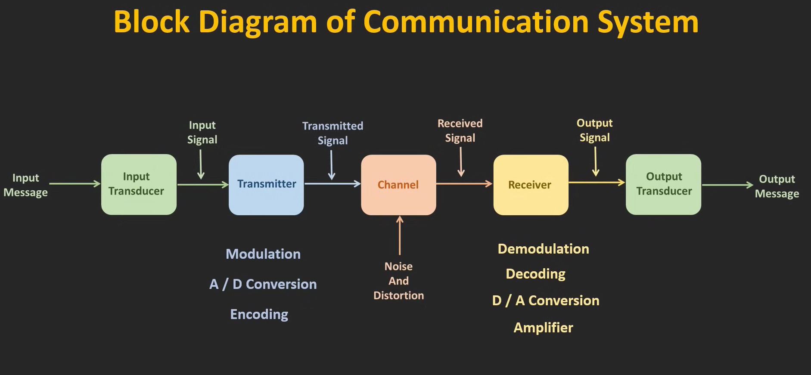

# <u>Encoding and Modulation</u>

> ### 1. **Encoding**
>
> Encoding refers to the process of converting data from one form into another for the purpose of transmission, storage, or processing. In the context of digital communication, encoding typically involves transforming digital data (binary sequences) into a specific format or signal that can be transmitted over a communication channel.
>
> <mark> occurs in Physical and presentation layers</mark>
>
> ### 2. **Modulation**
>
> Modulation refers to the process of varying a carrier signal's properties (such as amplitude, frequency, or phase) in accordance with the data signal. This process enables the data to be transmitted over long distances and through various types of media, which might not support direct transmission of the original signal.
>
> <mark> occurs in Physical layer</mark>
>
> ### **Relation Between Encoding and Modulation**
>
> In a typical communication system, data is first encoded to prepare it for transmission and to ensure it can be correctly received even in the presence of noise. The encoded data is then modulated onto a carrier signal, which is transmitted over the communication channel. At the receiver end, the process is reversed: the signal is demodulated to extract the encoded data, which is then decoded to retrieve the original information.
>
> 
>
> ## <u>In simple terms</u>
>
> ### **Encoding:**
>
> Think of encoding like putting your message in a special code. For example, let’s say you want to tell your friend "Hello!" Instead of just saying it, you could decide that each letter of your message will be represented by a specific toy car movement:
>
> - **H** could be a *honk*.
> - **E** could be a *turn left*.
> - **L** could be *drive forward*.
> - **O** could be *turn right*.
>
> So, to send "Hello," you honk, turn left, drive forward, drive forward again, and then turn right. This special code is how you "encode" your message.
>
> ### **Modulation:**
>
> Now, imagine you have to send your toy car down a road to get to your friend’s house. But here’s the tricky part: sometimes the road is bumpy, sometimes it’s smooth, and sometimes it’s curvy. To make sure your car can drive on any kind of road, you have to adjust how fast it goes, how high it jumps over bumps, or how it turns around curves. This is called modulation.
>
> - If the road is bumpy, you might slow down your car (change the speed).
> - If it’s a curvy road, you might need to turn the steering wheel more (change the direction).
> - If it’s a steep hill, you might need to give the car more power (change the strength).
>
> Modulation is like adjusting the car so it can drive smoothly on any road and deliver your encoded message to your friend.
>
> ### **Putting It All Together:**
>
> First, you encode your message by deciding what movements the toy car will make. Then, you modulate how the car drives on the road to make sure it gets to your friend’s house without crashing. When your friend receives the car, they can watch the movements to decode the message you sent: "Hello!"


>  <u>*Encoding Techniques*</u>
>
>  - Digital data, digital signal
>  - Analog data, digital signal
>  - Digital data, analog signal 
>  - Analog data, analog signal 

# 1. Digital data, Digital Signal


> <u>*Terms*</u>
>
> -  Unipolar —All signal elements have same sign 
>
> -  Polar —One logic state represented by positive voltage the  other by negative voltage 
>
> -  Data rate —Rate of data transmission in bits per second 
>
> -  Duration or length of a bit —Time taken for transmitter to emit the bit (When you are sending a digital signal, they are represented by certain voltage levels. We have to maintain that voltage for a certain period of time in order to transfer data properly)
>
>   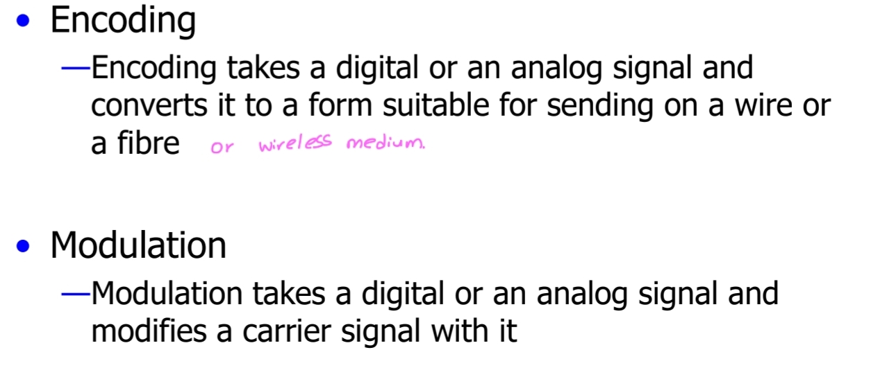
>
>   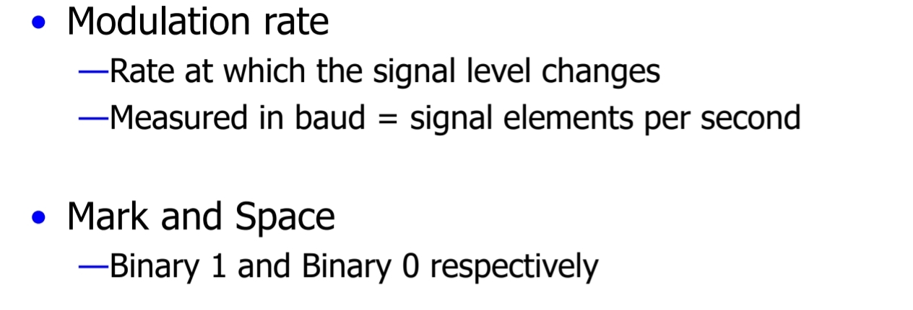

## *1.Baseband vs Broadband* :round_pushpin:

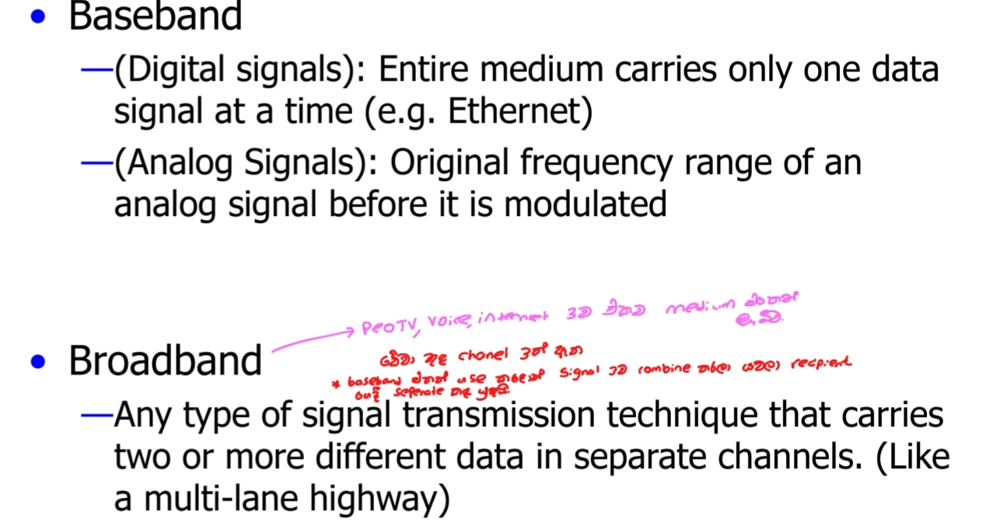

------

## *2.Interpreting signals* :signal_strength:

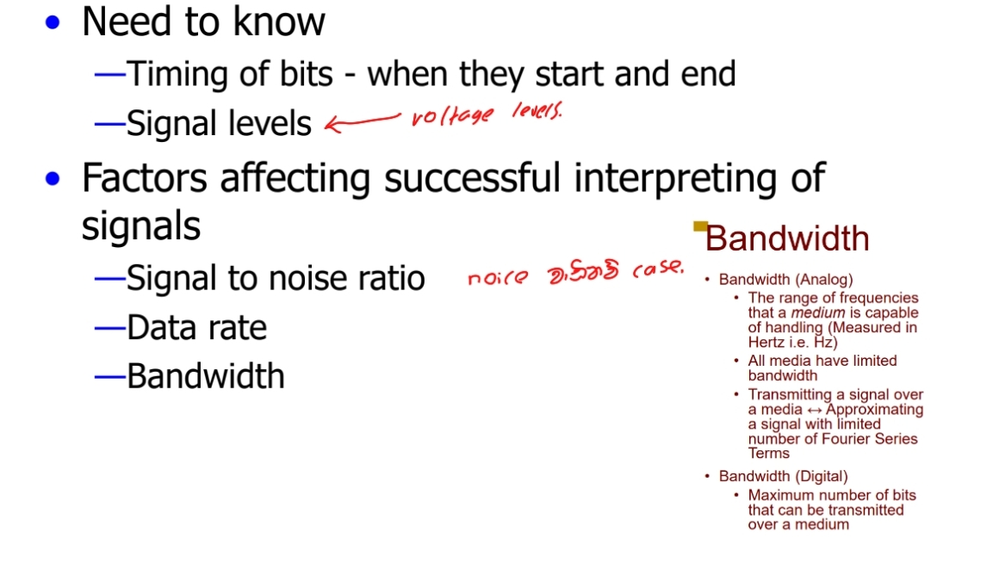

------

## *3.Encoding Schemas* :envelope_with_arrow: 

> ## Line Encoding Techniques
>
> The following are common line encoding techniques used in digital communication: 
>
> 1. Nonreturn to Zero-Level (NRZ-L) 
>
> 2. Nonreturn to Zero Inverted (NRZI)
>
> 3. Multilevel binary 
>      :gear:  Bipolar -AMI 
>
>      :arrow_up_down:  Pseudo ternary
>
> 4. BiPhase
>
>    1. Manchester 
>    2. Differential Manchester 
>
> 5. Scrambling :recycle:
>
>    1. B8ZS 
>    2. HDB3

#### 1.<u>Nonreturn to Zero_Level (NRZ-L)</u>

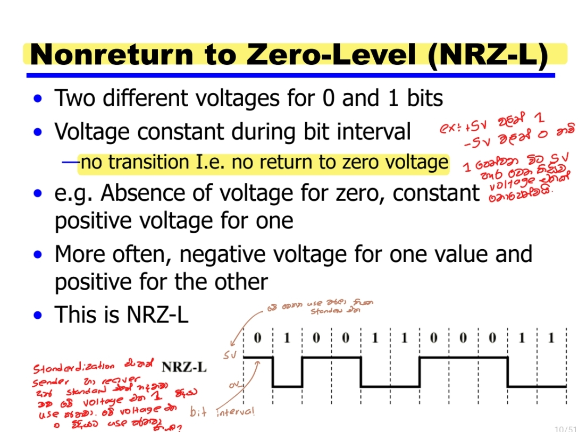

####  2.<u>Nonreturn to Zero inverted (NRZI)</u> 

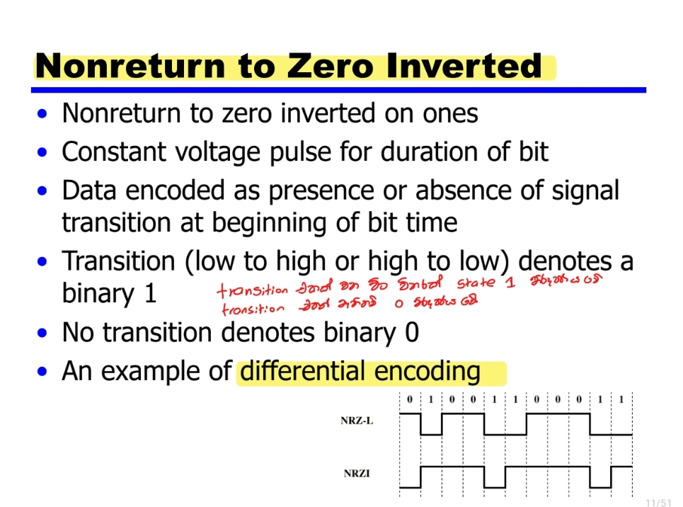

>  <u>Differential encoding</u>: Data represented by changes rather than levels
>
>  • Advantage —More reliable detection of transition rather than level 
>
> • Disadvantage —In complex transmission layouts it is easy to lose  sense of polarity

Let's compare Non-Return-to-Zero (NRZ) and Non-Return-to-Zero Inverted (NRZI) encoding methods using an example.

Let's consider the binary sequence: **1011001**.

<u>NRZ Encoding:</u>

In NRZ level encoding, the binary data directly maps to two different voltage levels:

- `1` is represented by a high voltage (e.g., +V).
- `0` is represented by a low voltage (e.g., 0V or -V).

For the sequence **1011001**, NRZ encoding would look like this:

| Bit  | 1    | 0    | 1    | 1    | 0    | 0    | 1    |
| ---- | ---- | ---- | ---- | ---- | ---- | ---- | ---- |
| NRZ  | +V   | 0V   | +V   | +V   | 0V   | 0V   | +V   |

In this example:

- The signal is high (+V) when the bit is `1`.
- The signal is low (0V) when the bit is `0`.

<u>NRZI Encoding:</u>

In NRZI encoding, the binary data is represented by the **changes** or **lack of changes** in the signal level:

- `1` causes the signal to invert (change state).
- `0` causes the signal to remain at the same level.

For the same sequence **1011001**, NRZI encoding would look like this:

1. Start at a base level (let's assume 0V as the starting level).
2. The first bit is `1`, so invert the signal (change from 0V to +V).
3. The second bit is `0`, so keep the signal at +V.
4. The third bit is `1`, so invert the signal (change from +V to 0V).
5. The fourth bit is `1`, so invert the signal (change from 0V to +V).
6. The fifth bit is `0`, so keep the signal at +V.
7. The sixth bit is `0`, so keep the signal at +V.
8. The seventh bit is `1`, so invert the signal (change from +V to 0V).

| Bit  | 1    | 0    | 1    | 1    | 0    | 0    | 1    |
| ---- | ---- | ---- | ---- | ---- | ---- | ---- | ---- |
| NRZI | +V   | +V   | 0V   | +V   | +V   | +V   | 0V   |

Key Differences:

- **NRZ**:
  - The <cl>signal level directly corresponds to the bit value (`1` = +V, `0` = 0V).
  - Long sequences of `1`s or `0`s can cause issues with synchronization and DC bias.
- **NRZI**:
  - The signal level changes only when a `1` is encountered; it stays the same for `0`.
  - Helps in maintaining synchronization, especially with long sequences of `1`s, but can still have issues with long sequences of `0`s.

Visualization:

- **NRZ**:
  - For the sequence 1011001, the signal would look like a series of square waves directly corresponding to the bits.
- **NRZI**:
  - For the same sequence, the signal would consist of changes (inversions) at the positions of `1`s and flat levels at `0`s, creating a pattern that emphasizes transitions over static levels.

NRZI is particularly useful in scenarios where transitions in the signal help in clock recovery and maintaining synchronization, which is not as effectively handled by standard NRZ encoding.

##### <u>NRZ pros and Cons</u>

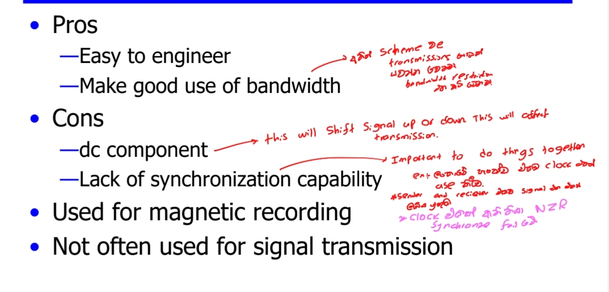

- **DC Component**: In the context of a digital signal, the DC component is the average value of the signal over time. If the signal tends to stay at a particular voltage level for extended periods, it can create a non-zero average (DC) level. Therefore the receiver can't efficiently interpret the signal. We have to use techniques like scrambling. This DC component will cause to the lack of synchronization capability.
- Both NRZ and NRZI suffer from synchronization issues when there are long sequences of identical bits (either all '0's or all '1's). This lack of transitions makes it difficult for the receiver to align its clock with the transmitter's clock, resulting in potential misinterpretation of the data. To overcome these limitations, encoding schemes that ensure frequent transitions, such as Manchester encoding or 8b/10b encoding, are often used.

------

#### 3.<u>Multilevel Binary</u>

Multilevel binary encoding is a method of representing binary data using more than two discrete voltage levels. Unlike traditional binary encoding, where only two levels (high and low) are used to represent `1` and `0`, multilevel binary encoding employs multiple voltage levels to represent combinations of bits within a single signal unit.

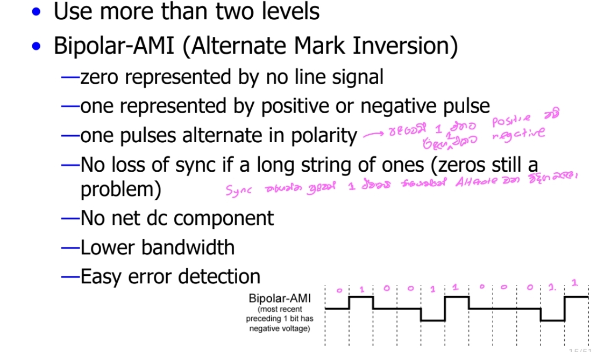

Key Concepts:

1. **Multiple Levels**: In multilevel binary encoding, the number of distinct voltage levels is greater than two. Each level can represent a combination of binary digits (bits).
2. **Increased Data Throughput**: By using more levels, it is possible to encode more bits in a single signal unit, thereby increasing the data transmission rate without increasing the signal bandwidth.
3. **Noise Sensitivity**: With more levels, the system becomes more sensitive to noise, as the difference between adjacent levels is smaller, making it easier for noise to cause errors.
4. **Synchronization**: Proper synchronization and timing are crucial in multilevel binary systems, as small errors in timing or amplitude can lead to misinterpretation of the data.

Example:

Let's take the same binary sequence: **10101100**.

Bipolar AMI Encoding:

- **1** → +V (First `1`)
- **0** → 0V
- **1** → -V (Next `1`, opposite of the last `1`)
- **0** → 0V
- **1** → +V (Next `1`, opposite of the last `1`)
- **1** → -V (Next `1`, opposite of the last `1`)
- **0** → 0V
- **0** → 0V

Signal Representation:

| Bit  | 1    | 0    | 1    | 0    | 1    | 1    | 0    | 0    |
| ---- | ---- | ---- | ---- | ---- | ---- | ---- | ---- | ---- |
| AMI  | +V   | 0V   | -V   | 0V   | +V   | -V   | 0V   | 0V   |

Multilevel binary encoding is essential in modern communication systems where high data rates are required within limited bandwidth, and it represents a trade-off between complexity, data rate, and noise immunity.

------

#### 4.<u>Pseudo ternary</u>

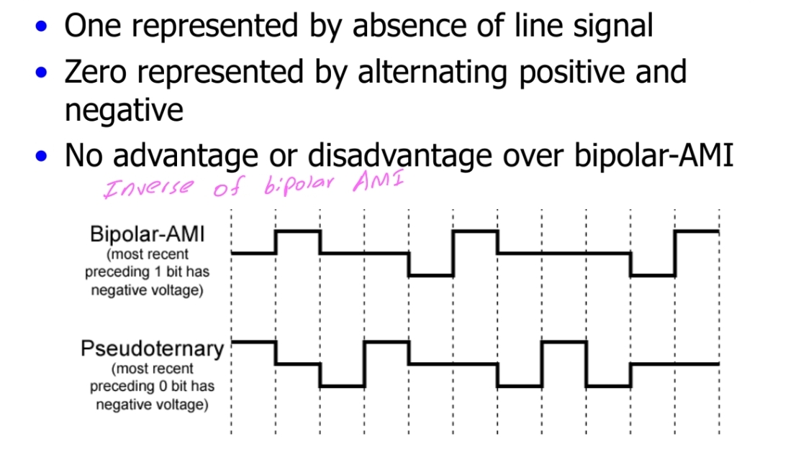

> <mark>Multilevel binary is not as efficient as NRZ</mark>
>
> —Each signal element only represents one bit 
>
> —In a 3 level system could represent log<sub>2</sub>3 = 1.58 bits
>
>  —Receiver must distinguish between three levels  (+A, -A, 0)
>
>  —Requires approx. 3dB more signal power for same  probability of bit error

------

#### 5.<u>Biphase</u>

Biphase encoding is a category of line coding techniques used in digital communication where the <mark><u>signal changes at least once during each bit period.</u> <u>This change helps to provide synchronization, as it ensures that there are always transitions in the signal, which can be used to recover the clock signal at the receiver.</u></mark> The two most common types of biphase encoding are **Manchester encoding** and **Differential Manchester encoding**.

##### <u>*1. **Manchester Encoding**:*</u>

In Manchester encoding, each bit is represented by two level transitions within a single bit period:

- A binary `1` is represented by a transition from low to high (0 to 1) in the middle of the bit period.
- A binary `0` is represented by a transition from high to low (1 to 0) in the middle of the bit period.

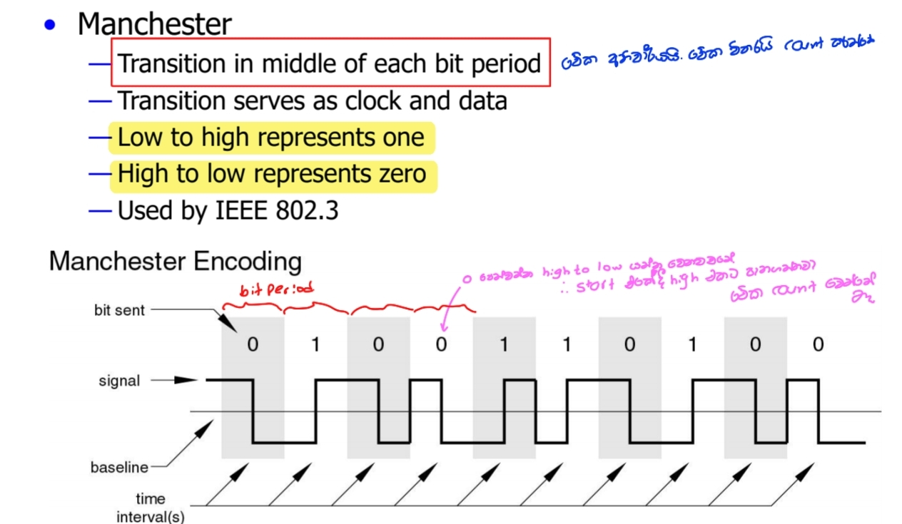

**Example**:

For the binary sequence **1010** using Manchester encoding:

- **1**: Transition from low to high.
- **0**: Transition from high to low.
- **1**: Transition from low to high.
- **0**: Transition from high to low.

| Bit                 | 1    | 0    | 1    | 0    |
| ------------------- | ---- | ---- | ---- | ---- |
| Manchester Encoding | ↓↑   | ↑↓   | ↓↑   | ↑↓   |

- Signal Visualization:
  - For `1`, the signal starts low (0) and transitions to high (1) in the middle of the bit period.
  - For `0`, the signal starts high (1) and transitions to low (0) in the middle of the bit period.

##### <u>*2. Differential Manchester Encoding:*</u>

 Differential Manchester encoding is similar to Manchester encoding but with a key difference:

- A binary `0` is represented by a transition at the beginning of the bit period (regardless of what the previous signal level was).
- A binary `1` is represented by no transition at the beginning of the bit period (the signal remains the same as it was at the end of the previous bit period).
- There is always a transition in the middle of the bit period to provide synchronization.

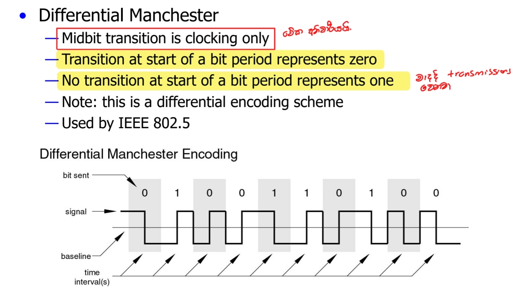

**Example**:

For the binary sequence **1010** using Differential Manchester encoding:

- **1**: No transition at the start, but a transition in the middle.
- **0**: Transition at the start, plus a transition in the middle.
- **1**: No transition at the start, but a transition in the middle.
- **0**: Transition at the start, plus a transition in the middle.

| Bit                              | 1    | 0    | 1    | 0    |
| -------------------------------- | ---- | ---- | ---- | ---- |
| Differential Manchester Encoding | ↑↓   | ↓↑   | ↑↓   | ↓↑   |

:cocktail:

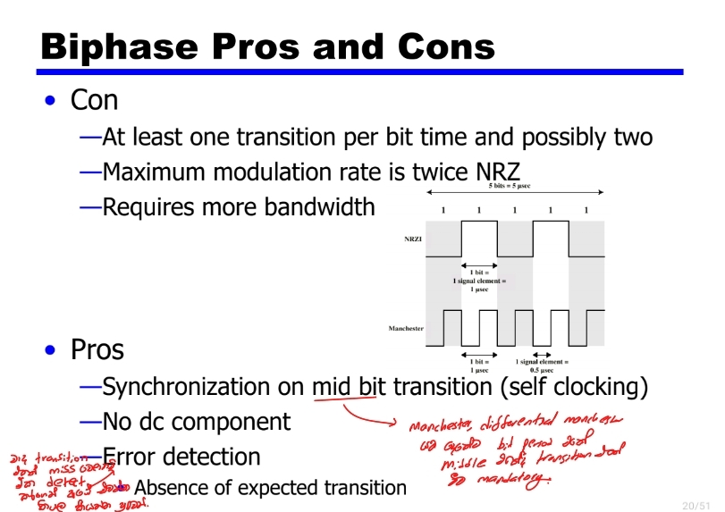

------

#### 6.<u>Scrammbling</u>

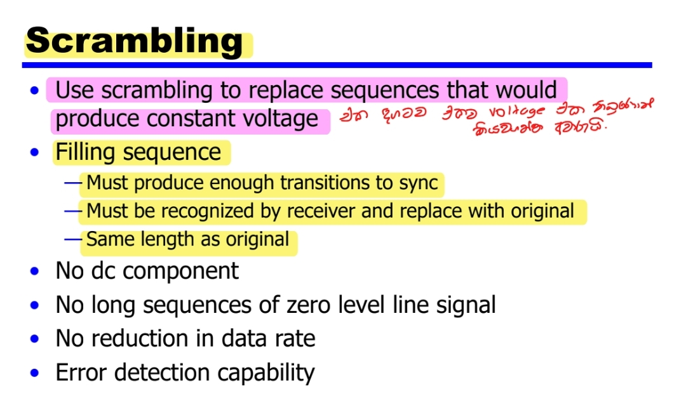

**Common Scrambling Techniques**

1. **B8ZS (Bipolar with 8-Zero Substitution)**: Used in T1 lines to avoid long sequences of zeroes by substituting a sequence of eight zeroes with a special pattern.
2. **HDB3 (High Density Bipolar 3 Zeros)**: Used in E1 lines where sequences of four zeroes are replaced with a specific pattern to maintain the signal’s density.

For example, in B8ZS:

- **Original Data**: 00000000 (eight zeroes)
- **Scrambled Data**: 000VB0V0 (where `V` denotes violations of the bipolar code rules)

##### <mark>***1.B8ZS***</mark>

###### **Concept of B8ZS**

B8ZS is a line coding technique used to address the problem of long sequences of zeros in digital communication systems. It is specifically designed for use in bipolar-AMI (Alternate Mark Inversion) encoding schemes. Here’s a breakdown of the key aspects:

###### **1. Bipolar-AMI Encoding**

- **Bipolar-AMI**: In this encoding scheme, a `1` is represented by alternating positive and negative voltages, while a `0` is represented by a zero voltage level.
- **Alternate Mark Inversion (AMI)**: This technique ensures that `1`s are represented by alternating polarity, helping to maintain a balanced signal and avoiding a DC bias.

###### **2. Problem with Long Zero Sequences**

- **Long Sequences of Zeroes**: In some digital communication systems, long sequences of zeros (like an octet of all zeros) can occur. In bipolar-AMI, this results in no transitions, which can make clock recovery difficult and cause synchronization issues.

###### **3. B8ZS Encoding Scheme**

- **Objective**: To prevent long sequences of zeros from causing synchronization problems by introducing deliberate violations of the AMI encoding rules.
- Encoding Rules:
  - If the Last Voltage Pulse Was Positive:
    - Encode an octet of zeros as `000+-0-+`.
    - This introduces transitions in the middle of the sequence, helping to ensure there are enough changes in the signal for clock recovery.
  - If the Last Voltage Pulse Was Negative:
    - Encode an octet of zeros as `000-+0+-`.
    - Similarly, this pattern introduces transitions and helps with synchronization.

###### **4. AMI Code Violations**

- **Violations**: The patterns introduced by B8ZS create two violations of the AMI encoding rules (where the alternating polarity of `1`s is disrupted). These violations are carefully chosen and are unlikely to be mistaken for errors or noise because they occur in a specific pattern that is recognized by the receiver.
- **Detection**: The receiver detects these specific patterns and interprets them as sequences of zeros, ensuring that the communication system can properly decode the data.

**Visualizing the Encoding**

- **For Positive Last Pulse**:

  - **Original Data**: `00000000` (eight zeroes)

  - Encoded Data: 

    ```
    000+-0-+
    ```

    - The pattern introduces transitions to break the long sequence of zeros into a recognizable format.

- **For Negative Last Pulse**:

  - **Original Data**: `00000000` (eight zeroes)

  - Encoded Data: 

    ```
    000-+0+-
    ```

    - Similarly, this pattern introduces transitions and ensures the signal remains robust for clock recovery.

##### <mark>2.HDB3</mark>

| **Aspect**          | **Description**                                              |
| ------------------- | ------------------------------------------------------------ |
| **Definition**      | High Density Bipolar 3 Zeros                                 |
| **Basis**           | Based on bipolar-AMI (Alternate Mark Inversion)              |
| **Purpose**         | To handle long sequences of zeros and maintain synchronization by introducing sufficient transitions. |
| **Encoding Rule**   | Replaces a string of four consecutive zeros with one or two pulses to ensure signal transitions. |
| **Common Patterns** | - **000V**: Replaces `0000` with three zeros followed by a violation pulse. - **00VB**: Replaces `0000` with two zeros, a violation, and a balanced pulse. |
| **Advantages**      | - Ensures sufficient transitions for clock recovery. - Avoids long runs of zeros that can cause synchronization issues. |

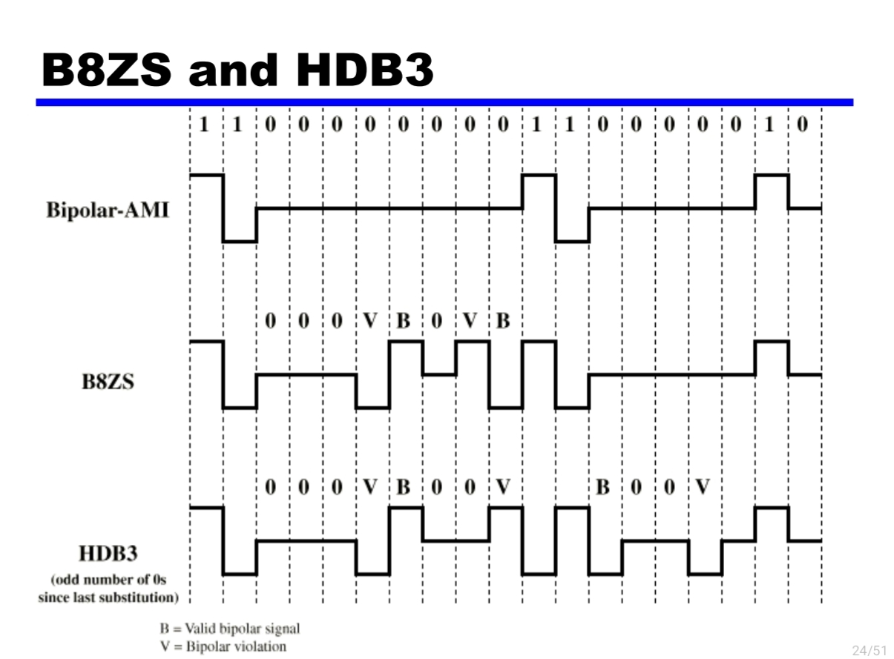

------

# 2. Digital Data, Analog Signal

| **Aspect**                             | **Description**                                              |
| -------------------------------------- | ------------------------------------------------------------ |
| **Context**                            | Digital Data over Analog Signal (e.g., public telephone systems) |
| **Frequency Range**                    | 300 Hz to 3400 Hz                                            |
| **Device Used**                        | Modem (Modulator-Demodulator)                                |
| <mark>**Modulation Techniques**</mark> |                                                              |
| 1.**Amplitude Shift Keying (ASK)**     | - **Definition**: Varies the amplitude of the carrier signal to represent data.<br>- **Usage**: Simple technique where different amplitudes correspond to different data values. |
| 2.**Frequency Shift Keying (FSK)**     | - **Definition**: Varies the frequency of the carrier signal to represent data.<br>- **Usage**: Different frequencies represent different data values, commonly used in data transmission. |
| 3.**Phase Shift Keying (PSK)**         | - **Definition**: Varies the phase of the carrier signal to represent data.<br>- **Usage**: More robust against noise and interference, commonly used for better signal integrity. |

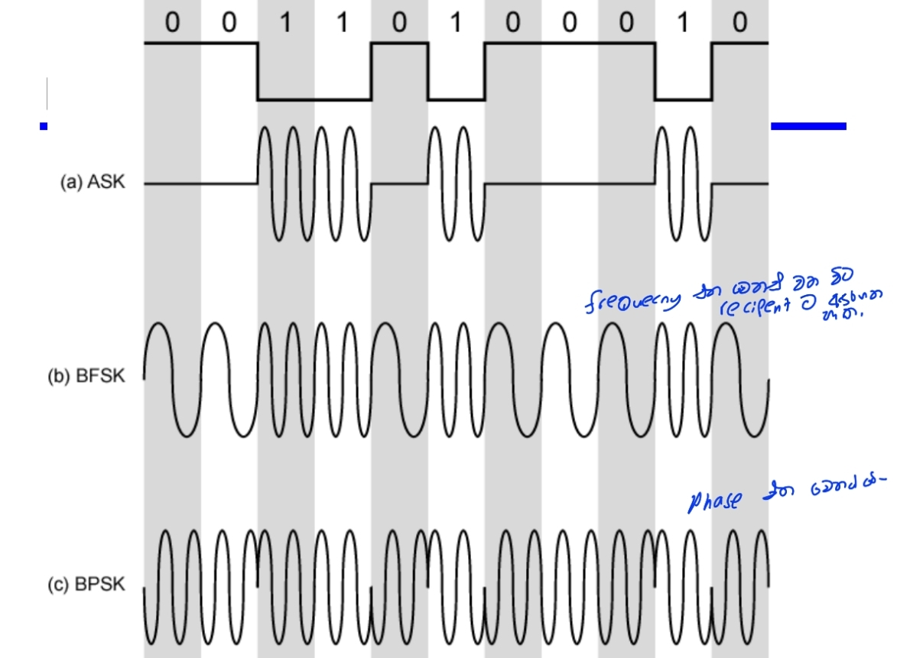

### 1.<u>Amplitude shift keying (ASK)</u>

• Values represented by different amplitudes of  carrier

 • Usually, one amplitude is zero —i.e. presence and absence of carrier is used

### 2.<u>Frequency shift keying (FSK)</u>

most common form is binary FSK. <mark>BFSK</mark>: Two binary values represented by two different  frequencies (near carrier)

multiple FSK <mark>MFSK </mark>: MORE PRONE TO ERROR

### 3.<u>Phase shift keying (PSK)</u>

1. Binary PSK
   Two phases represent two binary digits.
2. Differential PSK
   Phase shifted relative to previous transmission rather  than some reference signal
3. Quadrature PSK
   More efficient use by each signal element  representing more than one bit
    —e.g. shifts of pi/2 (90<sup>0</sup> ) —Each element represents two bits

### 4. <u>Quadrature Amplitude Modulation (QAM)</u> 

Quadrature Amplitude Modulation (QAM) is a modulation technique that combines Amplitude Shift Keying (ASK) and Phase Shift Keying (PSK) to transmit data efficiently. Here’s a brief overview:

- **Definition**: QAM encodes data by varying both the amplitude and phase of a carrier signal, allowing multiple bits to be transmitted simultaneously.
- **Applications**: It is widely used in technologies such as Asymmetric Digital Subscriber Line (ADSL) and various wireless communication systems.
- **Mechanism**: QAM sends two different signals on the same carrier frequency by using two copies of the carrier, one of which is phase-shifted by 90 degrees. Each carrier is modulated using ASK, enabling the transmission of two independent signals over the same medium.
- **Demodulation**: At the receiver end, the signals are demodulated and combined to reconstruct the original binary output.

QAM enhances data transmission rates and bandwidth efficiency, making it a vital component in modern communication systems.

### Performance of digital data, Analog signal

• Bandwidth 		

​			 —ASK and PSK bandwidth directly related to bit rate
​		         —FSK bandwidth related to data rate for lower  frequencies, but to offset of modulated frequency  from carrier at 			     high frequencies

• In the presence of noise, bit error rate of PSK  and QPSK are about 3dB superior to ASK and  FSK

------

# 3. Analog Data, Digital Signal

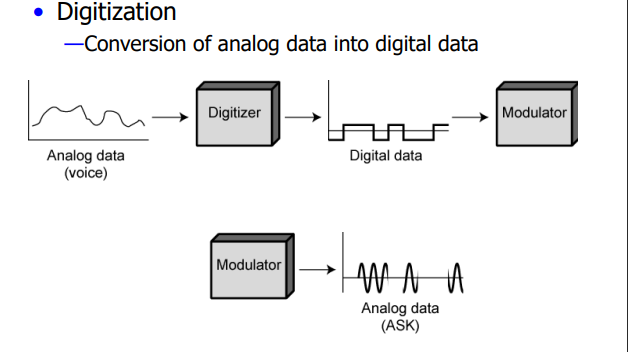

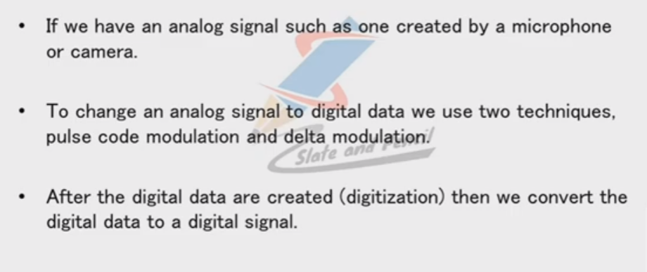

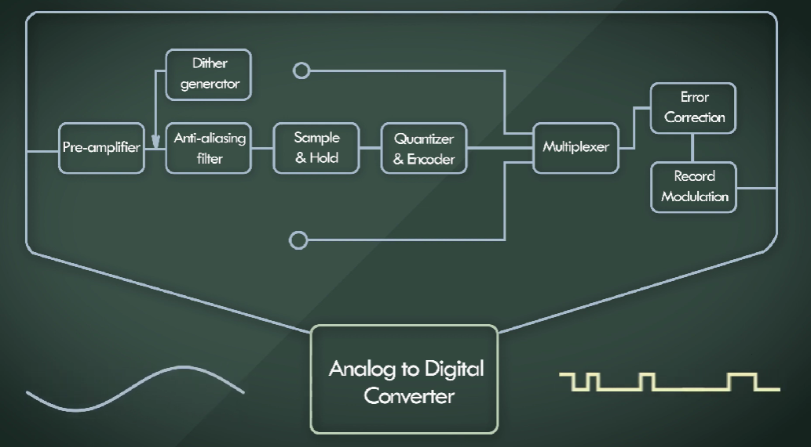

### 1. <u>Pulse Code Modulation (PCM)</u>

##### 1. Basics of Pulse Code Modulation.

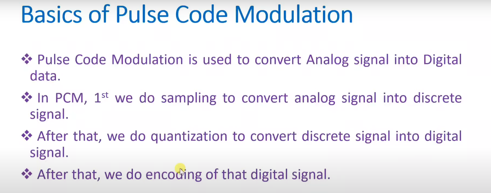

##### 2.Block diagram of pulse code modulation 


##### 3. Process of PCM

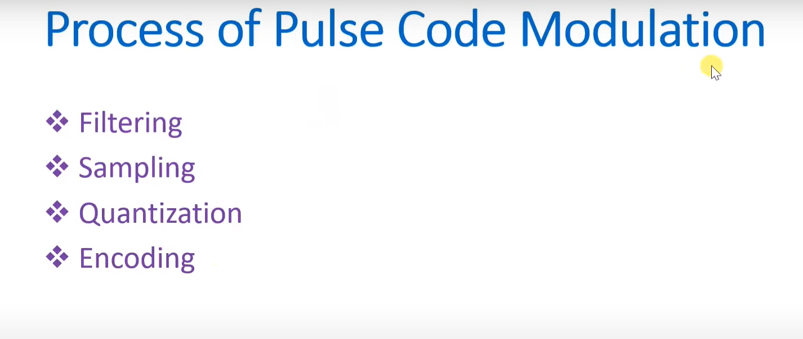

###### 4.*Sampling in PCM*


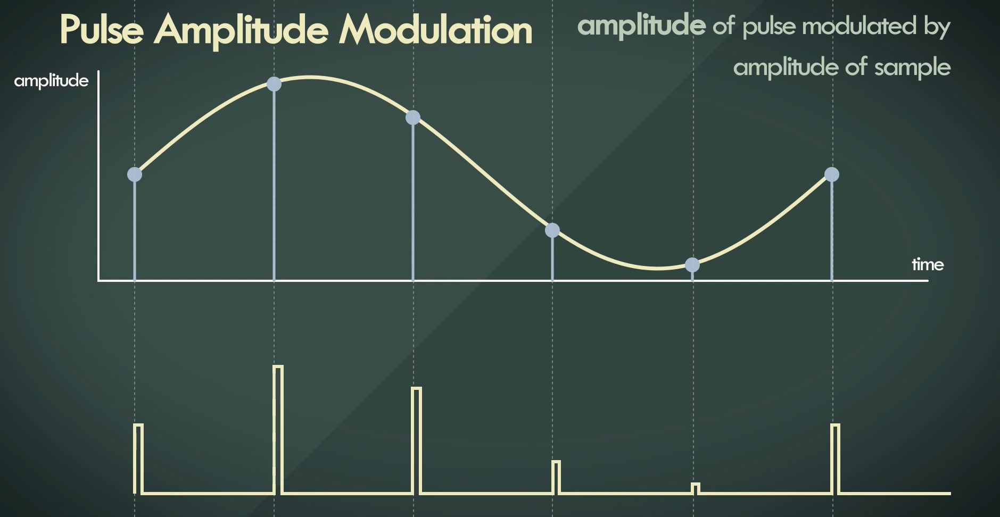


###### 5.*Quantization in PCM*


##### 6.Encoding

- Two types of encoding occur according to what type of quantization we have used.

- <u>Non - Linear encoding</u>

  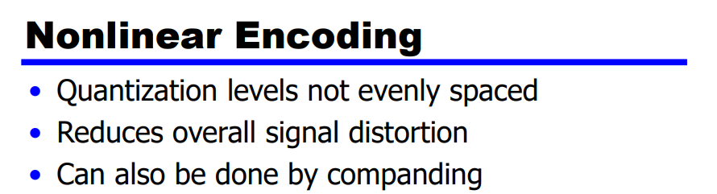

  ​    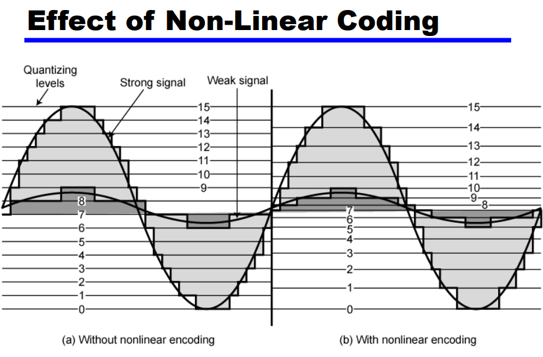

##### 7. Bitrate and bandwidth of PCM 

##### 8.Advantages and Disadvantages of PCM
 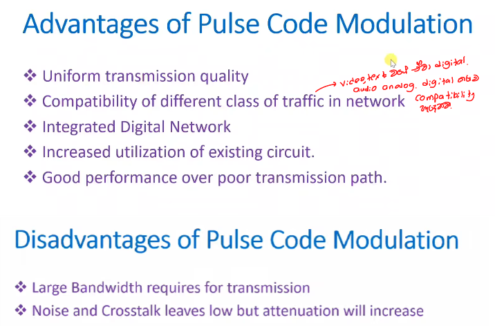
 

------

### 2. Delta modulation

<mark>DM is the simplest form of differential pulse-code modulation</mark>

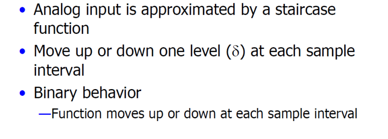

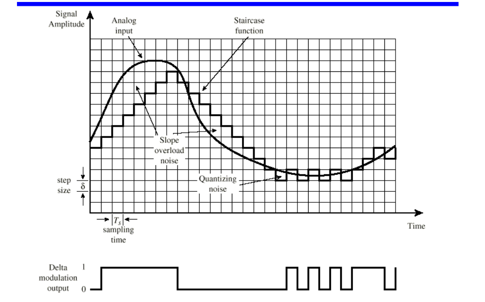

- each sampling interval(Ts), staircase value compared with analog value and if the analog value is high, it has a increment(increment value is delta which is known as step size).
-  Increase of the staircase value corresponds to the digital value 1 and decrease corresponds to the digital value 0 .
-  Here noise value are problematic. But if we have a bigger step value, we can follow the analog signal without that much slope overload noise. Then Slope overload noise is decreased. But in that case, Quantizing noise is increased


 

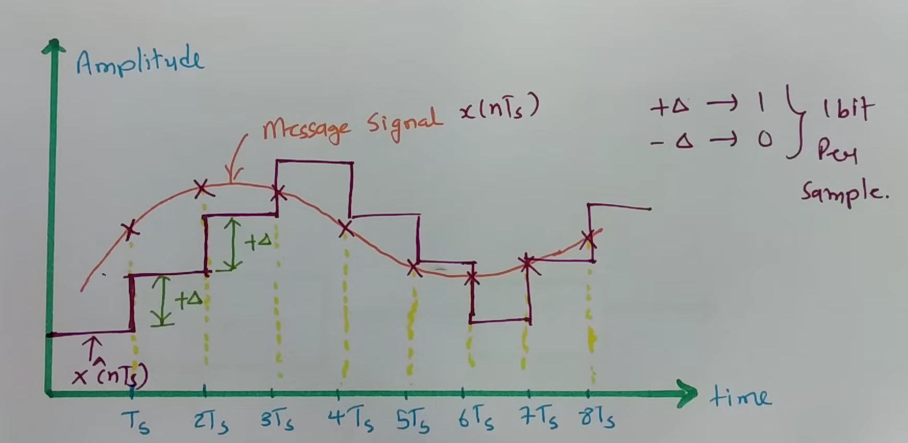

In lecture note :

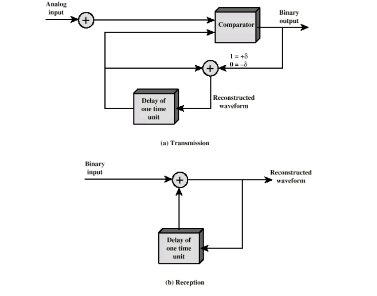

------


## 4. Analog data , Analog Signal

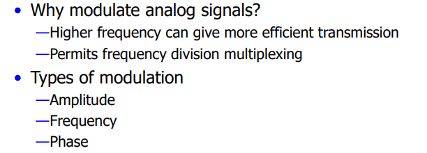

Analog-to-analog conversion, or modulation, is the representation of analog information by an analog signal. It is a process by virtue of which a characteristic of carrier wave is varied according to the instantaneous amplitude of the modulating signal. This modulation is generally needed when a ***\*bandpass channel\**** is required. Bandpass is a range of frequencies which are transmitted through a bandpass filter which is a filter allowing specific frequencies to pass preventing signals at unwanted frequencies.

Analog to Analog conversion can be done in three ways:

1. Amplitude Modulation
2. Frequency Modulation
3. Phase Modulation

##### 1. AMPLITUDE MODULATION:

The modulation in which the amplitude of the carrier wave is varied according to the instantaneous amplitude of the modulating signal keeping phase and frequency as constant. The figure below shows the concept of amplitude modulation:


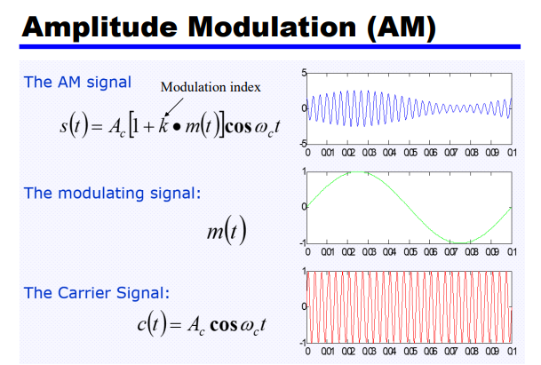

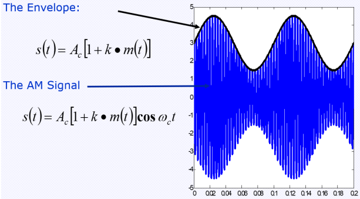

AM is normally implemented by using a simple multiplier because the amplitude of the carrier signal needs to be changed according to the amplitude of the modulating signal.

***\*AM bandwidth:\****

The modulation creates a bandwidth that is twice the bandwidth of the modulating signal and covers a range centered on the carrier frequency.

***\*Bandwidth= 2fm\****

##### 2. FREQUENCY MODULATION 

The modulation in which the frequency of the carrier wave is varied according to the instantaneous frequency of the modulating signal keeping phase and amplitude as constant. The figure below shows the concept of frequency modulation:


FM is normally implemented by using a voltage-controlled oscillator as with FSK. The frequency of the oscillator changes according to the input voltage which is the amplitude of the modulating signal.

***\*FM bandwidth:\****

1. The bandwidth of a frequency modulated signal varies with both deviation and modulating frequency. If modulating frequency (Mf) 0.5, wide band Fm signal.
2. For a narrow band Fm signal, bandwidth required is twice the maximum frequency of the modulation, however for a wide band Fm signal the required bandwidth can be very much larger, with detectable sidebands spreading out over large amounts of the frequency spectrum.

##### 3.PHASE MODULATION 

The modulation in which the phase of the carrier wave is varied according to the instantaneous pIn of the modulating signal keeping amplitude and frequency as constant. The figure below shows the concept of frequency modulation:


Phase modulation is practically similar to Frequency Modulation, but in Phase modulation frequency of the carrier signal is not increased. It is normally implemented by using a voltage-controlled oscillator along with a derivative. The frequency of the oscillator changes according to the derivative of the input voltage which is the amplitude of the modulating signal.

***\*PM bandwidth:\****

1. For small amplitude signals, PM is similar to amplitude modulation (AM) and exhibits its unfortunate doubling of baseband bandwidth and poor efficiency.
2. For a single large sinusoidal signal, PM is similar to FM, and its bandwidth is approximately, ***\*2 (h+1) Fm\**** where h= modulation index.

Thus, Modulation allows us to send a signal over a bandpass frequency range. If every signal gets its own frequency range, then we can transmit multiple signals simultaneously over a single channel, all using different frequency ranges.

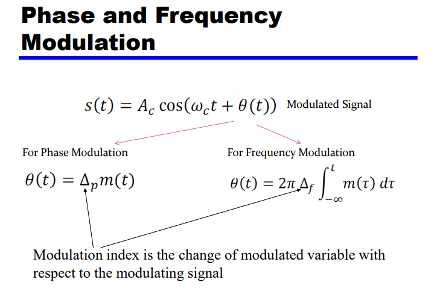

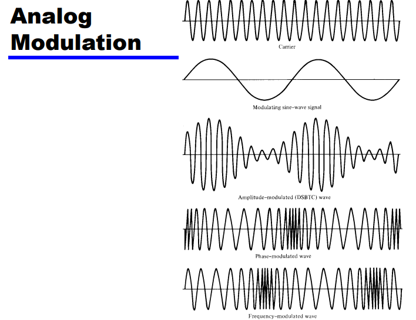


