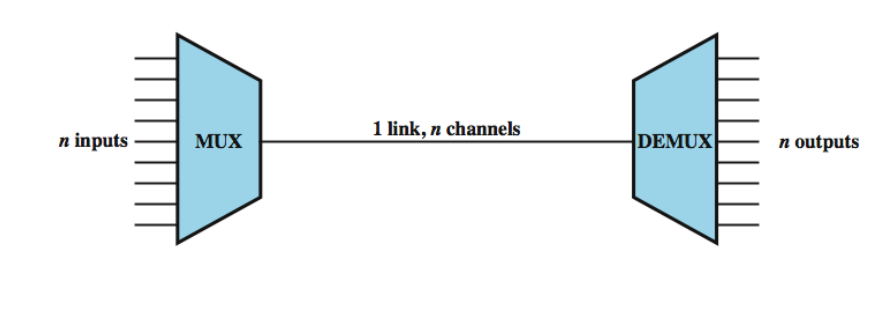
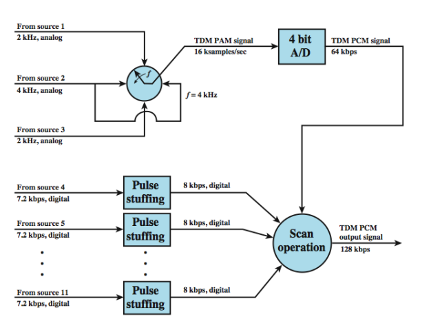

# <u>Data Transmission</u>


## Types of Data Transmission

Data transmission can be categorized based on several criteria:

#### 1. Number of Bits Sent Simultaneously


##### 1.**Parallel Transmission**:

-  Multiple bits are sent simultaneously over multiple channels. This allows for faster data transfer but can be more susceptible to interference over longer distances.

##### 2.**Serial Transmission**:

- Data is sent sequentially, one bit at a time. This method is often used for long-distance communication due to its simplicity and reliability.

- > [!IMPORTANT]
  >
  > ####  Synchronization  <mark> (in here we only talk about synchronization of serial data transmission)</mark>
  >
  > | Transmission Type         | Need for Synchronization                                     | Issues                                                       |
  > | ------------------------- | ------------------------------------------------------------ | ------------------------------------------------------------ |
  > | **Parallel Transmission** | Synchronization is needed because multiple bits are sent simultaneously across different lines. The receiver must know when all the bits are valid. | Without proper synchronization, bits may arrive at different times, leading to incorrect data interpretation due to wire length or signal degradation. |
  > | **Serial Transmission**   | Synchronization is needed because bits are sent one after another. The sender and receiver must agree on timing (clock rate) to interpret the bit stream correctly. | The receiver must determine the start and stop of each bit. Techniques like start/stop bits or clock recovery are used for synchronization. |

  

  > 1. <mark>Asynchronous Transmission</mark>: Data is sent in chunks with start and stop bits, allowing for flexibility in timing. This is commonly used for lower-speed transmissions. <mark>bits are divided into smaller groups (e.g byte) and send independantly</mark>
  >
  >    > **Asynchronous Transmission** divides data into small groups, such as bytes, which are sent independently rather than in a continuous stream. A common example is keyboard inputs.
  >    >
  >    > ### Key Properties:
  >    >
  >    > - The receiver doesn't know when the next group of bits will arrive, leading to **unpredictable time intervals** between transmissions.
  >    > - Timing is maintained within each group of bits, but there is no overall synchronization between groups.
  >    >
  >    > ### Signaling:
  >    >
  >    > - Before sending actual data, the sender must signal the beginning of transmission. This is done using a **Start Bit**, which changes the line state from idle (normally considers as binary 1) to 0.
  >    > - After sending the data, the sender uses **Stop Bits** to signal the end, returning the line state back to idle (binary 1).
  >    >
  >    > ### Drawbacks:
  >    >
  >    > - Asynchronous transmission introduces **overhead** due to the need for start and stop bits, which increases the amount of non-data bits sent along with the actual information.
  >    >
  >    > 

  

  > <mark>Synchronous Transmission</mark>: Data is sent in a continuous stream, synchronized with a clock signal without start/stop  bits for each character. This method is efficient for high-speed data transfer.
  >
  > <mark>larger group of bits are sent without start/stop bits for each character</mark>
  >
  > ### Key Points:
  >
  > 1. **Larger bit groups are sent without start/stop bits for each character**:
  >    - Unlike asynchronous transmission, where each character has its own start and stop bits, synchronous transmission sends a continuous stream of data without such individual bits.
  > 2. **Such a bit group is called a Frame**:
  >    - The data in synchronous transmission is grouped into larger blocks called **frames**. A frame consists of data bits along with additional control, synchronization, and error-checking bits.
  > 3. **Frame structure varies from protocol to protocol**:
  >    - Depending on the communication protocol, the exact structure and contents of the frame may change. Different systems may require different control or error-checking bits.
  >
  > 
  >
  > 
  >
  > 
  >
  > - **Syn (Synchronization bits)**: Used to sync the transmitter and receiver so that both are aligned on when the data starts and ends.
  > - **Ctrl (Control bits)**: These bits manage the communication flow, signal priority, or instructions for handling the frame.
  > - **Data (Data bits)**: These are the actual data being transmitted.
  > - **Error (Error-checking bits)**: These bits ensure data integrity by detecting errors in transmission.
  > - **End (End-of-frame bits)**: These indicate the end of the frame, signaling that the next group of data will follow.
  >
  > 

  

  

  > - <mark>Isochronous Transmission</mark>: Data is sent at a constant rate without gaps, suitable for real-time applications like video streaming.
  >
  >   ### Key Points:
  >
  >   1. **Combines features of synchronous and asynchronous transmission**:
  >      - Like asynchronous transmission, data is not sent continuously and can occur at random intervals.
  >      - However, once a transmission begins, the delivery of data resembles synchronous transmission with a guaranteed flow rate or bandwidth.
  >   2. **Blocks of data are sent asynchronously**:
  >      - The key characteristic is that the data blocks (or frames) are sent **asynchronously**. This means there can be unpredictable delays between blocks, much like in asynchronous transmission where the timing between characters is flexible.
  >   3. **Each transmission begins with a start packet**:
  >      - Every isochronous transmission starts with a **start packet** that signals the beginning of data transfer. This is similar to the start bit in asynchronous transmission.
  >   4. **Guaranteed bandwidth after the start packet**:
  >      - Once the start packet is transmitted, the data that follows must be delivered with **guaranteed bandwidth**. This ensures that the data is transferred without interruptions or delays, making it suitable for real-time applications like audio or video streaming where timely data delivery is crucial.
  >
  >   


| Characteristics               | Parallel Transmission                                  | Serial Transmission                                     |
| ----------------------------- | ------------------------------------------------------ | ------------------------------------------------------- |
| **Definition**                | Group of bits sent simultaneously using separate lines | Bits sent one after another over a single line          |
| **Speed**                     | Fast                                                   | Slower than parallel                                    |
| **Cost**                      | Expensive due to multiple wires                        | Cheaper as it uses a single line                        |
| **Distance**                  | Not suitable for long distances (signal degradation)   | Suitable for long distances                             |
| **Complexity**                | Simple setup for short distances                       | More complex as order of bits must be determined        |
| **Reliability**               | Less reliable over long distances                      | More reliable over long distances                       |
| **Wire Usage**                | Uses multiple wires (one for each bit)                 | Uses a single wire                                      |
| **Practicality for Bundling** | Not practical for bundling multiple wires into a cable | Easily bundled into a single cable                      |
| **Synchronization Issues**    | Bits may not be received simultaneously                | No synchronization issues as bits are sent sequentially |

------

#### 2. Direction of Data Flow

- **Simplex**: Data flows in one direction only (e.g., television broadcasts).
- **Half-duplex**: Data can flow in both directions, but not simultaneously (e.g., walkie-talkies).
- **Full-duplex**: Data flows in both directions simultaneously (e.g., telephone conversations).

------

## <u>Multiplexing</u>

• Multiplexer (Mux): device that routes transmission  from multiple sources to a single destination




**1 Link, n Channels**:

- The **1 link** represents the single communication channel that carries all the signals from the multiple inputs.
- **n channels** means that even though only one physical link is being used, it carries multiple **logical channels** corresponding to each input. The channel can represent time slots, frequencies, or other divisions that allow multiple inputs to share the same link.

> [!NOTE]
>
> ## Advantages
>
> • The higher the data rate, the more cost-effective  the transmission facility
>
> ## Cost-Effectiveness
>
> - **Higher Data Rates**: Multiplexing allows multiple signals to be transmitted over a single communication channel, which increases the overall data rate. This means that the cost per kilobit per second (kbps) decreases as the data rate increases, making it more economical for service providers.
> - **Reduced Equipment Costs**: By enabling multiple data streams to share a single transmission medium, multiplexing reduces the need for extensive transmission and receiving equipment. This results in lower capital expenditures for network infrastructure, as fewer devices are required to handle multiple channels of communication.
>
> ## Efficiency in Resource Utilization
>
> - **Scalability**: Multiplexing enhances scalability by allowing additional channels to be added without the need for extensive rewiring or additional hardware. This is particularly beneficial in environments where the demand for bandwidth may grow over time.
> - **Simplified Wiring**: Traditional wiring systems require separate channels for each signal, which can become complex and costly as the number of channels increases. Multiplexing simplifies this by consolidating multiple signals into a single line, thus reducing circuit complexity and the number of physical wires needed


### Types of multiplexing

> [!IMPORTANT]
>
> 1. Frequency division multiplexing
> 2. Wavelength division multiplexing
> 3. Time division multiplexing
>    1. Synchronous TDM
>    2. Statistical TDM

#### 1. <u>Frequency division multiplexing (FDM)</u>


 


###### example - Analog telephony system

> [!TIP]
>
> 
>
> Sideband is a amplitude modulation technique. The original frequencies below the modulation frequency is called lower side band and higher ones called upper side band.
>
> A **sideband** is a range of frequencies that are produced when a carrier wave is modulated to carry a signal, typically in radio or telecommunications. Sidebands are generated during modulation, the process by which information (like voice, data, or video) is encoded onto a carrier signal.
>
> ### Types of Sidebands:
>
> 1. **Upper Sideband (USB)**: This refers to the range of frequencies **above** the carrier frequency that result from modulation.
> 2. **Lower Sideband (LSB)**: This refers to the range of frequencies **below** the carrier frequency that also result from modulation.
>
> ### How Sidebands Work:
>
> - When a carrier signal is modulated by an information signal (e.g., voice or data), two sidebands are created.
> - These sidebands carry the actual information, and their frequency is equal to the carrier frequency plus or minus the frequency of the modulating signal.
>   - Example: If a carrier frequency is 1 MHz and the modulating signal is 1 kHz, the upper sideband would be at 1 MHz + 1 kHz (1.001 MHz), and the lower sideband would be at 1 MHz − 1 kHz (0.999 MHz).
>
> ### Types of Modulation and Sidebands:
>
> - **Amplitude Modulation (AM)**: Produces both upper and lower sidebands. In traditional AM, the carrier and both sidebands are transmitted.
> - **Single Sideband (SSB)**: A variant of AM that transmits only one sideband (either the upper or lower) to save bandwidth and power.
>
> ### Applications of Sidebands:
>
> - **AM Radio**: Traditional AM radio broadcasts transmit both the upper and lower sidebands along with the carrier.
> - **SSB Communication**: Common in two-way radio communication, SSB reduces bandwidth usage by transmitting only one sideband and suppressing the carrier and the other sideband.
>
> ------
>
> ### <u>Single Sideband (SSB) Modulation</u>
>
> - **Definition**: **Single sideband modulation (SSB)** is an amplitude modulation scheme in which only a single sideband is transmitted through the channel. It is also known as **SSB-SC** which is an acronym for **Single Sideband Suppressed Carrier** as it allows the suppression of one sideband and carrier completely.
> - As we know, DSB-SC modulation technique generates an output wave having twice the bandwidth as that of the original modulating signal. So, in order to **avoid doubling factor** of bandwidth in such modulation system, the **SSB-SC modulation** technique was introduced.
>
> #### Why is the suppression of a sideband allowed in SSB modulation?
>
> Single-sideband modulation technique was adopted, as suppression of one of the two sidebands along with the carrier causes no loss of information.
>
> This is so because the two sidebands of the modulated signal are particularly related to each other. In other words, we can say the two sidebands carry similar information. Thus, for the transmission of information, we need only one sideband. So, by suppressing one sideband along with the carrier, no any information is lost.
>
> Hence, the bandwidth requirement also gets reduced to half and there are chances for an accommodation of twice the number of channels using the SSB modulation technique.
>
> ### Key Concepts of SSB:
>
> 1. **Sidebands in AM**: When a signal is amplitude modulated, it generates two sidebands — the **upper sideband (USB)** and the **lower sideband (LSB)** — around the carrier frequency. Both sidebands carry the same information.
> 2. **Eliminating Redundancy**: Since the same information is present in both sidebands, SSB transmits only one (either USB or LSB), reducing bandwidth usage by about half.
> 3. **Carrier Suppression**: In SSB, the carrier is not transmitted (or greatly reduced), which conserves power. This contrasts with standard AM, where the carrier consumes significant power but carries no information.


- **First Diagram (a)**: Shows the spectrum of a voice signal, typically occupying the frequency range from 300 Hz to 3400 Hz, with a carrier at 4000 Hz.
- **Second Diagram (b)**: Demonstrates how the voice signal is modulated onto a carrier (in this case, at 64 kHz). After modulation, the signal is split into upper and lower sidebands. The example suggests choosing to transmit only the **lower sideband** to make more efficient use of bandwidth. This is called **Single Sideband (SSB**) transmission.
- **Third Diagram**: Depicts how the lower sidebands of three different voice signals are transmitted simultaneously by using different carrier frequencies: 64 kHz, 68 kHz, and 72 kHz. Each carrier modulates a different signal, and their lower sidebands are transmitted without interference.


###### FDM issues

> [!WARNING]
>
> ###### 1. **Crosstalk**:
>
> - **What is Crosstalk?**
>   Crosstalk occurs when signals from one channel interfere with signals in an adjacent channel. This happens if the frequencies assigned to the different channels overlap or are too close to each other.
> - **Cause**: When the **spectra of adjacent component signals** overlap significantly, some of the signal's energy leaks into the neighboring channel, causing interference.
> - **Effect**: Crosstalk leads to distortion and degraded signal quality, as data meant for one channel may unintentionally appear in another channel.
> - **Solution**: To minimize crosstalk, FDM systems need to ensure enough **guard bands** (unused frequency spaces) between channels to prevent spectral overlap.
>
> ###### 2. **Intermodulation Noise**:
>
> - **What is Intermodulation Noise?**
>   Intermodulation noise occurs when signals from one channel generate **additional frequency components** that interfere with other channels. This is due to the nonlinear behavior of amplifiers or other devices on the transmission path.
> - **Cause**: When signals pass through **nonlinear amplifiers** (which don't amplify all frequencies equally), they can interact to create new, unintended frequencies. These new frequencies can appear in the bands used by other channels.
> - **Effect**: This leads to noise or interference in other channels, reducing the overall signal quality.
> - **Solution**: To reduce intermodulation noise, FDM systems should use **linear amplifiers** and other equipment that minimize nonlinear effects. Proper filtering and signal management are also necessary to prevent interference.

#### 2. <u>Wavelength division multiplexing (WDM)</u>

:heavy_exclamation_mark:This is particularly similar to FDM. But different name is used because this uses different wavelengths instead of frequencies.

<mark>**Frequency Division Multiplexing (FDM)** can be used in **fiber optics**, but in this context, it is more commonly referred to as **Wavelength Division Multiplexing (WDM)**.</mark>

##### Key Concepts of WDM in Fiber Optics:

1. **Exploiting the Potential of Fiber Optics**:
   - Optical fibers have a huge capacity for data transmission. To fully utilize this potential, **multiple beams of light**, each with a different wavelength (or frequency), can be sent through the same fiber.
   - This is a form of **frequency division multiplexing (FDM)**, but because we are dealing with light and wavelengths, it’s termed **wavelength division multiplexing (WDM)**.
2. **How WDM Works**:
   - **Different wavelengths (colors) of light** are used to carry separate channels of data. These wavelengths are analogous to the different frequency bands in traditional FDM.
   - Each wavelength operates as a distinct data channel, allowing multiple channels to be transmitted simultaneously through a single fiber.
3. **Components of a WDM System**:
   - **Laser Sources**: Multiple laser sources generate light beams at different wavelengths (colors).
   - **Multiplexer**: These individual wavelengths are combined using a **multiplexer**, which consolidates the different light beams into one composite signal for transmission over the fiber.
   - **Optical Amplifiers**: Along the transmission line, **optical amplifiers** boost the signal without needing to convert it back to electrical form. These amplifiers simultaneously amplify all wavelengths being transmitted.
   - **Demultiplexer**: At the receiving end, a **demultiplexer** separates the composite signal back into its individual wavelengths (or channels). Each channel is then sent to its corresponding receiver.
4. **Advantages of WDM**:
   - **Increased Bandwidth**: WDM significantly increases the capacity of the fiber by allowing multiple data streams to be sent simultaneously on different wavelengths.
   - **Efficient Use of Fiber**: By transmitting several channels on a single fiber, WDM makes more efficient use of the infrastructure, avoiding the need for multiple fibers.
   - **Scalability**: As data demands increase, more wavelengths can be added, making WDM highly scalable for future growth.

------

#### 3. <u>Synchronous time division multiplexing (TDM)</u> 

This happens when the data transmission rate of media is greater than that of the source, and each signal is allotted a definite amount of time. These slots are so small that all transmissions appear to be parallel. In frequency division multiplexing all the signals operate at the same time with different frequencies, but in time-division multiplexing, all the signals operate with the same frequency at different times.


 


> [!IMPORTANT]
>
> - **Synchronous TDM** is called synchronous not because synchronous transmission is used, but because the **time slots are preassigned** to sources and fixed. The time slots for each source are transmitted whether or not the source has data to send.
> - This is the case with **FDM** as well. **Capacity is wasted** to achieve simplicity of implementation.
> - Even when fixed assignment is used, it is possible for a synchronous TDM device to handle **sources of different data rates**. For example, the slowest input device could be assigned **one slot per cycle**, while faster devices are assigned **multiple slots per cycle**.

##### HDLC Framework.

> [!CAUTION]  
>
> ## error handling and HDLC Framework (High level data link control)
>
> - **Flow Control**: Flow control mechanisms are **not needed** for the TDM multiplexer (mux) and demultiplexer (Demux) because the data rate on the multiplexed line is **fixed**, and both the mux and Demux are designed to operate at that rate.
> - **Handling Output Device Issues**:
>   - What happens if an output device can't accept data?
>   - **TDM transmission will not stop**. The affected channel will simply carry **empty slots**, while the other channels will continue transmitting data as usual.
> - **Error Control**:
>   - If an error occurs on one channel, it **will not trigger retransmission** of the entire TDM frame.
>   - **Error control** is handled on a **per-channel basis**.
> - **Protocols for Flow and Error Control**:
>   For flow and error control, a **data link control protocol** such as **HDLC (High-Level Data Link Control)** can be used.
> - <mark>HDLC is just a framework for building the frame.It adds addition data like how to handle erros,how to multiplex,what is the address etc</mark>
> - 


##### TDM synchronization:

> [!NOTE]
>
> ## TDM Framing: (Synchronization)
>
> In **Time Division Multiplexing (TDM)**, multiple signals (or channels) are sent over the same communication line, but instead of sending them all at once, **each channel gets its own time slot** to send data. The system switches between channels quickly, sending small parts of each signal one after the other.
>
> To make sure the receiver knows where each time slot starts and ends, it needs **frame synchronization**. This means the receiver has to stay in sync with the incoming data and know when each frame (a complete set of all channels' time slots) begins.
>
> Unlike some systems that use **special markers** (like flags or SYNC characters) to signal the start or end of a frame, **TDM does not use these explicit markers**. Instead, TDM uses a fixed pattern inside the frame (like a recognizable bit pattern) to help the receiver figure out the frame's start.
>
> ###### <mark>How is Synchronization Achieved?</mark>
>
> - **Control Channel Using Bit Pattern**:
>   To keep the frames synchronized, TDM systems use a dedicated bit pattern that repeats at the beginning of each frame. This bit pattern is called a **control channel**, and its purpose is to help the receiver recognize the boundaries of the frames.
> - **Example – Alternating Bit Pattern (101010)**:
>   One example of such a control pattern could be **101010** (alternating 1s and 0s). This pattern is chosen because it is **unlikely to naturally occur** in the data being transmitted, which means it can be easily distinguished from the actual data. When the receiver detects this unique pattern, it knows that a new frame is starting, thus ensuring proper synchronization.
>   - This pattern is typically placed at the beginning of every frame. It acts as a **reference** for the receiver. When the receiver detects this pattern, it knows the frame has started, and it can correctly assign the subsequent time slots to their respective channels.
> - <mark>While both TDM fixed bit patterns and HDLC flags serve to indicate frame boundaries, they operate in different contexts. TDM uses fixed patterns for synchronization within the TDM system, whereas HDLC uses specific flags as part of its protocol to manage frame boundaries and control data transmission.</mark> Not sure. <mark> mata htenne synn krnn use krneth HDLC flag ekama tma</mark>


##### <u>Data Rate Management in TDM</u>

> [!NOTE]
>
> ## <u>Data Rate Management in TDM</u>
>
> 
>
> ###### <u>Multilevel Multiplexing</u> (Not in lecture note)
>
> 
>
> ###### <u>Multiple-Slot Allocation</u> (Not in lecture notes)
>
> 
>
> ### <mark>Pulse Stuffing</mark> 
>
> 
>
> - **Purpose**: Pulse stuffing is used to **synchronize data sources** that have slightly different clock speeds or data rates. This is needed because clocks in different systems can drift over time.
> - **Data Rate Mismatch**: The data rates from different sources may not be equal or have a simple relationship, making it difficult to synchronize them.
> - **Solution**: Pulse stuffing is a **common solution** to this issue.
> - **How It Works**:
>   - The **outgoing data rate** (excluding framing bits) is set to be **slightly higher** than the total sum of the incoming data rates.
>   - **Extra dummy bits or pulses** are added ("stuffed") into the incoming signals to match the local clock speed.
>   - These **stuffed pulses** are inserted at fixed locations within the frame and are later **removed** by the demultiplexer on the receiving end.

> ##### example
>
> 
>
> - **Multiplexing 11 Sources**: There are **11 sources** to be multiplexed onto a **single link**.
>   
> - **Analog-to-Digital Conversion (PCM)**:  
>    - The **analog sources** are converted to digital using **Pulse Code Modulation (PCM)**, which follows the **sampling theorem**. 
>    - According to the theorem, a signal must be sampled at a rate equal to **twice its bandwidth**.
>
> - **Sampling Rates**:  
>    - **4000 samples per second** are required for sources 1 and 3.
>    - **8000 samples per second** are needed for source 2.
>    - > [!TIP]
>      >
>      > **Multiplexing Rate**: In your system, the multiplexing process operates at a rate of 4000 samples per second. This is your “scan rate.”
>      >
>      > **Sampling Rate**: This is how often you need to take samples from a source to accurately capture its data.
>      >
>      > - **Source 1 and Source 3**: These sources need to be sampled at 4000 samples per second. This means you need to take 4000 samples each second for these sources.
>      > - **Source 2**: This source needs to be sampled at 8000 samples per second. Therefore, you need to take 8000 samples each second for this source.
>    
>      
>    
> - **Quantization and Digitization**:  
>    - After sampling, the analog samples are **quantized** or digitized. Each sample is represented by **4 bits**.
>
> - **Multiplexing the First Three Sources**:  
>    - For convenience, **sources 1, 2, and 3** are multiplexed as a unit.
>    - At a **scan rate of 4 kHz**, one sample is taken from **sources 1 and 3**, and **two samples** from **source 2** per scan.
>    - These **four samples** are interleaved and converted into **4-bit PCM samples**.
>    - This results in **16 bits generated 4000 times per second**, giving a **composite bit rate of 64 kbps**.
>
> - **Pulse Stuffing for Digital Sources**:  
>    - For the **digital sources**, **pulse stuffing** is used to raise each source’s data rate to **8 kbps**.
>    - This results in an **aggregate data rate of 64 kbps**.
>

------

#### 4. <u>Statistical time division multiplexing</u>

**Problem with Synchronous TDM**:

- In synchronous TDM, fixed time slots are allocated to each terminal in a regular cycle.
- Many time slots can be wasted because not all terminals send data all the time.

**Statistical TDM Solution**:

- **Dynamic Allocation**: Instead of fixed slots, statistical TDM allocates time slots dynamically based on demand.
- **Efficiency**: This reduces wasted time slots and increases overall efficiency.

**Configuration**:

- **I/O Lines**: There are **n** input/output lines.
- **Time Slots**: There are **k** time slots in the TDM frame, where **k < n**.

**Multiplexer Operation**:

- **Data Collection**: The multiplexer scans input buffers and collects data.
- **Frame Construction**: It fills a frame with the collected data.
- **Transmission**: Sends the completed frame.

**Demultiplexer Operation**:

- **Frame Reception**: Receives a frame from the multiplexer.
- **Data Distribution**: Distributes the data in the frame to the appropriate output buffers.

**Advantages**:

- **Lower Data Rate**: Statistical TDM can support the same number of devices as a synchronous multiplexer but with a lower data rate.
- **More Devices**: With the same data rate, a statistical multiplexer can support more devices compared to a synchronous multiplexer.


###### Frame Structure in Statistical TDM

> [!NOTE]
>
> ## Frame Structure in Statistical TDM
>
> <mark>In a statistical TDM system, HDLC is used to define the structure and manage the frames of data being transmitted. The HDLC protocol provides the framework for creating, sending, and receiving these frames, ensuring proper handling and control of the multiplexed data stream.</mark>
>
> - **Protocol**:
>
>   - **Synchronous Protocol**: Statistical TDM systems often use a synchronous protocol like HDLC (High-Level Data Link Control).
>
> - **HDLC Frame**:
>
>   - **Data Frame**: Each frame in HDLC carries not just the data but also control bits required for multiplexing.
>
> - **Control Bits**:
>
>   - **Purpose**: These control bits manage how data is multiplexed and demultiplexed, ensuring proper routing and timing of the data.
>
> - **Optimization**:
>
>   - **Frame Structure Optimization**: The structure of the frame can be tailored to enhance performance, such as improving the efficiency of data handling and reducing overhead.
>
>   
>
>   
>
>   
>
>   ### Synchronization in HDLC
>
>   In the context of HDLC (High-Level Data Link Control), synchronization is achieved using specific mechanisms within the HDLC frame structure. Here’s how HDLC handles synchronization:
>
>   1. **Flag Sequences**:
>
>      - Start and End Flags : HDLC uses special flag sequences to mark the beginning and end of each frame. The most common flag sequence is 
>
>        ```
>        01111110
>        ```
>
>         (0x7E in hexadecimal).
>
>        - **Start Flag**: Marks the beginning of the frame.
>        - **End Flag**: Marks the end of the frame.
>
>      - **Purpose**: These flags help in identifying frame boundaries, ensuring that the receiver knows where each frame starts and ends.
>
>   2. **Bit Stuffing**:
>
>      - **Avoiding Confusion**: To prevent the flag sequence from occurring within the actual data, HDLC uses bit stuffing. Whenever the flag pattern appears in the data, an additional bit (0) is inserted to ensure the pattern does not accidentally be interpreted as a frame boundary.
>      - **Restoration**: The receiver removes these extra bits to restore the original data.
>
>   3. **Frame Structure**:
>
>      - HDLC Frame Fields :
>        - **Flag**: Marks the start and end of the frame.
>        - **Address**: Specifies the destination address.
>        - **Control**: Contains information for flow control and frame management.
>        - **Information**: Carries the actual data being transmitted.
>        - **Frame Check Sequence (FCS)**: Provides error detection for the transmitted data.
>
>   4. **Synchronization Mechanism**:
>
>      - **Fixed Pattern**: The flag sequence provides a fixed pattern that is recognizable and helps the receiver maintain synchronization with the incoming data stream.
>      - **Consistency**: By using consistent flag sequences, HDLC ensures that both the sender and receiver remain in sync regarding frame boundaries.

------

### Asymmetric Digital Subscriber Line (ADSL)


ADSL is a technology that leverages existing voice telephone lines to provide high-speed digital data transmission. Here’s a detailed overview of how ADSL works:

1. **Existing Infrastructure**:
   - **Voice Lines**: ADSL uses existing voice telephone lines, which were originally designed to carry frequencies in the 0-4 kHz range.
   - **Spectrum Utilization**: While voice lines were intended for low frequencies, they are capable of handling higher frequencies up to around 1 MHz.
2. **Asymmetry**:
   - **Downstream vs. Upstream**: ADSL is called "asymmetric" because it provides more bandwidth for downstream data (from the network to the subscriber) than for upstream data (from the subscriber to the network). This suits typical internet usage patterns, where users download more data than they upload.
3. **Frequency Division Multiplexing (FDM)**:
   - **Novel Use**: ADSL employs FDM to utilize the entire spectrum of the telephone line, splitting it into different frequency bands for various types of data.
   - Reserved Bandwidth :
     - **Voice Band**: The lowest 25 kHz of the spectrum is reserved for voice communication (POTS - Plain Old Telephone Service).
     - **Additional Bandwidth**:  the  additional bandwidth is  to prevent crosstalk  between the voice and  data channels.
4. **Channel Allocation**:
   - Upstream and Downstream Bands:
     - **Echo Cancellation or FDM**: To manage simultaneous voice and data transmission, ADSL uses either echo cancellation or FDM. Echo cancellation allows both upstream and downstream signals to travel over the same line without interfering with each other.
     - Frequency Bands :
       - **Upstream Band**: A smaller frequency band allocated for sending data from the user to the network.
       - **Downstream Band**: A larger frequency band allocated for receiving data from the network to the user.
5. **FDM within Bands**:
   - **Splitting Bit Streams**: Inside both upstream and downstream bands, FDM is used to further divide the spectrum into multiple parallel channels. In this case, a single bit  stream is split into  multiple parallel bit  streams and each  portion is carried in a  separate frequency  band.

##### <mark>Discrete Multitone (DMT)</mark>


**Discrete Multitone (DMT)** is a modulation technique used in technologies like ADSL to optimize data transmission over telephone lines. Here’s how DMT works:

1. **Carrier Signals and Subchannels**:
   - **Multiple Carriers**: DMT divides the available transmission bandwidth into multiple subchannels, each using a different carrier frequency. This allows for parallel data transmission over these subchannels.
   - **Subchannel Size**: Typically, the transmission band is divided into a number of 4-kHz subchannels.
2. **Bit Allocation**:
   - **Initialization**: When a DMT modem starts, it sends test signals over each subchannel to measure the signal-to-noise ratio (SNR) of each one.
   - **Dynamic Assignment**: Based on the measured SNR, the modem allocates more bits to subchannels with better transmission quality (higher SNR) and fewer bits to those with poorer quality (lower SNR). This ensures that data is transmitted efficiently based on the quality of each subchannel.
3. **Data Rate per Subchannel**:
   - **Range**: Each 4-kHz subchannel can carry data at rates ranging from 0 to 60 kbps, depending on the signal quality.
   - **Variable Data Rates**: The data rate for each subchannel is dynamically adjusted based on its signal-to-noise ratio, optimizing overall performance.
4. **Attenuation and Signal-to-Noise Ratio**:
   - **Frequency Dependence**: Higher frequencies typically experience greater attenuation and reduced SNR. This means that higher-frequency subchannels may carry fewer bits or might be disabled if the signal quality is too poor.
   - **Channel Optimization**: DMT adapts to these conditions by varying the bit rate according to the signal quality of each subchannel.

Discrete Multitone (DMT) modulation divides the available bandwidth into multiple 4-kHz subchannels, each using a different carrier frequency. It dynamically adjusts the number of bits transmitted on each subchannel based on its signal-to-noise ratio, optimizing data transmission. DMT accommodates varying levels of attenuation and signal quality across different frequencies, ensuring efficient use of the available bandwidth.