# 1. **Transmission Errors**


## **Introduction**
Errors are inevitable in communication systems, primarily due to noise and interference. Efficient data communication systems employ error detection and correction mechanisms to ensure that data integrity is maintained. Once an error is detected, a system may perform some action. Some systems perform no error control, but simply let the  data in error be discarded. This note provides an overview of various types of errors and noise encountered during transmission, as well as prevention techniques.

---

## **Transmission Errors**
Transmission errors occur when the transmitted signal is corrupted due to noise or other disturbances in the communication medium. These errors can severely affect data integrity, necessitating error detection and, in some cases, correction mechanisms.

### **Types of Transmission Errors**
- **Error Detection and Control**:  
  Different layers of communication models (OSI and Internet models) have mechanisms for error detection and control, with a primary focus on the data link layer for independent error handling, unaffected by the physical medium.

​	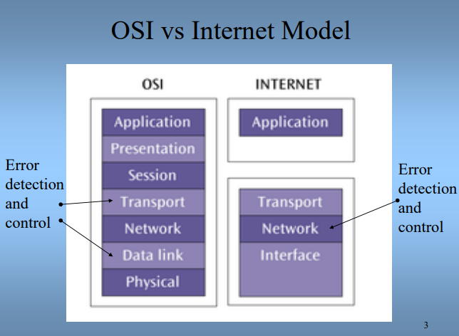

- **Error in the <mark> Data Link Layer (In this lecture)</mark>**:  
  The Data Link Layer plays a critical role in ensuring accurate data transmission by packaging data into frames, which include error detection codes, address, and control information. Independent of the medium or physical layer

​	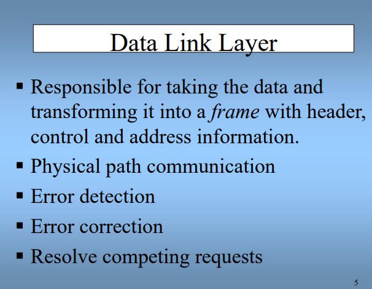

---

## **Common Types of Noise and Errors**

### **1. White Noise (Thermal/Gaussian Noise)**  


White noise is relatively constant and can be reduced through proper signal conditioning. It occurs due to the thermal agitation of electrons and manifests as random fluctuations.  
**Effect**: If the noise level is too high, it can completely disrupt the signal, making error detection difficult.

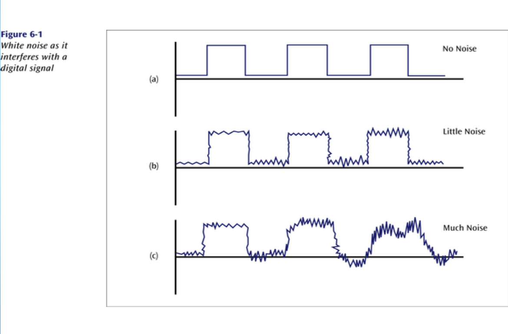

---

### **2. Impulse Noise**


Impulse noise consists of random spikes of power that can destroy one or more bits of information. It is one of the most disruptive types of noise and can be particularly challenging to remove from analog signals because it may be  hard to distinguish from the original signal.  
**Effect**: Damages more bits if the transmission rate is high, as bits are closer together.

> *unlike Gaussian noise, for an impulse noise corrupted image all the image pixels are not noisy. 

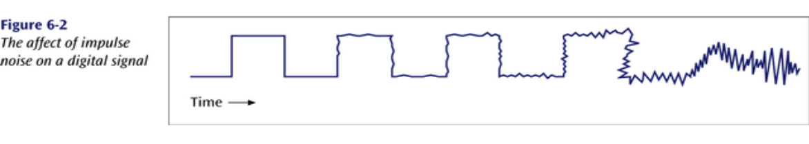

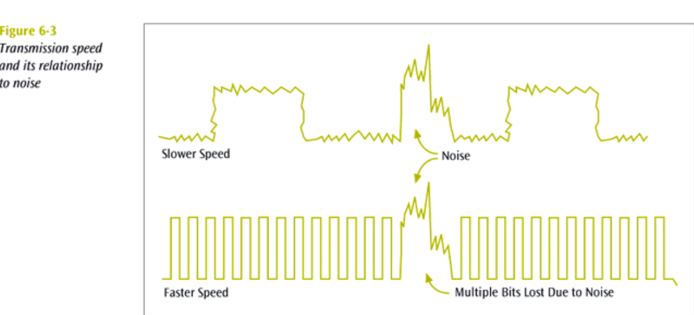

---

### **3. Crosstalk**
Crosstalk is the unwanted coupling between two different signal paths. A typical example is hearing another conversation on a telephone line.  
**Effect**: Although relatively constant, it can cause significant interference and can be reduced through shielding and careful cabling.

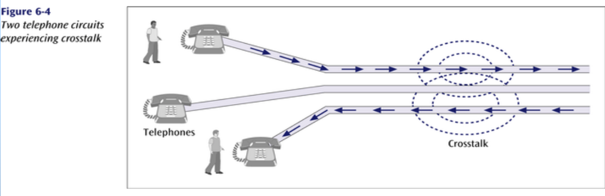

---

### **4. Echo**

Echo is the reflective feedback of a transmitted signal as it moves through a communication medium, often occurring in coaxial cables.  
**Effect**: If severe, echo can distort the original signal, though it can be controlled or reduced with proper techniques.

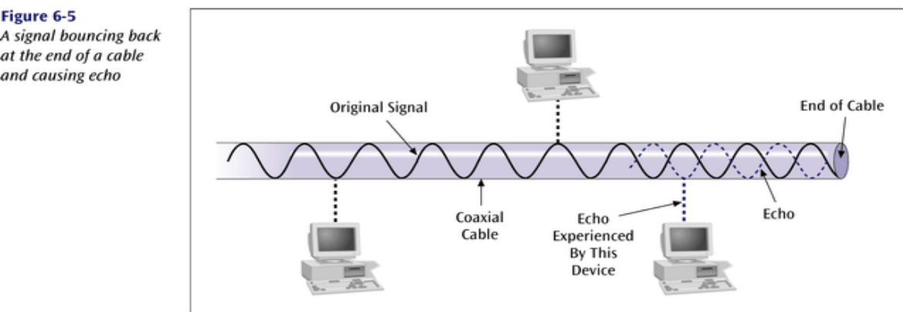

---

### **5. Jitter**


The result of small timing irregularities during the  transmission of digital signals. Occurs when a digital signal is repeated over and over.  
**Effect**: If serious enough, jitter can force a system to slow down its transmission speed, impacting overall communication efficiency.


---

### **6. Delay Distortion**

This occurs when the propagation velocity of a signal varies with its frequency, causing distortion as the signal travels.  
**Effect**: Delay distortion can be mitigated with equalizers, though excessive distortion can affect signal clarity.

---

### **7. Attenuation**

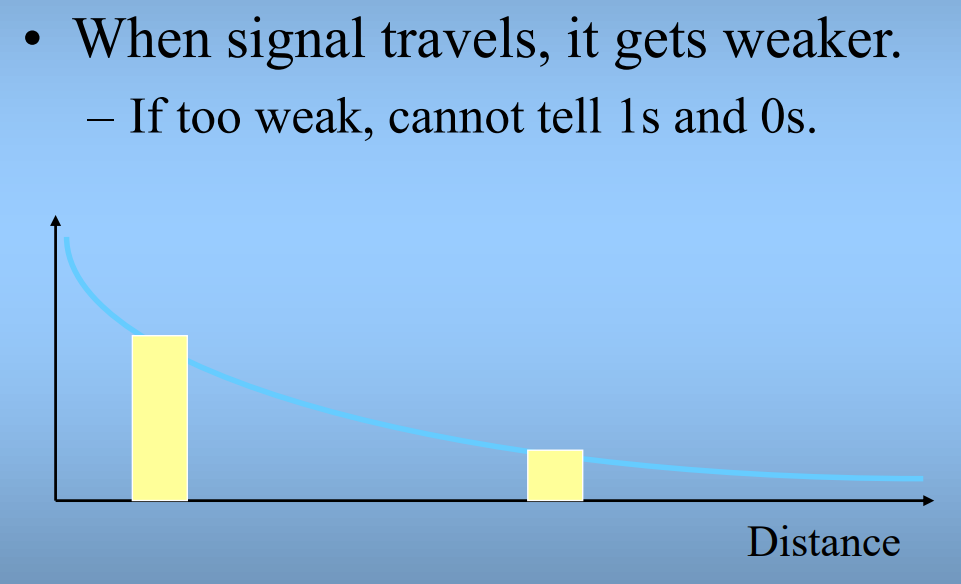

As a signal travels through a medium, it weakens due to attenuation.  
**Effect**: If a signal weakens too much, distinguishing between 1s and 0s becomes difficult, potentially leading to transmission errors. Solutions include using amplifiers or less lossy media.

---

### **8. Distortion**


Signals can become distorted as they travel, especially over long distances. <mark> – Changes shape – Successive bits may merge, making reception  difficult</mark>
**Effect**: This distortion can cause successive bits to merge, making it difficult for the receiver to distinguish between different bits.

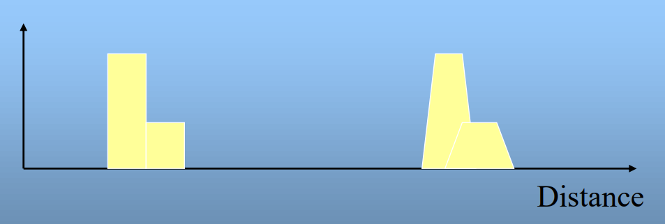

---

### **9. Interference**
Interference refers to unwanted signals from external sources, which can disrupt communication.  
**Effect**: It is often intermittent and can be challenging to diagnose, requiring specific diagnostic tools and methods to resolve.

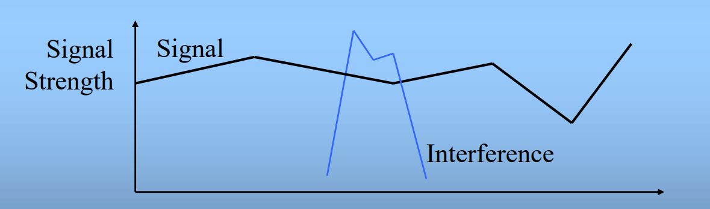

---

## **Error Prevention Techniques**
To minimize the risk of transmission errors, several preventive measures can be applied:

- **Proper shielding of cables**: Helps reduce interference from external noise sources.
- **Telephone line conditioning**: Improves the line's ability to handle signal transmission without introducing noise.
- **Replacing old equipment**: Using modern digital equipment can significantly reduce noise and error rates.
- **Digital repeaters and analog amplifiers**: These devices boost weak signals and prevent attenuation-related errors.
- **Adhering to media capacity limitations**: Following the manufacturer’s specifications ensures that the transmission medium operates within its designed capacity, reducing error risks.

---

# 2.**Transmission Errors Handling**
## **Information Redundancy & Coding**
In data communication, redundancy is often introduced to detect and sometimes correct errors.

- > [!IMPORTANT]
  >
  > -  This is done by encoding a data word (d bits) into a codeword (c bits) where \( c > d \). 
  > - To recover the original data, the c bits must be decoded.
  > -  If they don’t form a valid codeword, an error is detected, and depending on the encoding scheme, some errors can also be corrected.

  

---

## **Separability of a Code**
- **Separable Codes**:  
  A separable code has distinct fields for data and code bits. This allows for easier decoding as the code bits are processed separately from the data to verify correctness.
  
- **Non-separable Codes**:  
  In non-separable codes, data and code bits are integrated, requiring additional processing to extract the data from the encoded word.
  
- > [!TIP]
  >
  > ### **Example of Separable Code**:
  > In a **separable code**, the data and the code bits are stored in distinct sections. This separation makes decoding straightforward.
  >
  > Let’s say you have a **data word** of 4 bits (`1011`), and you add a **parity bit** (`1`) to make the total number of 1’s even. The final codeword becomes:
  >
  > - Data: `1011`
  > - Parity: `1`
  >
  > The **codeword**: `10111`
  >
  > Here, the data (`1011`) and the code bit (parity `1`) are clearly separated. During decoding, you can simply check the parity bit, discard it, and extract the original data without additional processing.
  >
  > ---
  >
  > ### **Example of Non-Separable Code**:
  > In a **non-separable code**, the data and code bits are intermingled, requiring more processing to extract the original data.
  >
  > For example, a **Hamming code** might interleave the parity bits with the data bits. Let’s consider a (7,4) Hamming Code for the data `1011`. The codeword might be structured like this:
  >
  > - Codeword: `p1 p2 m1 p4 m2 m3 m4`  
  >   (Where `p1, p2, p4` are the parity bits, and `m1, m2, m3, m4` are the data bits.)
  >
  > Using **Hamming code placement**, the final encoded word might look like this:
  >
  > - Data: `1011` (mapped to positions `m1, m2, m3, m4`)
  > - Parity: `011` (calculated and placed in positions `p1, p2, p4`)
  >
  > So, the codeword becomes: `0110101`
  >
  > Here, the **data** and **parity bits** are not in separate fields. To decode and detect/correct errors, you must process the entire word (including the parity bits) to recover the original data.
  >

  

---

## **Error Detection and Correction Codes**

> ### **Parity Codes**
> - <mark>The simplest form of error detection uses **parity codes**, <u>which add an extra bit (parity bit) to the data bits. The parity bit is set to ensure the total number of 1’s is either even (even parity) or odd (odd parity).</u></mark>
>
>   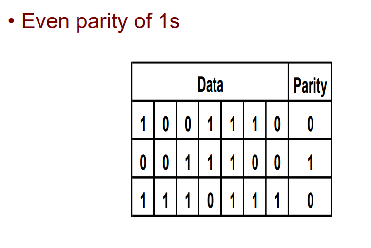
> #### **Example of Parity Code**
> In an even parity code:
>
> Data: 
>
> - Data: `1001100`
> - Parity: `1`
>
> The total number of 1s is **3** (in the data) and adding the parity bit `1` would make it **4** (which is even). Therefore, it should say:
>
> - **Data**: `1001100`
> - **Parity**: `1`
> - **Total number of 1s**: **4** (3 data 1s + 1 parity bit), making it even.
>
> <u>**How it Works in Error Detection**</u>
>
> - If this codeword (`10011001`) is transmitted, the receiver counts the number of 1’s (4 in this case). Since it's even and matches the even parity rule, the data is assumed to be error-free.
> - If any bit changes during transmission (e.g., one bit flips from 0 to 1 or vice versa), the number of 1’s will change, making it odd, and the receiver will detect an error.
>
> This mechanism provides a simple way to detect single-bit errors.

---

### 1. Simple Parity check

Simple-bit parity is a simple error detection method that involves adding an extra bit to a data transmission. It works as:

- 1 is added to the block if it contains an odd number of 1’s, and
- 0 is added if it contains an even number of 1’s

This scheme makes the total number of 1’s even, that is why it is called [even parity](https://www.geeksforgeeks.org/how-even-parity-is-different-from-odd-parity/) checking. 


##### <u>Advantages</u> 

- Simple parity check can detect all single bit error.
- Simple parity check can detect an odd number of errors.
- ***\*Implementation\****: Simple Parity Check is easy to implement in both hardware and software.
- ***\*Minimal Extra Data\****: Only one additional bit (the parity bit) is added per data unit (e.g., per byte).
- ***\*Fast Error Detection\****: The process of calculating and checking the parity bit is quick, which allows for rapid error detection without significant delay in data processing or communication.
- ***\*Single-Bit Error Detection\****: It can effectively detect single-bit errors within a data unit, providing a basic level of error detection for relatively low-error environments.

##### <u>Disadvantages</u>

- Single Parity check is not able to detect even no. of bit error. 
- ***\*For example,\**** the Data to be transmitted is ***\*101010\****. Codeword transmitted to the receiver is 1010101 (we have used even parity). 
  Let’s assume that during transmission, two of the bits of code word flipped to 1111101.
  On receiving the code word, the receiver finds the no. of ones to be even and hence ***\*no error,\**** **which is a wrong assumption.**

### 2. Two dimensional parity check

***\*Two-dimensional Parity check\**** bits are calculated for each row, which is equivalent to a simple parity check bit. Parity check bits are also calculated for all columns, then both are sent along with the data. At the receiving end, these are compared with the parity bits calculated on the received data.

​                                          

##### <u>Advantages</u> 

- Two-Dimensional Parity Check can detect and correct all single bit error.
- Two-Dimensional Parity Check can detect two or three bit error that occur any where in the matrix.

##### <u>Disadvantages</u> 

- Two-Dimensional Parity Check can not correct two or three bit error. It can only detect two or three bit error.
- If we have a error in the parity bit then this scheme will not work.

### 3. Hamming code

> Hamming code is an error-correcting code used to ensure data accuracy during transmission or storage. Hamming code detects and corrects the errors that can occur when the data is moved or stored from the sender to the receiver. This simple and effective method helps improve the reliability of communication systems and digital storage. It adds extra bits to the original data, allowing the system to detect and correct single-bit errors. It is a technique developed by Richard Hamming in the 1950s.
>
> ## ***\*What is Redundant Bits?\****
>
> Redundant bits are extra binary bits that are generated and added to the information-carrying bits of data transfer to ensure that no bits were lost during the data transfer. The number of redundant bits can be calculated using the following formula:
>
> ```
>  2r ≥ m + r + 1 
> ```
>
> where m is the number of bits in input data, and r is the number of redundant bits.
>
> Suppose the number of data bits is 7, then the number of redundant bits can be calculated using: = 24 ≥ 7 + 4 + 1 . Thus, the number of redundant bits is 4.
>
> ## ***\*Types of Parity Bits\****
>
> A parity bit is a bit appended to a data of binary bits to ensure that the total number of 1’s in the data is even or odd. Parity bits are used for error detection. There are two types of parity bits:
>
> - ***\*Even Parity Bit:\**** In the case of [even parity](https://www.geeksforgeeks.org/how-even-parity-is-different-from-odd-parity/), for a given set of bits, the number of 1’s are counted. If that count is odd, the parity bit value is set to 1, making the total count of occurrences of 1’s an even number. If the total number of 1’s in a given set of bits is already even, the parity bit’s value is 0.
> - ***\*Odd Parity Bit:\**** In the case of odd parity, for a given set of bits, the number of 1’s are counted. If that count is even, the parity bit value is set to 1, making the total count of occurrences of 1’s an odd number. If the total number of 1’s in a given set of bits is already odd, the parity bit’s value is 0.
>
> ## ***\*Algorithm of Hamming Code\****
>
> Hamming Code is simply the use of extra parity bits to allow the identification of an error.
>
> Step 1: Write the bit positions starting from 1 in binary form (1, 10, 11, 100, etc).
>
> Step 2: All the bit positions that are a power of 2 are marked as parity bits (1, 2, 4, 8, etc).
>
> Step 3: All the other bit positions are marked as data bits.
>
> Step 4: Each data bit is included in a unique set of parity bits, as determined its bit position in binary form:
>
> - ***\*a.\**** Parity bit 1 covers all the bits positions whose binary representation includes a 1 in the least significant position (1, 3, 5, 7, 9, 11, etc).
> - ***\*b.\**** Parity bit 2 covers all the bits positions whose binary representation includes a 1 in the second position from the least significant bit (2, 3, 6, 7, 10, 11, etc).
> - ***\*c.\**** Parity bit 4 covers all the bits positions whose binary representation includes a 1 in the third position from the least significant bit (4–7, 12–15, 20–23, etc).
> - ***\*d.\**** Parity bit 8 covers all the bits positions whose binary representation includes a 1 in the fourth position from the least significant bit bits (8–15, 24–31, 40–47, etc).
> - ***\*e.\**** In general, each parity bit covers all bits where the bitwise AND of the parity position and the bit position is non-zero.
>
> Step 5: Since we check for even parity set a parity bit to 1 if the total number of ones in the positions it checks is odd. Set a parity bit to 0 if the total number of ones in the positions it checks is even.
>
>  ***\*Determining The Position of Redundant Bits\****
>
> A redundancy bits are placed at positions that correspond to the power of 2. As in the above example:
>
> - The number of data bits = 7
> - The number of redundant bits = 4
> - The total number of bits = 7+4=>11
> - The redundant bits are placed at positions corresponding to power of 2 that is 1, 2, 4, and 8
>
> 
>
> - Suppose the data to be transmitted is 1011001 from sender to receiver, the bits will be placed as follows: 
>
> 
>
> ## ***\*Determining The Parity Bits According to Even Parity\****
>
> - R1 bit is calculated using parity check at all the bits positions whose binary representation includes a 1 in the least significant position. R1: bits 1, 3, 5, 7, 9, 11 
>
> 
>
> - To find the redundant bit R1, we check for even parity. Since the total number of 1’s in all the bit positions corresponding to R1 is an even number. So, the value of R1 (parity bit’s value) = 0.
>
> - R2 bit is calculated using parity check at all the bits positions whose binary representation includes a 1 in the second position from the least significant bit. R2: bits 2,3,6,7,10,11 
>
> 
>
> - To find the redundant bit R2, we check for even parity. Since the total number of 1’s in all the bit positions corresponding to R2 is odd the value of R2(parity bit’s value)=1
> - R4 bit is calculated using parity check at all the bits positions whose binary representation includes a 1 in the third position from the least significant bit. R4: bits 4, 5, 6, 7 
>
> 
>
> -  To find the redundant bit R4, we check for even parity. Since the total number of 1’s in all the bit positions corresponding to R4 is odd so the value of R4(parity bit’s value) = 1
> - R8 bit is calculated using parity check at all the bits positions whose binary representation includes a 1 in the fourth position from the least significant bit. R8: bit 8,9,10,11 
>
> - To find the redundant bit R8, we check for even parity. Since the total number of 1’s in all the bit positions corresponding to R8 is an even number the value of R8(parity bit’s value)=0. Thus, the data transferred is:
>
> 
>
> ## ***\*Error Detection and Correction\****
>
> Suppose in the above example the 6th bit is changed from 0 to 1 during data transmission, then it gives new parity values in the [binary number](https://www.geeksforgeeks.org/binary-number-system/): 
>
> 
>
> For all the parity bits we will check the number of 1’s in their respective bit positions.
>
> - For R1: bits 1, 3, 5, 7, 9, 11. We can see that the number of 1’s in these bit positions are 4 and that’s even so we get a 0 for this.
> - For R2: bits 2,3,6,7,10,11 . We can see that the number of 1’s in these bit positions are 5 and that’s odd so we get a 1 for this.
> - For R4: bits 4, 5, 6, 7 . We can see that the number of 1’s in these bit positions are 3 and that’s odd so we get a 1 for this.
> - For R8: bit 8,9,10,11 . We can see that the number of 1’s in these bit positions are 2 and that’s even so we get a 0 for this.
> - The bits give the binary number 0110 whose decimal representation is 6. Thus, bit 6 contains an error. To correct the error the 6th bit is changed from 1 to 0.
>
> ## Features of Hamming Code
>
> - ***\*Error Detection and Correction:\**** Hamming code is designed to detect and correct single-bit errors that may occur during the transmission of data. This ensures that the recipient receives the same data that was transmitted by the sender.
> - ***\*Redundancy:\**** Hamming code uses redundant bits to add additional information to the data being transmitted. This redundancy allows the recipient to detect and correct errors that may have occurred during transmission.
> - ***\*Efficiency:\**** Hamming code is a relatively simple and efficient error-correction technique that does not require a lot of computational resources. This makes it ideal for use in low-power and low-bandwidth communication networks.
> - ***\*Widely Used:\**** Hamming code is a widely used error-correction technique and is used in a variety of applications, including telecommunications, computer networks, and data storage systems.
> - ***\*Single Error Correction:\**** Hamming code is capable of correcting a single-bit error, which makes it ideal for use in applications where errors are likely to occur due to external factors such as electromagnetic interference.
> - ***\*Limited Multiple Error Correction:\**** Hamming code can only correct a limited number of multiple errors. In applications where multiple errors are likely to occur, more advanced error-correction techniques may be required.
>
> For Implementation you can refer [this](https://www.geeksforgeeks.org/hamming-code-implementation-in-c-cpp) article.
>
> ## Question on Hamming Code
>
> ### Assume that 12 bit hamming codeword consist of 8 bit data and 4 check bits is d8d7d6d5c4d4d3d2c3d1c2c1 ,where the data bits and the check bits are given in the following tables: [GATE 2021 ]
>
> 
>
> Which one of the following choices gives the correct values of x and y ?
>
> (A) x is 0 and y is 0
>
> (B) x is 0 and y is 1
>
> (C) x is 1 and y is 0
>
> (D) x is 1 and y is 1
>
> ***\*Answer: (A)\****
>
> We will first insert our codeword according to hamming code d8d7d6d5c4d4d3d2c3d1c2c1,
>
> 
>
> Now,calculating hamming code according to first parity bit C1: d7d5d4d2d1c1. 1×0010, To make number of 1 even , for this x must be 0.
>
> Similarly, lets calculate for y , we will start from c8 and make its even=>110xy here x is already 0 , so y should be 0.
>
> So the value of x is 0 and y is 0.
>
> For more details you can refer [GATE | GATE CS 2021 | Set 1 | Question 39](https://www.geeksforgeeks.org/gate-gate-cs-2021-set-1-question-39) published quiz.
>
> ## Advantages
>
> - Hamming code can detect and correct single-bit errors, enhancing data reliability during transmission and storage.
> - It adds a minimal number of redundant bits to the original data, maintaining a good balance between data integrity and overhead.The algorithm for generating and checking Hamming code is straightforward and can be easily implemented in both hardware and software.
> - By detecting and correcting errors, Hamming code ensures that the received data is accurate, reducing the chances of data corruption.
> - Hamming code is widely used in various fields such as computer memory (RAM), data storage devices, and communication systems.
> - Compared to more complex error correction codes, Hamming code provides a cost-effective solution for applications where single-bit error correction is sufficient.
>
> ## Disadvantages
>
> - Hamming code can only correct single-bit errors. It is unable to correct multiple-bit errors, which limits its effectiveness in environments with high error rates.
> - While it can detect single-bit and some two-bit errors, Hamming code cannot detect all multiple-bit errors. This reduces its reliability in certain applications.
> - Although it uses fewer redundant bits compared to some other error correction methods, the addition of these bits still increases the overall data size, which can be a drawback in bandwidth-constrained environments.
> - Implementing Hamming code requires additional hardware or software resources for error detection and correction, which can be a limitation in resource-constrained systems.
>
> ## Conclusion
>
> Hamming code is a method used for [error correction](https://www.geeksforgeeks.org/error-correction-in-computer-networks/) in data transmission. It can detect and correct single-bit errors, ensuring that the data received matches the data sent. This makes communication systems more reliable by reducing the impact of errors.


### 4. Checksum (<mark>extra</mark>)

Checksum error detection is a method used to identify errors in transmitted data. The process involves dividing the data into equally sized segments and using a [1’s complement](https://www.geeksforgeeks.org/ones-complement/) to calculate the sum of these segments. The calculated sum is then sent along with the data to the receiver. At the receiver’s end, the same process is repeated and if all zeroes are obtained in the sum, it means that the data is correct.

#### <u>Checksum – Operation at Sender’s Side</u>

- Firstly, the data is divided into k segments each of m bits.
- On the sender’s end, the segments are added using 1’s complement arithmetic to get the sum. The sum is complemented to get the checksum.
- The checksum segment is sent along with the data segments.

#### <u>Checksum – Operation at Receiver’s Side</u>

- At the receiver’s end, all received segments are added using 1’s complement arithmetic to get the sum. The sum is complemented.
- If the result is zero, the received data is accepted; otherwise discarded.


### 5.Cyclic Redundancy Check (CRC)

- Unlike the checksum scheme, which is based on addition, CRC is based on [binary division](https://www.geeksforgeeks.org/binary-division/).
- In CRC, a sequence of redundant bits, called cyclic redundancy check bits, are appended to the end of the data unit so that the resulting data unit becomes exactly divisible by a second, predetermined binary number.
- At the destination, the incoming data unit is divided by the same number. If at this step there is no remainder, the data unit is assumed to be correct and is therefore accepted.
- A remainder indicates that the data unit has been damaged in transit and therefore must be rejected.

                                              *CRC Working*

We have given data word of length n and divisor of length k.

***\*Step 1:\**** Append (k-1) zero’s to the original message

***\*Step 2:\**** Perform modulo 2 division

***\*Step 3:\**** Remainder of division = CRC

***\*Step 4:\**** Code word = Data with append k-1 zero’s + CRC

Note:

- CRC must be k-1 bits
- Length of Code word = n+k-1 bits

Example: Let’s data to be send is 1010000 and divisor in the form of polynomial is x3+1. CRC method discussed below.


---

### **Summary**
- Information Coding Techniques
- Parity Codes
- Hamming Codes
- Cyclic Redundancy Check (CRC)

---

This detailed note on **Transmission Errors 2** outlines the various methods of error detection and correction through redundancy and coding techniques.