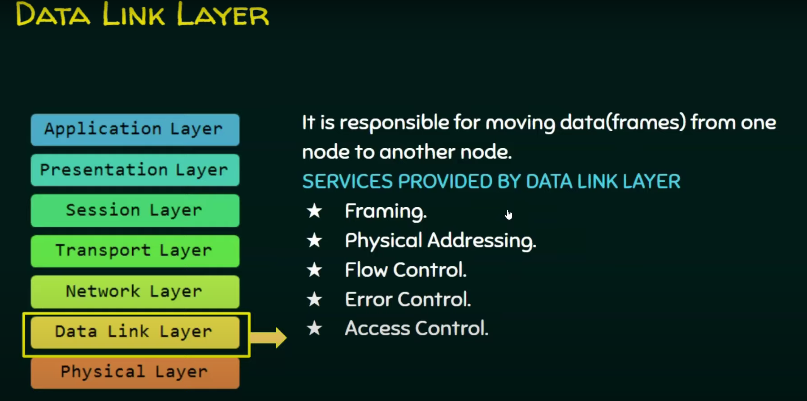

# Local Area Networks

## Network Types

Depend on geographic area covered by a network and  protocols involved,

1. **PAN – Personal Area Networks**

   - Scope: A few meters.

   - Purpose: Connects personal devices, like computers, smartphones, and wearables, within close proximity.
   - Examples: Bluetooth connections, infrared links.

2. **LAN – Local Area Networks**

   - Scope: A limited area, typically a building or campus.

   - Purpose: Allows organizations to interconnect communication equipment for internal use, efficiently handling communication within an organization.
   - Examples: Office networks, home Wi-Fi networks.

3. **MAN – Metropolitan Area Networks**

   - Scope: Covers a city or metropolitan area, usually up to about 30 kilometers.

   - Purpose: Extends connectivity beyond a LAN, often connecting multiple LANs within a larger region.
   - Examples: City-wide Wi-Fi, cable TV networks.

4. **WAN – Wide Area Networks**

   - Scope: Large geographical areas, potentially spanning countries or continents.

   - Purpose: Enables communication across vast distances, often connecting multiple LANs and MANs.
   - Examples: The internet, satellite networks.

5. **Interplanetary Networks**

   - Scope: Extends beyond Earth, spanning interplanetary distances.

   - Purpose: Facilitates communication between spacecraft and Earth, and potentially between celestial bodies.
   - Examples: NASA’s Deep Space Network.

## Network Topologies

- The way in which the end points or stations attached to the  network are interconnected.

  > A **station** in the context of networks typically refers to any device or endpoint connected to the network that can send, receive, or process data. These devices are also known as **nodes** or **hosts**. A station could be a computer, printer, smartphone, server, or any other network-enabled device. In network diagrams, stations are often represented as individual points connected to a network, and they interact with each other according to the network's topology.

------

### 1. Bus and Tree Topology

In **Bus and Tree Topologies**, a single communication line is shared among multiple stations, allowing data to be transmitted across the network. Here’s a closer look at their features and how common challenges are addressed:

##### Bus Topology

- **Structure**: In a bus topology, all stations (devices) are connected to a single central communication line, known as the "bus."
- **Hardware Interface (Tap)**: Each station is connected to the bus using a tap, which is a hardware interface allowing full-duplex communication between the station and the bus.
- **Terminator**: At each end of the bus, a terminator absorbs signals, preventing them from reflecting back along the line, which could cause interference.
- **Signal Propagation**: When a station sends data, it travels along the bus, and all other stations can detect and receive it.
- **Extendibility**: Additional stations can be added by connecting them to the bus with taps, making it simple and easily extendible.

##### Tree Topology

- **Structure**: A tree topology is essentially an extension of a bus topology, with multiple bus segments connected in a hierarchical tree-like structure. 
- **Special Case**: A single bus line can be seen as a simple form of a tree topology, where each segment can branch out further.

##### Key Challenges in Bus and Tree Topologies

1. **Addressing (Who Receives the Data)**:
   - Since the bus is a shared communication line, a mechanism is needed to specify which station should process the data. 
   - **Solution**: Data is sent in frames with control information in the header, typically including a destination address. This address ensures only the intended station processes the data.

2. **Media Access Control (When to Access the Shared Medium)**:
   - With multiple stations sharing the same medium, there must be a protocol to control when each station can send data, preventing collisions and ensuring orderly communication.
   - **Solution**: Media Access Control (MAC) protocols, such as CSMA/CD (Carrier Sense Multiple Access with Collision Detection) in Ethernet, are implemented to manage access to the shared medium. These protocols help coordinate transmission timings among stations and handle situations where two stations attempt to send data simultaneously.

##### Advantages and Disadvantages

- **Advantages**: 
   - Simple to install and extend, especially in smaller networks.
   - Cost-effective due to reduced cable requirements (especially in bus topology).
- **Disadvantages**:
   - The entire network can be affected by a fault in the bus line.
   - Performance degrades as more stations are added and the volume of data traffic increases.

By implementing these solutions, bus and tree topologies can maintain efficient data transmission across a shared network medium, making them suitable for various small to medium-sized network configurations.

### 2. Ring Topology

In a **Ring Topology**, devices are connected in a closed loop, with each device directly connected to its two neighboring devices. Here’s an overview of its structure, data transmission, and frame insertion methods:

##### Structure of Ring Topology

- **Closed Loop**: The network is arranged in a circular, closed loop where each station is connected to two adjacent stations through point-to-point links.
- **Repeaters**: Each station is attached to the network at a repeater, a device that amplifies or regenerates the signal. This ensures data can travel the full length of the ring without degrading.
- **Unidirectional Transmission**: Typically, data moves in one direction (clockwise or counterclockwise) around the ring. Some advanced ring networks may support bidirectional communication, but traditional ring topology is unidirectional.

##### Data Transmission in Ring Topology

- Frame-Based Transmission : Data is sent in packets or "frames." Each frame circulates around the ring, passing through each station along the way.
  - **Destination Station**: Each station examines each passing frame. When a frame reaches its intended destination, the station reads the data.
  - **Source Removal**: After the frame completes a full loop and returns to the source station, it is removed from the ring to prevent network congestion.

##### Frame Insertion and Access Control

- Media Access Control Protocols: Protocols determine when each station can insert frames into the ring to avoid data collisions.
  - Token Passing Protocol : One of the most common protocols in ring topology is Token Passing. In this method:
    - A "token" (a special control frame) circulates around the ring.
    - Only the station holding the token can insert data frames into the ring.
    - Once the station has sent its data, it releases the token, allowing the next station in line to use the network.
  - This controlled access prevents data collisions, as only one station can transmit at a time.

##### Advantages and Disadvantages

- Advantages:
  - Predictable performance under heavy load, as token passing ensures orderly access to the network.
  - Simplified troubleshooting, since a break in the loop can easily be located.
- Disadvantages:
  - A failure in any single station or link can disrupt the entire network, though adding redundancy or using dual rings (for bidirectional transmission) can mitigate this issue.
  - Slower performance as more stations are added, since each station must wait for the token to circulate.

Ring topology is effective for managing orderly communication in moderate-sized networks, especially when a predictable and fair access method is required.

### 3. Star Topology

In a **Star Topology**, a central station or **central node** acts as the primary communication hub for all devices in the network. Here’s how it functions and the different roles the central node can play:

##### Characteristics of Star Topology
1. **Central Communication Hub**: 
   - All devices, or stations, are connected directly to a central node. This central node can be a hub, switch, or router.
   - Every station communicates with other stations through this central hub, rather than connecting directly to each other.

2. **Types of Central Node Operations**:
   - **Broadcasting Node** (e.g., **Hub**):
     - In a network using a hub as the central node, data sent by any station is **broadcast** to all connected stations. Each station then checks if the message is intended for it.
     - Hubs operate at the physical layer and do not manage data intelligently; they simply repeat incoming signals to all ports.
   - **Frame Switching Device** (e.g., **Switch**):
     - In a network using a switch as the central node, the switch acts as a **frame-switching device**. It reads the destination address in each frame and **forwards the frame only to the intended recipient**.
     - Switches operate at the data link layer and provide more efficient, direct communication between stations, reducing unnecessary data traffic.

3. **Communication Between Stations**:
   - Since each station connects directly to the central node, all communication between two stations must go through this node.
   - This setup centralizes the control and management of data flow, making it easier to monitor and troubleshoot the network.

##### Advantages and Disadvantages of Star Topology
- **Advantages**:
   - **Centralized Management**: Easy to monitor, troubleshoot, and manage.
   - **Fault Isolation**: If one station fails, it does not affect the rest of the network, as each station is independently connected to the central node.
   - **Scalability**: Adding new devices is straightforward, requiring only a connection to the central node.

- **Disadvantages**:
   - **Single Point of Failure**: If the central node fails, the entire network becomes inoperable.
   - **Higher Cable Requirements**: More cabling is needed compared to topologies like bus, as each station requires a separate connection to the central node.

Star topology is commonly used in modern networks due to its manageability and reliability, especially with switches as the central node, providing efficient, direct communication between devices.

### 4. Considerations to do when choosing

When choosing a **network topology**, several key factors must be considered to ensure the network meets operational requirements effectively. Here’s how each factor influences the choice:

1. **Cost**:
   - The initial setup cost varies by topology. For example, **star topology** generally requires more cabling, which can increase costs, especially in large networks.
   - **Bus topology** is cost-effective for smaller networks due to minimal cabling, but costs can rise if extensive troubleshooting or enhancements are needed over time.
   - Devices such as **hubs, switches,** or **routers** add to the cost, especially in centralized topologies like star or mesh networks.
2. **Reliability**:
   - Some topologies are inherently more reliable. **Star topology** provides fault isolation, where the failure of a single station does not affect others, but the central node’s failure can halt the network.
   - **Mesh topology** offers the highest reliability, as multiple paths exist between stations, ensuring network continuity even if some links fail.
   - **Bus topology** is less reliable for larger networks; a single break in the main cable can disrupt the entire network.
3. **Expandability**:
   - Networks should be able to grow as needed. **Star topology** is easy to expand, as additional stations only require connection to the central node.
   - **Tree topology** is also suitable for expansion, as it allows hierarchical growth.
   - In contrast, **bus topology** can become complex and unreliable with more devices, making it less ideal for networks expected to expand significantly.
4. **Performance**:
   - **Data traffic** and **network load** impact performance, making it essential to choose a topology that distributes traffic efficiently.
   - **Mesh topology** provides high performance by offering multiple routes for data, making it ideal for networks with heavy traffic.
   - **Ring topology** with token passing ensures fair and predictable access times, which helps with performance consistency, though it may slow down as more devices are added.
   - **Star topology** with a switch can enhance performance by allowing simultaneous, direct data transfers between multiple devices.
5. **Overall Design, Media, Wiring Layout, and Access Control**:
   - The choice of **cabling and physical layout** influences which topologies are practical. For example, **fiber-optic** or **twisted-pair** cabling might suit certain topologies better, depending on the physical space and expected data speed.
   - **Access control methods** also play a role. For instance, **token-passing** in ring topology suits environments where fair, controlled access is needed, while **CSMA/CD** in bus topology is suitable for smaller networks with lighter data loads.
   - The design also considers **environmental factors**, like office layouts, where wireless topologies might be preferable for open or dynamic spaces.

Each topology has its own strengths and limitations, and the choice depends on balancing these factors based on the network’s scale, usage needs, and future growth potential.

------

# Protocols

**Application Layer**

- Contains the actual application data that needs to be transmitted.

**Transport Layer (TCP Layer)**

- Adds a TCP header to the data, forming a TCP segment. This layer handles data integrity and flow control.

**Network Layer (IP Layer)**

- Adds an IP header to the TCP segment, creating an IP datagram. This layer is responsible for routing the data to its destination.

**Data Link Layer (LLC Layer)**

- Adds an LLC (Logical Link Control) header to the IP datagram, forming an LLC protocol data unit. The LLC sublayer manages communication and error-checking.

**MAC Layer**

- Adds a MAC header at the start and a MAC trailer at the end to create a complete MAC frame. The MAC layer deals with physical addressing and access control for the transmission medium.

------

- Every layer has it's own set of protocols.<mark>In here we will discuss about  data link layer protocols</mark>

for physical layer to generate signals based on 1s and 0s data link layer should add control signals and encapsulate them as frames.

 <mark>Data Link layer is divided into two sub layers</mark>

### sublayers of data link layer

### MAC protocol

####  An ideal MAC protocol

#### Real MAC protocols

#### 1.Chanel partitioning MAC protocols

> [!NOTE]
>
> ## 1. TDMA (Time division Multiple access) protocol
>
> 
>
> Data will be sent in different times.
>
> 
>
> 
>
> ## 2. FDMA (Frequency division Multiple access) protocol
>
> - This is a data link layer . But it users Frequency division multiplexing at physical layer.
>
>   ​    
>
> 

#### 2. Random access MAC protocols

> **Full Channel Utilization**:
>
> - When a node has data to send, it transmits at the full data rate of the channel (denoted as **R**).
> - There’s **no centralized scheduling** or pre-defined order for transmissions, leading to the possibility of simultaneous transmissions by multiple nodes.
>
> **Collisions**:
>
> - **Collision** occurs when two or more nodes transmit at the same time, resulting in interference and loss of data.
> - Random access protocols specify mechanisms to **detect** these collisions and **recover** from them, often by re-transmitting data after a random delay to reduce the chance of repeated collisions.
>
> **Core Components**:
>
> - **Collision Detection**: Mechanisms to identify when a collision has occurred.
> - **Collision Recovery**: Methods to handle collisions, usually involving delayed retransmissions to avoid repeated interference.
>
> # *1. CSMA*
>
> 
>
> 
>
> Carrier (channel / medium) Sense Multiple Access ensures fewer collisions as the station is required to first sense the medium (for idle or busy) before transmitting data. If it is idle then it sends data, otherwise it waits till the channel becomes idle. However there is still chance of collision in CSMA due to propagation delay. For example, if station A wants to send data, it will first sense the medium. If it finds the channel idle, it will start sending data. However, by the time the first bit of data is transmitted (delayed due to propagation delay) from station A, if station B requests to send data and senses the medium it will also find it idle and will also send data. This will result in collision of data from station A and B. 
>
> > Extra
> >
> > 
>
> <mark>Modified protocols</mark>
>
> #  *2. CSMA/CD*
>
> 
>
> 
>
> 
>
> - Carrier sense multiple access with collision detection. Stations can terminate transmission of data if collision is detected, reducing channel  wastage.
> - <mark>Used in wired networks like Ethernet.</mark> If a collision is detected during transmission, the transmission stops immediately, and the nodes wait for a random time before reattempting.
>
> **Extra from Neso:**
>
> 
>
> 
>
> 
>
> 
>
> # *3. CSMA/CA* (Out of syllabus)
>
> -  Used in wireless networks like Wi-Fi, where it’s harder to detect collisions. Instead, nodes use strategies to avoid collisions, such as waiting for a random backoff time before transmitting.

------

#### 3. Taking turns / Controlled access protocols

> # 1. Polling
>
> 
>
> 
>
> 
>
> # 2. Token passing
>
> 
>
> 
>
> 

> ## <u>Mac Address</u>
>
> 
>
> ## <u>Bandwidth</u>
>
> 
>
> ------

------

# Ethernet

Ethernet standards : in Layer 2 : Ethernet protocol             in layer 1 : Ethernet technology

## <u>Frame format of ethernet</u>

<mark>Preamble+ SFD is taken as the preamble in lecture</mark>

| Field                           | Size (Bytes) | Description                                                  |
| ------------------------------- | ------------ | ------------------------------------------------------------ |
| **Preamble**                    | 7            | Synchronization pattern for the receiver.                    |
| **Start Frame Delimiter (SFD)** | 1            | Indicates the start of the frame.                            |
| **Destination MAC Address**     | 6            | MAC address of the recipient.                                |
| **Source MAC Address**          | 6            | MAC address of the sender.                                   |
| **Ether Type/Length**           | 2            | Identifies the protocol type or specifies the payload length. |
| **Payload/Data**                | 46-1500      | Contains the actual data, with padding if necessary to reach the minimum frame size. |
| **Frame Check Sequence (FCS)**  | 4            | CRC used to check for errors in the frame.                   |

Ethernet address is 6 bytes.

> [!IMPORTANT]
>
> ### Summary: Ethernet Frame vs. Ethernet Address
>
> - **Ethernet Address (MAC)**: A 6-byte identifier unique to each device on a network.
> - **Ethernet Frame**: A structured data packet that includes source and destination Ethernet addresses (12 bytes total for both) and other fields necessary for data transmission.

