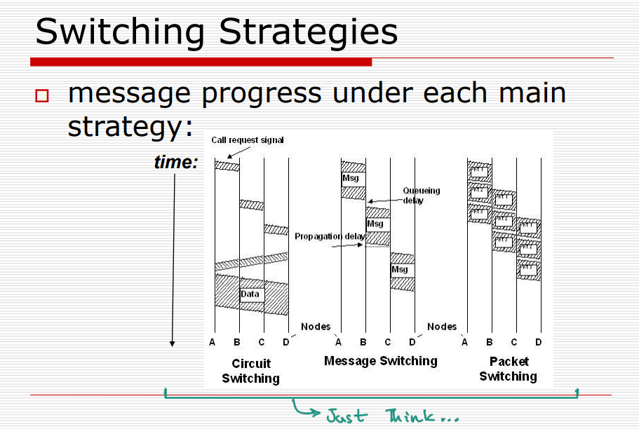

# Switching


## Why Switched networks ?


**Cost Efficiency**:

- In a network where each device would otherwise need a direct connection to every other device, the cost would be prohibitive. For n devices, a direct connection model would require n*(n−1)/2 links, which scales poorly.
- Switched networks use centralized switching devices (like switches and routers) to manage connections between devices, greatly reducing the number of direct physical links needed.

**Scalability Across Large Distances**:

- Unlike in a **Local Area Network (LAN)**, where devices are typically close to one another and broadcasts can work effectively, switched networks can handle devices spread across vast areas (like in Wide Area Networks, or WANs).
- Switched networks avoid broadcasting to all devices, which reduces unnecessary data traffic and ensures that only relevant devices receive each communication.

**Efficient Signal Routing**:

- In switched networks, the path a signal takes from sender to receiver can be dynamically determined by the switches, optimizing the route based on network conditions, path availability, and traffic.
- This switching allows more efficient, reliable communication, as switches direct data specifically to the intended recipient without flooding the entire network.

**Direct Connections are Not Available**:

- When the **source and destination** devices are not directly connected, a switch is needed to intelligently route the signal. The switch acts as an intermediary that directs the data to its correct destination by selecting an optimal path through the network.

> Similar to how **public transportation** systems (like buses) help people travel from one location to another without a direct path, switches enable data to "hop" between network segments, ultimately reaching its destination even if it’s far away.


## Routing vs switching

> [!TIP]
>
> - **Routing** is about **finding the path** across multiple networks (e.g., LAN to WAN), focusing on the big picture of how data traverses the internet or interconnected networks. 
>
> - **Switching** is about **moving data within a network**, efficiently managing data flow in a local area network (LAN). 
>
>   | Feature     | Routing                             | Switching                               |
>   | ----------- | ----------------------------------- | --------------------------------------- |
>   | **Purpose** | Determines path across networks     | Transfers data within a network segment |
>   | **Layer**   | Network Layer (Layer 3)             | Data Link Layer (Layer 2)               |
>   | **Device**  | Router                              | Switch                                  |
>   | **Usage**   | For inter-network communication     | For intra-network communication         |
>   | **Method**  | Uses IP addresses in routing tables | Uses MAC addresses in switching tables  |


------

## Switching techniques

  `4. Cell Switching (in lecture note) ` and

` label switching under packet switching as well`

### 1. Circuit Switching

Circuit Switching is a method of communication where a dedicated path is set up for the entire duration of the transmission between the caller and receiver. :


- **Dedicated Path**: A specific communication path is pre-allocated, meaning resources are reserved throughout the transmission.

- **Availability Requirement**: The caller, callee, and all intermediary links and nodes must be available simultaneously for the connection to be established.

- **Payment and Utilization**: Circuit capacity is reserved, and the user must pay for this capacity regardless of whether it is fully utilized. This makes it less efficient in cases where data transmission is sporadic (not continuously). 

- **Characteristics of the Route**:

  - **Low Transmission Delays**: Once the path is established, data can flow without significant delays, which is beneficial for real-time applications.

  - **Lack of Optimization**: The fixed route cannot be altered to optimize traffic flow, making it less flexible.

  - Idle time is a overhead : If two people are in a call and they stopped talking for 5 minutes. in that 5 minutes that resources cannot be used by any other devices.

  - > Suppose a person is talking to his friend, after sometime both of them stop talking for 5 minutes. For these 5 minutes, the reserved resources are idle and cannot be used by any other ongoing communication because they are reserved for their communication session only. Due to this reason, the circuit switched networks have low efficiency. However, the delay in this type of network is minimal because there is no waiting at the switches as the circuit is already set up before data transfer. The delay is only due to the time needed to set up connection,transfer data and terminating the circuit.

- **Application Suitability**:

  - **Good for Telephone Communications**: It is suitable for continuous, real-time, human-to-human communication, like telephone calls.
  - **Less Suitable for Computer Communications**:
    - **Set-Up Time**: There is a delay while the circuit is being set up, which can be inefficient for short or intermittent data exchanges.
    - **Data Bursts**: Circuit switching is not ideal for handling bursts of data, as the dedicated path cannot be reallocated or scaled dynamically based on demand (When a button in a website is clicked sudden data burst will be sent, So it is hard to send it through circuit switching at instant, because it need to establish a connection first) .

> ## Types of Circuit Switching
>
> 1. Space Division Switching
> 2. Time Division Switching
>
> ### 1. Space-Division Switching
>
>  
>
> - **Definition**: In space-division switching, each call is allocated a distinct physical path through the switch. This means that each connection uses separate hardware resources, such as different paths in a physical switch.
> - **How It Works**: Each call is established over its dedicated route, which may include separate wires or channels, effectively isolating each communication session.
> - Each sample takes a  different path  through the switch,  depending on its  destination 
>
>  <u>Crossbar: Simple  space-division switch</u>
>
> -   Cross points can be  turned on or off .  <mark>crosspoint :arrow_forward: different path through the switch</mark> 
>
>  
>
> 
>
> 
>
> - Advantages:
>   - Provides consistent performance since each call has a dedicated path.
>   - Eliminates interference between different calls.
> - Disadvantages:
>   - It can be resource-intensive, as it requires more physical infrastructure to accommodate multiple calls simultaneously.
>
> ### 2. Time-Division Switching
>
> 
>
> 
>
> - **Definition**: In time-division switching, each call is divided into smaller segments or pieces, and each piece is assigned a specific time slot within a shared channel.
> - **How It Works**: The data from each call is transmitted in these time slots, and the switch manages the assignment of time slots to different calls. The contents of each time slot can be processed independently.
> - Advantages:
>   - More efficient use of resources since multiple calls share the same physical medium and infrastructure.
>   - Allows for dynamic allocation of bandwidth based on demand, which can be beneficial for fluctuating traffic patterns.
> - Disadvantages:
>   - Introduces potential delays (latency) due to the time slot management and switching process.
>   - May not perform as well in real-time applications where consistent, uninterrupted transmission is critical.
>
> ## Problems with Circuit switching
>
> 
>
> 


### 2. Message Switching


**Store-and-Forward Mechanism**:

- In message switching, entire messages are received at a switching node (router or gateway) before they are forwarded to the next node. This allows the system to process the message and make forwarding decisions based on the current network conditions.

  

  

  

  

<mark>**Hop-by-Hop Transmission**:</mark>

- Messages travel through a series of nodes, or hops, from the sender to the final destination. At each node, the message is stored, processed, and then forwarded to the next node.

**Intermittent Progress**:

- As each hop becomes available (i.e., when the node has finished processing the current message), the next portion of the message is forwarded. This can lead to delays, especially if multiple messages are waiting to be processed.
- මැසේජ් එකම තමා තීරණය කරන්නේ ඊළගට මම යන්නේ කොහෙටද කියලා. 

**Uncertain End-to-End Delivery Time**:

- Since the delivery time depends on various factors such as network congestion, message size, and node processing times, it is not possible to guarantee a specific delivery time for messages.

**Impact of Very Long Messages**:

- Long messages can cause significant issues in the network:

  - **Buffer Space**: They can occupy a large amount of buffer space at intermediate nodes, which may prevent other messages from being processed. This can lead to delays and increased latency.
  - **Link Congestion**: Long messages can hog the links between nodes, making it difficult for other messages to be transmitted effectively. This can further exacerbate congestion in the network.

   

  HOG: take or use most or all of (something) in an [unfair](https://www.google.com/search?sca_esv=65c381cf0e3fbdc7&sxsrf=ADLYWIKs1CC0kHP7WiqwZjtTBfS1EHURHg:1730958230914&q=unfair&si=ACC90nwzNcbSj6HKgPz_Y9fzn5jcOTUMg8AgsalnQp0eDE0jAAU0hB6gIUMWzqt3K0qSW74siknf4cJWOiJ1UjllEgXMg3R41g%3D%3D&expnd=1&sa=X&ved=2ahUKEwjv2eXzwcmJAxX5yzgGHbTjALAQyecJegQILRAy) or [selfish](https://www.google.com/search?sca_esv=65c381cf0e3fbdc7&sxsrf=ADLYWIKs1CC0kHP7WiqwZjtTBfS1EHURHg:1730958230914&q=selfish&si=ACC90nypsxZVz3WGK63NbnSPlfCBUdFBUeoIscdU4JJg85H2XF0graedQlKWZH4vYZYxxBM39KohlIQJOE_ldz4ebAppbF4qig%3D%3D&expnd=1&sa=X&ved=2ahUKEwjv2eXzwcmJAxX5yzgGHbTjALAQyecJegQILRAz) way. take or use most or all of (something) in an [unfair](https://www.google.com/search?sca_esv=65c381cf0e3fbdc7&sxsrf=ADLYWIKs1CC0kHP7WiqwZjtTBfS1EHURHg:1730958230914&q=unfair&si=ACC90nwzNcbSj6HKgPz_Y9fzn5jcOTUMg8AgsalnQp0eDE0jAAU0hB6gIUMWzqt3K0qSW74siknf4cJWOiJ1UjllEgXMg3R41g%3D%3D&expnd=1&sa=X&ved=2ahUKEwjv2eXzwcmJAxX5yzgGHbTjALAQyecJegQILRAy) or [selfish](https://www.google.com/search?sca_esv=65c381cf0e3fbdc7&sxsrf=ADLYWIKs1CC0kHP7WiqwZjtTBfS1EHURHg:1730958230914&q=selfish&si=ACC90nypsxZVz3WGK63NbnSPlfCBUdFBUeoIscdU4JJg85H2XF0graedQlKWZH4vYZYxxBM39KohlIQJOE_ldz4ebAppbF4qig%3D%3D&expnd=1&sa=X&ved=2ahUKEwjv2eXzwcmJAxX5yzgGHbTjALAQyecJegQILRAz) way.

> NOT SUITABLE FOR STREAMING MEDIA AND REAL TIME APPLICATIONS.
>
> For example, if sender is sending a real -time communication, two people are talking over voice over IP phone. So, we can't expect the intermediary node to collect all the data that is sent by the person and forward it, because it is a real -time communication. For real -time applications, message switching technique cannot be used. So, for streaming media like real -time communications, or live data transfer, or for real -time applications, message switching technique will not be suitable. 

### 3. Packet switching

  Header එකෙන් කියන්නේ මෙතන ඉදන් තමා මම ආවේ මෙතනට තමා මම යන්න ඕනේ වගේ විස්තර.


> 
>
> 
>
> ## 1. Datagram packet switching
>
> 
>
>  Packets are routed independently 
>
>  No initial circuit set-up costs or delays
>
> ` Switching each packet is relatively  expensive`
>
>  adapts to node and link failures during  transmission 
>
>  datagrams may arrive out of order
>
> 
>
> Example
>
> 
>
> 
>
> 
>
> 
>
> Datagram 4 was faster than datagram 3 . But receiver knows how to reorder this because each datagram has a sequence number. `datagram = packet`
>
> 
>
> ## 2. Virtual circuit switching
>
> 
>
> 
>
> 
>
> example
>
> 
>
> - All the packets are transmitted in the same route. <mark> In circuit switching there were no data packets, no addressing ,only data flow. But in virtual circuit packet switching there will be packets</mark>
> - `Route will be decided on the availability. So always the route will not be same`
>
> 
>
> 
>
> 
>
> 
>
> ## 3. Label Switching
>
> 	core- ලේබල් එක අනුව ස්විච් කරන ස්විචස්.
>
> ලේබල් එකෙන් දැනගන්න පුලුවන් මෙයා කොහෙ ඉදන්ද ආවේ , මම කොහෙට යැව්වොත්ද වැඩියෙන්ම optimal වෙන්නේ වගේ දේවල්. පස්සේ ඒ core එක මගින් අලුත් ලේබල් එකක් ගහලා ඊළග එක වෙත යවයි.
>
> ```scala
> Path Determination: The network decides the path for packets.
> 
> Label Use: Labels are used to switch packets in the network.
> 
> Next Hop: Labels help determine the next hop for the packet.
> 
> Similarity to Virtual Circuits: The label system is similar to virtual circuits in the way it manages paths.
> ```
>
> 
>
> 
>
> 

### 4. Cell switching