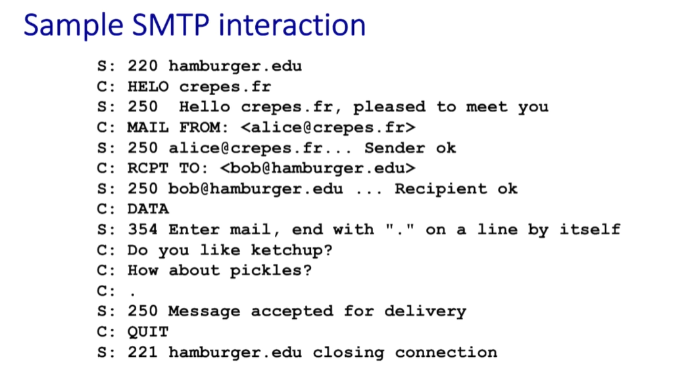

# <u>E-mail Messaging</u>

- Electronic mail, commonly known as email, is a method of exchanging messages over the internet.
-  Here are the basics of email:
  1. **An email address:** This is a unique identifier for each user, typically in the format of name@domain.com.
  2. **An email client:** This is a software program used to send, receive and manage emails, such as Gmail, Outlook, or Apple Mail.
  3. **An email server:** This is a computer system responsible for storing and forwarding emails to their intended recipients.

## <u>**Components of E-Mail System**</u>

- **User Agent (UA) :** The UA is normally a program which is used to send and receive mail. Sometimes, it is called as mail reader. It accepts variety of commands for composing, receiving and replying to messages as well as for manipulation of the mailboxes.

- **Message Transfer Agent (MTA) :** MTA is actually responsible for transfer of mail from one system to another. To send a mail, a system must have client MTA and system MTA. 

  - It transfer mail to mailboxes of recipients if they are connected in the same machine.
  - It delivers mail to peer MTA if destination mailbox is in another machine.
  - The delivery from one MTA to another MTA is done by Simple Mail Transfer Protocol.

  

- **Mailbox :** It is a file on local hard drive to collect mails. Delivered mails are present in this file. The user can read it delete it according to his/her requirement. To use e-mail system each user must have a mailbox . Access to mailbox is only to owner of mailbox.

**From Geeks For Geek:**  

- **Spool file :** This file contains mails that are to be sent. User agent appends outgoing mails in this file using SMTP. MTA extracts pending mail from spool file for their delivery. E-mail allows one name, an **alias**, to represent several different e-mail addresses. It is known as **mailing list**, Whenever user have to sent a message, system checks recipient’s name against alias database. If mailing list is present for defined alias, separate messages, one for each entry in the list, must be prepared and handed to MTA. If for defined alias, there is no such mailing list is present, name itself becomes naming address and a single message is delivered to mail transfer entity.

## <u>Email vs Web</u>

- The Web is:
  - Real-time
  - Unidirectional (one-way) (mostly)
  - Multimedia
- E-mail is:
  -  Asynchronous (both sender and receiver don’t have to  be on-line simultaneously)
  - Bi-directional
  - Multimedia

## <u>E-Mail Systems</u>

### <u>E-mail Access Methods</u>

### <u>Structure of an E-mail System</u>

1. **Sending Client**:
   - This is the device (e.g., a laptop) where the email is composed and sent by the user. 
   - The software used to send the email is typically a **Mail User Agent (MUA)**, which allows the user to interact with the email system.

2. **Mail Gateway (MTA)**:
   - The Mail Transfer Agent (MTA) serves as a gateway for routing emails. It receives the email from the Sending Client and is responsible for transferring it over the internet to the appropriate destination.
   - The MTA typically resides on a **local network** that connects it to the sending client.

3. **The Internet**:
   - The MTA sends the email through the internet to the recipient's domain.
   - The internet serves as the medium through which the email is transferred between the sending and receiving mail servers.

4. **Mail Server, Message Store**:
   - On the receiving side, there is a mail server that stores incoming messages.
   - The email remains in the **Message Store** until the recipient retrieves it.

5. **Receiving Client**:
   - The receiving client is where the user (recipient) checks and reads the email.
   - The Mail User Agent on the receiving client connects to the mail server to fetch and display the message.

University of Moratuwa manages its own mail server, providing email services within its domain (`uom.lk`) and handling both local and external email exchanges.

This setup would enable students and staff within the university network to send and receive emails, possibly without the need to go through the public internet for internal messages.

### <u>Sending E-mail</u>

- Mail client is configured with the name of a local mail gateway (MTA).
  - mail client does not have to know how to deliver mail to all recipients.

**Chat-gpt**

- In an email system, when a **client** sends an email, it typically interacts with an **SMTP (Simple Mail Transfer Protocol) gateway** that handles the outgoing message. 

  1. **Client Uses the Submit Protocol**:
     - When a client (such as an email app or webmail) wants to send an email, it uses the **SMTP Submit protocol**.
     - The client connects to the SMTP server on **port 587** (the standard port for email submission) to "submit" the message for delivery.
     - The submit protocol ensures that outgoing email is properly formatted and routed to the next server in the delivery path.
  2. **Gateway May Authenticate Users**:
     - The SMTP gateway (or Mail Transfer Agent) may require **user authentication** before accepting the message for sending.
     - This ensures that only authorized users (e.g., users within an organization or approved clients) are allowed to send emails, reducing the risk of spam or unauthorized access.
  3. **Use of TLS to Secure Data**:
     - **TLS (Transport Layer Security)** can be used to secure the data during transmission.
     - TLS encrypts the connection between the client and the gateway server, protecting the email’s content and authentication details from interception by third parties.
     - When TLS is in use, the connection is secure, and the email remains private between the client and the server.
  4. **Server May Limit Client Connections**:
     - The SMTP gateway server may also limit the locations from which clients can connect.
     - For instance, the server might restrict access to specific IP addresses or subnets (e.g., within a company’s network) or use firewalls and other access controls.
     - This measure helps prevent unauthorized access from outside the approved network, adding an extra layer of security.

  

**Chat-gpt**

Using the email `hdankotuwa@gmail.com`, 

1. **Domain Lookup**:
   - When you send an email to `hdankotuwa@gmail.com`, the **mail gateway** on the sending server (the system responsible for relaying email) will look up the **domain name** `gmail.com` in the **DNS (Domain Name System)**.
   - The purpose of this lookup is to find the **MX (Mail Exchange) record** associated with `gmail.com`.
2. **MX Record**:
   - The **MX record** for `gmail.com` specifies the **name of the mail server** that will handle emails for this domain.
   - For example, if the MX record for `gmail.com` points to `mail.google.com`, it means that `mail.google.com` is responsible for receiving emails sent to `@gmail.com` addresses.
   - MX records can have **priorities** (like the "10" shown in the image). If multiple servers are listed with different priorities, the one with the **lowest number** (highest priority) will be tried first.
3. **Mail Server and Message Store**:
   - Once the email is directed to the appropriate mail server (e.g., `mail.google.com`), the server processes the email and places it in the **message store**.
   - For Gmail, this means the email will be stored in Google’s email storage system, accessible when the user logs in to their Gmail account.
   - Often, the mail server and the message store are on the same machine or closely linked within the service’s infrastructure.

- Many organizations check incoming mail for  malware, spam, etc.
- Incoming mail is forwarded to a scanner, and only messages passing the scan are forwarded to the message store.
- Users access mail from message store. Outgoing e-mail is also scanned.

### <u>Summary of Sending Email</u>

When you send an email:

- The **User Agent** (UA) passes it to the **Client MTA**.
- The **Client MTA** sends it through the network to the **Server MTA** on the recipient's side.
- The **Server MTA** places the email in the recipient's **Mailbox** (where the **Message Store** holds the email content).
- The recipient’s **User Agent** retrieves the email from the **Mailbox** when the user wants to read it.

## <u>Simple Mail Transfer Protocol (SMTP)</u>

### <u>Sample SMTP Session</u>

**SMTP Email Transfer Process:**

1. **Establishing the TCP Connection**:
   - First, a TCP connection is established between Alice’s SMTP server and Bob’s server at **hamburger.edu**.

2. **Initial Greeting**:
   - Once connected, Bob’s SMTP server sends a **220 message** along with its hostname (e.g., **hamburger.edu**).
   - Alice’s SMTP server responds with a **HELO** command (or **EHLO** in modern implementations) and its hostname, introducing itself to Bob’s server.
   - Bob’s server then responds with a **250 message** that includes a greeting like: "**Hello [Alice's hostname], pleased to meet you**."

3. **SMTP Handshake**:
   - So far, the two SMTP servers have exchanged basic information and performed a handshake, confirming they can communicate.

4. **Message Transfer Process**:
   - Alice’s server then starts the message transfer by identifying the following information:
     - **Sender**: Alice’s server specifies who the message is from.
     - **Recipient**: Alice’s server specifies the intended recipient of the email.
     - **DATA Command**: The word **DATA** is sent, indicating that the message content is about to begin.
   - Bob’s server acknowledges these details, preparing to receive the email content.

5. **Email Content**:
   - Alice’s server sends the email content line by line.
   - The email message is terminated by a single line that contains only a **period (.)** to signify the end of the message.

6. **Termination**:
   - After the message is sent, Alice’s server issues a **QUIT** command, indicating that it’s done.
   - Bob’s server acknowledges with a **221 message**, signifying the end of the SMTP session.

7. **Completion**:
   - At this point, the email message has been successfully transferred from Alice’s server to Bob’s server using the SMTP protocol.

### <u>Mailing List</u>

- A **mailing list** is a mechanism that allows a single email to be sent to multiple recipients.
- Instead of sending the email to each individual recipient, the sender sends it to a **mailing list address**, which represents a special mailbox managed by a **list manager**.

#### How Mailing Lists Work:

1. **Mailing List Address**: This is a single email address that acts as a proxy for multiple recipients. For example, a mailing list address might look like `team@company.com` or `students@university.edu`.
2. **List Manager**:
   - The **list manager** is a software or server responsible for managing the mailing list.
   - When a message is sent to the mailing list address, the list manager **automatically distributes copies** of the message to every email address registered on the list.
3. **Sender Convenience**:
   - The sender does not need to know the individual email addresses of all recipients on the list.
   - Instead, they only need to send the message to the mailing list address, and the list manager handles the rest.

### <u>Receiving Email</u>

-  If user is logged in to the mail server, he can  directly access the message store. Otherwise, he must use a mail retrieval protocol
  - <mark>POP3 (very old)</mark>
  - <mark>IMAP (slightly newer)</mark>

### <u>Interactive Mail Access Protocol (IMAP)</u>

- IMAP follows **Client-server Architecture** and is the most commonly used email protocol.

- This protocol resides over the TCP/IP protocol for communication.

- Once the communication is set up the server listens on port 143 by default which is non-encrypted. For the secure encrypted communication port, 993 is used.

- Process:

  - Email client Gmail establishes a connection with Gmail’s SMTP server.

  - By approving the sender’s and recipient’s email addresses, the SMTP server verifies (authenticates) that the email can be sent.

  - The email is sent to the Outlook SMTP server by Gmail’s SMTP server.

  - The recipient’s email address is authenticated by the Outlook SMTP server.

  - IMAP or POP3 is used by the Outlook SMTP server to deliver the email to the Outlook email client.

### <u>SMTP vs POP vs IMAP</u>

|                             SMTP                             |                             POP                              |                             IMAP                             |
| :----------------------------------------------------------: | :----------------------------------------------------------: | :----------------------------------------------------------: |
|           Stands for Simple mail transfer protocol           | Stands for [Post Office Protocol.](https://www.geeksforgeeks.org/pop-full-form/) | Stands for [Internet Message Access Protocol.](https://www.geeksforgeeks.org/internet-message-access-protocol-imap/) |
|                    Used for sending mail.                    |                  Used for retrieving mail.                   |                  Used for retrieving mail.                   |
| it is push [protocol](https://www.geeksforgeeks.org/network-protocols/). |                     it is pull protocol.                     |                     it is pull protocol.                     |
| It work between sender’s mail server to receiver’s mail server and sender and sender’s mail server. |     It work between receiver and receiver’s mail server.     |    It works between receiver and receiver’s mail server.     |
|   It does not store mail on server it just send the mail.    |   It download all the mail when it connected to internet.    | It store all mail on server and download when it get request to download. |
|                 Works on TCP port number 25.                 |                Works on TCP port number 110.                 |                Works on TCP port number 143.                 |
|                Connection oriented protocol.                 |                Connection oriented protocol.                 |                Connection oriented protocol.                 |
|              It has persistence TCP connection.              |              It has persistence TCP connection.              |              It has persistence TCP connection.              |
| [Stateless](https://www.geeksforgeeks.org/difference-between-stateless-and-stateful-protocol/) protocol. |                      Stateful protocol.                      |                      Stateful protocol.                      |
|                   It is in band protocol.                    |                   It is in band protocol.                    |                   It is in band protocol.                    |
|                  Not used at receiver side.                  |                    Used at receiver side.                    |                    Used at receiver side.                    |

### ??? <u>Sender Policy Framework (SPF)</u> 

### <u>Format of an E-mail Message</u>

#### <u>The SMTP Envelope</u>

### <u>Multipurpose Internet Mail Extension  (MIME)</u>

- MIME is a kind of add-on **or a supplementary protocol** that allows non-ASCII data to be sent through SMTP. It allows the users to exchange different kinds of data files on the Internet: audio, video, images, application programs as well. 

#### <u>MIME Types</u>

## <u>Messaging</u>

