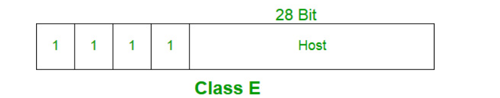

# <u>IP Addressing and Subnetting</u>

## Introduction of Classful IP Addressing

- An ***\*IP address\**** is an address that has information about how to reach a specific host, especially outside the LAN. An IP address is a 32-bit unique address having an address space of 2<sup>32</sup>.

- ***\*Classful IP addressing\**** is a way of organizing and managing IP addresses, which are used to identify devices on a network. Think of IP addresses like street addresses for houses; each device on a network needs its unique address to communicate with other devices. 


### What is an IPV4 Address?

An ***\*IPv4 address\**** is a unique number assigned to every device that connects to the internet or a computer network. It’s like a home address for your computer, smartphone, or any other device, allowing it to communicate with other devices.

- ***\*Format\****: An IPv4 address is written as four numbers separated by periods, like this: `192.168.1.1`. Each number can range from 0 to 255.

- The [IPv4 address](https://www.geeksforgeeks.org/what-is-ipv4/) is divided into two parts: ***\*Network ID\**** and ***\*Host ID.\****

- ***\*Purpose\****: The main purpose of an IPv4 address is to identify devices on a network and ensure that data sent from one device reaches the correct destination.

  

### Dotted Decimal Notation

- The value of any segment (byte) is between 0 and 255 (both included).
- No zeroes are preceding the value in any segment (054 is wrong, 54 is correct).


### Hexadecimal Notation


### Classful Addressing

The 32-bit IP address is divided into five sub-classes. These are given below:

- Class A
- Class B
- Class C
- Class D
- Class E

Each of these classes has a valid range of IP addresses.

Classes D and E are reserved for multicast and experimental purposes respectively.

The order of bits in the first octet determines the classes of the IP address. 

The class of IP address is used to determine the bits used for network ID and host ID and the number of total networks and hosts possible in that particular class.

Each [ISP ](https://www.geeksforgeeks.org/internet-service-provider-isp-hierarchy/)or network administrator assigns an IP address to each device that is connected to its network. 


- IP addresses are globally managed by **Internet Assigned Numbers Authority(IANA)** and **Regional Internet Registries(RIR).**
- While finding the total number of host IP addresses, 2 IP addresses are not counted and are therefore, decreased from the total count because the first IP address of any network is the **network number** and whereas the last IP address is reserved for **broadcast IP**.

#### <u>**Network ID (Network Address):**</u>

The **network ID** (also called the **network address**) is used to identify the network portion of an IP address. It is the first address in an IP range and represents the entire network.

- **Example:**
  - IP Address: `192.168.1.10`
  - Subnet Mask: `255.255.255.0`
  - Network ID: `192.168.1.0` (all host bits set to 0)

#### <u>**Broadcast Address:**</u>

The **broadcast address** is the last address in an IP range and is used to send data to all devices (hosts) on the network. When data is sent to the broadcast address, all devices in the network receive the message.

- **How it works:**
  The broadcast address is obtained by setting all the host bits to 1, while keeping the network portion the same.
- **Example:**
  - IP Address: `192.168.1.10`
  - Subnet Mask: `255.255.255.0`
  - Broadcast Address: `192.168.1.255` (all host bits set to 1)


#### <u>Class A</u>

IP addresses belonging to class A are assigned to the networks that contain a large number of hosts. 

- The network ID is 8 bits long.
- The host ID is 24 bits long.

<mark>The higher-order bit of the first octet in class A is always set to 0. The remaining 7 bits in the first octet are used to determine network ID. The 24 bits of host ID are used to determine the host in any network. The default subnet mask for Class A is `255.x.x.x`.</mark>
$$
2^{24}-2 = 16,777,216  =>hostID
$$
IP addresses belonging to class A ranges from `0.0.0.0` – `127.255.255.255.` 


#### <u>Class B</u>

IP address belonging to class B is assigned to networks that range from medium-sized to large-sized networks. 

- The network ID is 16 bits long.
- The host ID is 16 bits long.

<mark>The higher-order bits of the first octet of IP addresses of class B are always set to 10. The remaining 14 bits are used to determine the network ID. The 16 bits of host ID are used to determine the host in any network. The default subnet mask for class B is `255.255.x.x`. </mark>
$$
2^{14} = 16384 => network address
$$

$$
2^{16} – 2 = 65534  => host address
$$

IP addresses belonging to class B ranges from `128.0.0.0` – `191.255.255.255.`


#### <u>Class C</u>

IP addresses belonging to class C are assigned to small-sized networks.

- The network ID is 24 bits long.
- The host ID is 8 bits long.

<mark>The higher-order bits of the first octet of IP addresses of class C is always set to 110. The remaining 21 bits are used to determine the network ID. The 8 bits of host ID are used to determine the host in any network. The default subnet mask for class C is `255.255.255.x.`</mark>
$$
2^{21} = 2097152 =>  network address
$$

$$
2^{8} – 2 = 254  => host address
$$

IP addresses belonging to class C range from `192.0.0.0` – `223.255.255.255`.


#### <u>Class D</u>

<mark>IP address belonging to class D is reserved for multi-casting. The higher-order bits of the first octet of IP addresses belonging to class D is always set to 1110. The remaining bits are for the address that interested hosts recognize. Class D does not possess any subnet mask.</mark>

IP addresses belonging to class D range from `224.0.0.0` – `239.255.255.255.`


#### <u>Class E</u>

<mark>IP addresses belonging to class E are reserved for experimental and research purposes. IP addresses of class E range from `240.0.0.0` – `255.255.255.255`. This class doesn’t have any subnet mask. The higher-order bits of the first octet of class E are always set to 1111.</mark>




#### Range of Special IP Addresses

```
169.254.0.0 – 169.254.0.16 : Link-local addresses
127.0.0.0 – 127.255.255.255 : Loop-back addresses
0.0.0.0 – 0.0.0.8: used to communicate within the current network.
```

#### Rules for Assigning Host ID

Host IDs are used to identify a host within a network. The host ID is assigned based on the following rules:

- Within any network, the host ID must be unique to that network.
- A host ID in which all bits are set to 0 cannot be assigned because this host ID is used to represent the network ID of the IP address.
- Host ID in which all bits are set to 1 cannot be assigned because this host ID is reserved as a broadcast address to send packets to all the hosts present on that particular network.

#### Rules for Assigning Network ID

Hosts that are located on the same physical network are identified by the network ID, as all host on the same physical network is assigned the same network ID. The network ID is assigned based on the following rules:

- The network ID cannot start with 127 because 127 belongs to the class A address and is reserved for internal loopback functions.
- All bits of network ID set to 1 are reserved for use as an IP broadcast address and therefore, cannot be used.
- All bits of network ID set to 0 are used to denote a specific host on the local network and are not routed and therefore, aren’t used.

#### Summary of Classful Addressing 


## <u>Subnet Mask</u>

- Setting all 0s for the host bits and all 1s for the network bits results in a 32-bit value known as a subnet mask.
- The IP address is divided into the host address and network address in this manner by the subnet mask. 
- `255` is always the address assigned to the broadcast address, while `0` is always the address assigned to the network address.
- The subnet mask cannot be assigned to the host because it is set aside for a specific purpose.

## <u>Classless Inter Domain Routing (CIDR)</u> / Classless Addressing

- **Classless Inter-Domain Routing (CIDR)** is a method of IP address allocation and IP routing that allows for more efficient use of IP addresses.
- CIDR is based on the idea that IP addresses can be allocated and routed based on their network prefix rather than their class, which was the traditional way of IP address allocation.
- CIDR addresses are represented using a slash notation, which specifies the number of bits in the network prefix.
  - For example, an IP address of `192.168.1.0` with a prefix length of 24 would be represented as `192.168.1.0/24`. This notation indicates that the first 24 bits of the IP address are the network prefix and the remaining 8 bits are the host identifier.


Now, let’s suppose an Organization requires 214 hosts, then it must have to purchase a Class B network. In this case, 49150 Hosts will be wasted.

This is the major drawback of Classful Addressing. In order to reduce the wastage of IP addresses a new concept of ***\*Classless Inter-Domain Routing\**** is introduced.

Nowadays **IANA** is using this technique to provide IP addresses. Whenever any user asks for IP addresses, IANA is going to assign that many IP addresses to the User. 


- It is as also a 32-bit address, which includes a special number that represents the number of bits that are present in the Block Id.

  - `a . b . c . d / n `

    


## <u>Subnetting</u>


### <u>Private IP Blocks</u>


### <u>Subnet Example</u>


- According to this, we can have 2<sup>16 </sup> hosts within the network.

- Now, we are going to divide this network in to sub nets.

  

  


### <u>Important</u>

- You can only subnet the host portion, you do not have control of the  network portion.
- Subnetting does not give you more hosts, it only allows you to divide your  larger network into smaller networks.
- When subnetting, you will actually lose host addresses
  - For each subnet you lose the address of that subnet.
  - For each subnet you lose the broadcast address of that subnet.
  - You “may” lose the first and last subnets.
- Why would you want to subnet?
  - Divide larger network into smaller networks.
  - Limit layer 2 and layer 3 broadcasts to their subnet.
  - Better management of traffic.

